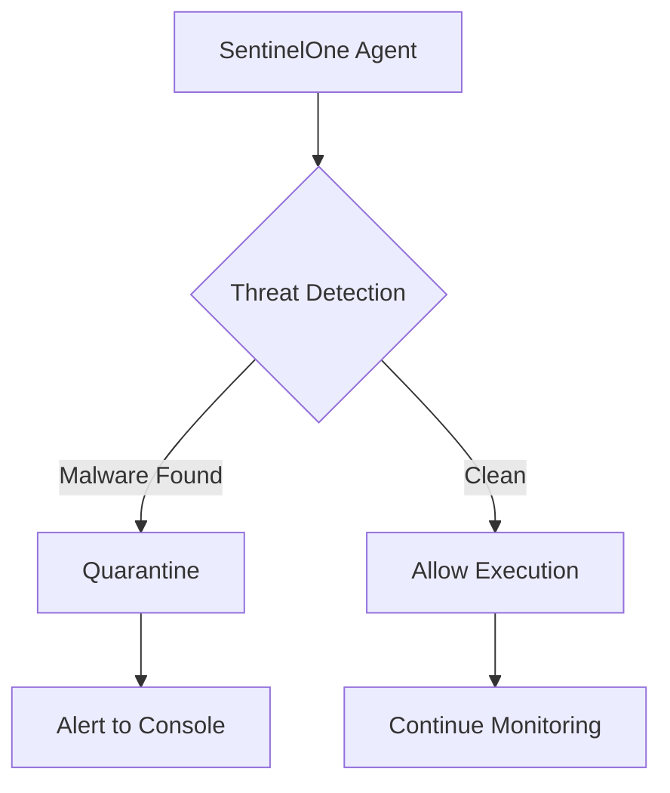
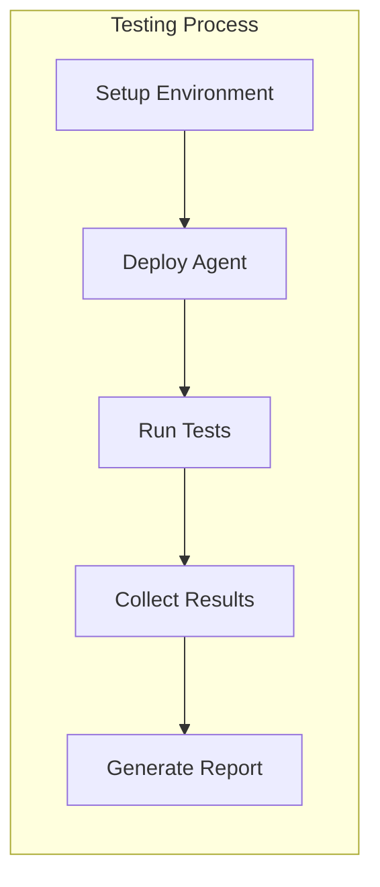

# Cara Insert Gambar di MkDocs

## 1. Mermaid Diagrams (Otomatis Ter-render)



## 2. Gambar Static/Screenshot

### Cara 1: Markdown Standard
```markdown

```

### Cara 2: HTML dengan Caption
```html
<div class="architecture-diagram">
    
    <div class="image-caption">Gambar 1: Arsitektur SentinelOne EDR</div>
</div>
```

### Cara 3: Gambar dengan Ukuran Custom
```html

<div class="image-caption">Management Console Dashboard</div>
```

## 3. Platform Badges

Anda bisa menggunakan badge untuk menandai platform:

<span class="platform-badge windows">Windows</span>
<span class="platform-badge linux">Linux</span>
<span class="platform-badge">Cross-Platform</span>

## 4. Status Indicators

<span class="status-indicator status-success">✅ Test Passed</span>
<span class="status-indicator status-warning">⚠️ Warning</span>
<span class="status-indicator status-error">❌ Failed</span>

## 5. Testing Scenario Box

<div class="testing-scenario">
<h4>🔥 Test Scenario: Malware Detection</h4>
<p><strong>Objective:</strong> Validate real-time malware detection capability</p>
<p><strong>Expected Result:</strong> EICAR file detected within 3 seconds</p>
</div>

## 6. Demo Checklist

<div class="demo-checklist">
<h4>Pre-Demo Checklist</h4>
<ul>
<li>[ ] SentinelOne Agent installed</li>
<li>[ ] Management Console accessible</li>
<li>[ ] Test files prepared</li>
<li>[ ] Network connectivity verified</li>
</ul>
</div>

## 7. Metrics Table

<table class="metrics-table">
<thead>
<tr>
<th>Metric</th>
<th>Target</th>
<th>Actual</th>
<th>Status</th>
</tr>
</thead>
<tbody>
<tr>
<td>Detection Rate</td>
<td>&gt;99%</td>
<td>99.8%</td>
<td><span class="status-success">✅ Passed</span></td>
</tr>
<tr>
<td>Response Time</td>
<td>&lt;3s</td>
<td>2.1s</td>
<td><span class="status-success">✅ Passed</span></td>
</tr>
</tbody>
</table>

## 8. Flowchart Container

<div class="flowchart-container">



</div>

## Cara Upload Gambar

1. **Copy gambar ke folder `docs/images/`**
2. **Reference dengan path relatif:**
   ```markdown
   
   ```

3. **Atau gunakan path absolut dari docs root:**
   ```markdown
   
   ```

## Format Gambar yang Didukung

- ✅ **PNG** (recommended untuk screenshot)
- ✅ **JPG/JPEG** (untuk photos)  
- ✅ **GIF** (untuk animasi)
- ✅ **SVG** (untuk vector graphics)
- ✅ **WebP** (modern format)

## Tips untuk Gambar yang Bagus

1. **Resolusi**: Gunakan resolusi tinggi (minimal 1920x1080)
2. **Format**: PNG untuk screenshot, JPG untuk foto
3. **Size**: Kompres gambar untuk loading yang cepat
4. **Alt text**: Selalu include alt text untuk accessibility
5. **Caption**: Berikan caption yang descriptive
