# Integrasi SentinelOne dengan Sistem Pihak Ketiga

Panduan komprehensif untuk mengintegrasikan SentinelOne EDR dengan berbagai sistem keamanan, monitoring, dan operasional enterprise.

---

## 🔗 Arsitektur Integrasi Enterprise

### Overview Integrasi Utama

```mermaid
flowchart TD
    S1["🛡️ SentinelOne<br/>Management Console"]
    
    S1 --> SIEM["📊 SIEM Integration"]
    S1 --> SOAR["🤖 SOAR Integration"]
    S1 --> ITSM["🎫 ITSM Integration"]
    S1 --> THREAT["🎯 Threat Intelligence"]
    S1 --> COMM["💬 Communication"]
    
    SIEM --> SIEM_TOOLS["Splunk | QRadar<br/>Azure Sentinel | Elastic"]
    SOAR --> SOAR_TOOLS["Phantom | XSOAR<br/>Swimlane | Demisto"]
    ITSM --> ITSM_TOOLS["ServiceNow | JIRA<br/>BMC Remedy"]
    THREAT --> THREAT_TOOLS["MISP | ThreatConnect<br/>AlienVault OTX"]
    COMM --> COMM_TOOLS["Slack | Teams<br/>Email | Webhooks"]
    
    style S1 fill:#e3f2fd,stroke:#1976d2,stroke-width:3px
    style SIEM fill:#e8f5e8,stroke:#4caf50,stroke-width:2px
    style SOAR fill:#fff3e0,stroke:#ff9800,stroke-width:2px
    style ITSM fill:#fce4ec,stroke:#e91e63,stroke-width:2px
    style THREAT fill:#f3e5f5,stroke:#9c27b0,stroke-width:2px
    style COMM fill:#e0f2f1,stroke:#00796b,stroke-width:2px
```

<div class="architecture-large">



</div>

### Alur Data dan Integrasi Detail


---

## 🎛️ SIEM Integration

### 1.1 Splunk Integration

#### Architecture Overview


#### Configuration Steps

**Step 1: Setup Splunk HTTP Event Collector**
```bash
# Splunk Configuration
# Enable HEC in Splunk
splunk enable http-event-collector -auth admin:password

# Create HEC token
splunk http-event-collector create sentinelone-token \
  -uri https://splunk.company.com:8089 \
  -auth admin:password \
  -index sentinelone \
  -sourcetype sentinelone:alert
```

**Step 2: Configure SentinelOne Integration**
```bash
# Via sentinelctl
sudo sentinelctl integration splunk configure \
  --hec-url "https://splunk.company.com:8088/services/collector" \
  --hec-token "your-hec-token" \
  --index "sentinelone" \
  --source "sentinelone_edr" \
  --sourcetype "sentinelone:threat"

# Test the integration
sudo sentinelctl integration splunk test
```

**Step 3: Splunk App Configuration**
```spl
# Create Splunk searches for SentinelOne data
index=sentinelone sourcetype=sentinelone:threat
| eval threat_name=json_extract(rawdata, "threatInfo.threatName")
| eval endpoint_name=json_extract(rawdata, "agentRealtimeInfo.agentComputerName")
| eval severity=json_extract(rawdata, "ruleInfo.severity")
| stats count by threat_name, endpoint_name, severity
| sort -count
```

### 1.2 IBM QRadar Integration

#### QRadar DSM Configuration
```xml
<!-- QRadar Device Support Module for SentinelOne -->
<device-extension xmlns="event_parsing/device_extension">
  <pattern id="SentinelOnePattern">
    <![CDATA[SentinelOne\s+(\S+)\s+(.*)]]>
  </pattern>
  <event-match pattern-id="SentinelOnePattern">
    <event category-id="6003" severity="5">
      <property-matches>
        <property-match property="DeviceType" value="SentinelOne EDR"/>
        <property-match property="ThreatName" capture-group="1"/>
        <property-match property="Message" capture-group="2"/>
      </property-matches>
    </event>
  </event-match>
</device-extension>
```

### 1.3 Azure Sentinel Integration

#### Data Connector Configuration
```json
{
  "kind": "SentinelOneDataConnector",
  "properties": {
    "connectorUiConfig": {
      "title": "SentinelOne EDR",
      "publisher": "SentinelOne",
      "descriptionMarkdown": "Connect SentinelOne EDR to Azure Sentinel",
      "graphQueries": [
        {
          "metricName": "Total events received",
          "legend": "SentinelOne Events",
          "baseQuery": "SentinelOne_CL | summarize Events = count() by bin(TimeGenerated, 1h)"
        }
      ]
    }
  }
}
```

---

## 🤖 SOAR Integration

### 2.1 Splunk Phantom Integration

#### Phantom App Architecture


#### Phantom Playbook Example
```python
# Phantom Playbook for SentinelOne Alert Response
def on_start(container, summary):
    phantom.debug('Starting SentinelOne Alert Response Playbook')
    
    # Get alert details from SentinelOne
    get_threat_details(container=container)
    
def get_threat_details(action=None, success=None, container=None, results=None, handle=None):
    # Query SentinelOne API for threat details
    parameters = [{
        'threat_id': container['data']['threatInfo']['threatId']
    }]
    
    phantom.act('get threat', parameters=parameters, 
                app='sentinelone', callback=enrich_with_threat_intel)

def enrich_with_threat_intel(action=None, success=None, container=None, results=None, handle=None):
    # Enrich with external threat intelligence
    if success:
        threat_data = results[0]['data']
        # Continue with enrichment logic...
        decide_response_action(container, threat_data)

def decide_response_action(container, threat_data):
    risk_score = calculate_risk_score(threat_data)
    
    if risk_score >= 8:
        isolate_endpoint(container, threat_data)
    elif risk_score >= 5:
        create_incident_ticket(container, threat_data)
    else:
        log_for_monitoring(container, threat_data)
```

### 2.2 Cortex XSOAR Integration

#### XSOAR Playbook YAML
```yaml
id: SentinelOne-Threat-Response
version: -1
name: SentinelOne Threat Response
description: Automated response to SentinelOne threats
tasks:
  "0":
    id: "0"
    type: start
    task:
      id: eb9c3dd0-7e51-4b8e-8a2f-6c1234567890
      version: -1
      name: ""
    nexttasks:
      '#none#':
      - "1"
  "1":
    id: "1"
    type: regular
    task:
      id: ab1c3dd0-7e51-4b8e-8a2f-6c1234567890
      version: -1
      name: Get Threat Details
      script: SentinelOne|||sentinelone-get-threat
    nexttasks:
      '#none#':
      - "2"
  "2":
    id: "2"
    type: condition
    task:
      id: cd2c3dd0-7e51-4b8e-8a2f-6c1234567890
      version: -1
      name: Risk Assessment
    conditions:
    - label: High Risk
      condition:
      - - left:
            value:
              simple: ${SentinelOne.Threat.RiskScore}
          operator: greaterThanOrEqual
          right:
            value: "8"
    - label: Medium Risk
      condition:
      - - left:
            value:
              simple: ${SentinelOne.Threat.RiskScore}
          operator: greaterThanOrEqual
          right:
            value: "5"
```

---

## 📋 ITSM Integration

### 3.1 ServiceNow Integration

#### ServiceNow Flow Design


#### ServiceNow Integration Script
```javascript
// ServiceNow Business Rule for SentinelOne Integration
(function executeRule(current, previous /*null when async*/) {
    
    // Parse SentinelOne webhook data
    var payload = JSON.parse(current.u_webhook_payload);
    
    // Create incident from SentinelOne alert
    var incident = new GlideRecord('incident');
    incident.initialize();
    
    // Map SentinelOne fields to ServiceNow
    incident.short_description = 'SentinelOne Alert: ' + payload.threatInfo.threatName;
    incident.description = buildDescription(payload);
    incident.urgency = mapSeverityToUrgency(payload.ruleInfo.severity);
    incident.category = 'Security';
    incident.subcategory = 'Endpoint Security';
    incident.u_source = 'SentinelOne';
    incident.u_threat_id = payload.threatInfo.threatId;
    incident.u_endpoint_name = payload.agentRealtimeInfo.agentComputerName;
    
    // Auto-assign based on threat type
    incident.assignment_group = getAssignmentGroup(payload.threatInfo.threatName);
    
    incident.insert();
    
    // Send notification to SentinelOne
    updateSentinelOneTicket(payload.threatInfo.threatId, incident.number);
    
})(current, previous);

function buildDescription(payload) {
    var desc = 'Threat Details:\n';
    desc += 'Threat Name: ' + payload.threatInfo.threatName + '\n';
    desc += 'File Path: ' + payload.threatInfo.filePath + '\n';
    desc += 'Endpoint: ' + payload.agentRealtimeInfo.agentComputerName + '\n';
    desc += 'User: ' + payload.agentRealtimeInfo.loggedInUsers + '\n';
    desc += 'Detection Time: ' + payload.threatInfo.createdAt + '\n';
    return desc;
}
```

---

## 🔒 Threat Intelligence Integration

### 4.1 MISP Integration Architecture


### 4.2 MISP Configuration

```bash
# Configure MISP integration in SentinelOne
sudo sentinelctl threat-intel misp configure \
  --url "https://misp.company.com" \
  --auth-key "your-misp-auth-key" \
  --pull-interval "1h" \
  --push-detections true \
  --threat-level "2" \
  --tags "sentinelone,edr,automated"

# Test MISP connection
sudo sentinelctl threat-intel misp test

# Manual IOC pull
sudo sentinelctl threat-intel misp pull --last-days 7
```

---

## 📱 Communication Integration

### 5.1 Slack Integration

#### Slack Bot Configuration
```python
# SentinelOne Slack Bot Integration
import slack_sdk
from slack_sdk import WebClient
from slack_sdk.errors import SlackApiError

class SentinelOneSlackBot:
    def __init__(self, token):
        self.client = WebClient(token=token)
    
    def send_threat_alert(self, threat_data):
        blocks = self.build_threat_blocks(threat_data)
        
        try:
            response = self.client.chat_postMessage(
                channel='#security-alerts',
                blocks=blocks,
                text=f"SentinelOne Alert: {threat_data['threatName']}"
            )
        except SlackApiError as e:
            print(f"Error sending message: {e}")
    
    def build_threat_blocks(self, threat_data):
        return [
            {
                "type": "header",
                "text": {
                    "type": "plain_text",
                    "text": f"🚨 SentinelOne Threat Alert"
                }
            },
            {
                "type": "section",
                "fields": [
                    {
                        "type": "mrkdwn",
                        "text": f"*Threat:* {threat_data['threatName']}"
                    },
                    {
                        "type": "mrkdwn",
                        "text": f"*Endpoint:* {threat_data['endpointName']}"
                    },
                    {
                        "type": "mrkdwn",
                        "text": f"*Severity:* {threat_data['severity']}"
                    },
                    {
                        "type": "mrkdwn",
                        "text": f"*Status:* {threat_data['status']}"
                    }
                ]
            },
            {
                "type": "actions",
                "elements": [
                    {
                        "type": "button",
                        "text": {
                            "type": "plain_text",
                            "text": "View in Console"
                        },
                        "url": threat_data['consoleUrl']
                    },
                    {
                        "type": "button",
                        "text": {
                            "type": "plain_text",
                            "text": "Isolate Endpoint"
                        },
                        "action_id": "isolate_endpoint",
                        "value": threat_data['threatId']
                    }
                ]
            }
        ]
```

---

## ⚙️ API Integration Framework

### 6.1 SentinelOne API Overview


### 6.2 API Integration Template

```python
#!/usr/bin/env python3
"""
SentinelOne API Integration Template
Author: Security Team
Version: 1.0
"""

import requests
import json
from datetime import datetime, timedelta
import logging

class SentinelOneAPI:
    def __init__(self, console_url, api_token):
        self.console_url = console_url.rstrip('/')
        self.api_token = api_token
        self.session = requests.Session()
        self.session.headers.update({
            'Authorization': f'ApiToken {api_token}',
            'Content-Type': 'application/json'
        })
        
        # Setup logging
        logging.basicConfig(level=logging.INFO)
        self.logger = logging.getLogger(__name__)
    
    def get_threats(self, limit=100, created_after=None):
        """Get threats from SentinelOne"""
        url = f"{self.console_url}/web/api/v2.1/threats"
        params = {'limit': limit}
        
        if created_after:
            params['createdAt__gte'] = created_after.isoformat()
        
        try:
            response = self.session.get(url, params=params)
            response.raise_for_status()
            return response.json()
        except requests.exceptions.RequestException as e:
            self.logger.error(f"Error fetching threats: {e}")
            return None
    
    def isolate_endpoint(self, agent_id, reason="Security incident"):
        """Isolate an endpoint"""
        url = f"{self.console_url}/web/api/v2.1/agents/actions/disconnect"
        payload = {
            'filter': {'ids': [agent_id]},
            'data': {'reason': reason}
        }
        
        try:
            response = self.session.post(url, json=payload)
            response.raise_for_status()
            return response.json()
        except requests.exceptions.RequestException as e:
            self.logger.error(f"Error isolating endpoint: {e}")
            return None
    
    def create_webhook(self, webhook_url, events):
        """Create webhook for real-time events"""
        url = f"{self.console_url}/web/api/v2.1/settings/webhooks"
        payload = {
            'url': webhook_url,
            'events': events,
            'active': True
        }
        
        try:
            response = self.session.post(url, json=payload)
            response.raise_for_status()
            return response.json()
        except requests.exceptions.RequestException as e:
            self.logger.error(f"Error creating webhook: {e}")
            return None

# Usage Example
if __name__ == "__main__":
    # Initialize API client
    s1_api = SentinelOneAPI(
        console_url="https://your-tenant.sentinelone.net",
        api_token="your-api-token"
    )
    
    # Get recent threats
    yesterday = datetime.now() - timedelta(days=1)
    threats = s1_api.get_threats(created_after=yesterday)
    
    if threats:
        print(f"Found {threats['pagination']['totalItems']} threats")
        for threat in threats['data']:
            print(f"Threat: {threat['threatInfo']['threatName']}")
            print(f"Endpoint: {threat['agentRealtimeInfo']['agentComputerName']}")
```

---

## 🔧 Integration Testing & Validation

### Testing Framework
```bash
#!/bin/bash
# Integration Testing Script

echo "=== SentinelOne Integration Testing Framework ==="

# Test SIEM Integration
echo "Testing SIEM Integration..."
sudo sentinelctl integration splunk test
sudo sentinelctl integration qradar test

# Test SOAR Integration
echo "Testing SOAR Integration..."
sudo sentinelctl integration phantom test
sudo sentinelctl integration xsoar test

# Test ITSM Integration
echo "Testing ITSM Integration..."
sudo sentinelctl integration servicenow test
sudo sentinelctl integration jira test

# Test Communication Integration
echo "Testing Communication Integration..."
sudo sentinelctl integration slack test
sudo sentinelctl integration teams test

echo "✅ All integration tests completed"
```

### Validation Checklist

- [ ] **SIEM Integration**: Events flowing to SIEM platforms
- [ ] **SOAR Integration**: Automated playbooks triggered
- [ ] **ITSM Integration**: Tickets created automatically
- [ ] **Threat Intel**: IOCs synchronized bidirectionally
- [ ] **Communication**: Notifications sent to teams
- [ ] **API Integration**: Custom integrations functional
- [ ] **Webhook Integration**: Real-time events received
- [ ] **Performance**: Integration latency acceptable

---

*Untuk bantuan lebih lanjut dengan integrasi, hubungi Security Team atau rujuk ke SentinelOne API Documentation.*

*Last updated: {{ git_revision_date_localized }}*
