# Bandwidth Utilization Monitoring

## 🌐 Konsep Bandwidth Monitoring SentinelOne

Bandwidth monitoring SentinelOne EDR melibatkan **pemahaman pola traffic** antara endpoint dan SentinelOne cloud untuk optimasi jaringan dan mencegah bottleneck.


## 📊 Traffic Categories & Bandwidth Usage

<div class="testing-scenario">
<h4>🚀 Normal Bandwidth Usage</h4>
<p><strong>Heartbeat:</strong> 1-5 KB/min (keep-alive)</p>
<p><strong>Telemetry:</strong> 10-50 KB/min (performance metrics)</p>
<p><strong>Policy Updates:</strong> 100-500 KB/hour (configuration)</p>
<p><strong>Signature Updates:</strong> 1-10 MB/day (threat intelligence)</p>
<p><strong>Event Upload:</strong> Variable (depends on activity)</p>
</div>

---

## 📈 Console-Based Bandwidth Monitoring

### 🎯 Management Console Workflow


**Console Monitoring Steps:**

1. **Dashboard Access**
   ```
   Console → Network → Bandwidth Monitoring
   View: Real-time usage graphs
   Filter: By site, endpoint group, or individual agent
   ```

2. **Traffic Analysis**
   ```
   Time Range: Last 24 hours / 7 days / 30 days
   Metrics: Upload/Download volumes
   Peak Times: Identify high-usage periods
   ```

3. **Bandwidth Optimization**
   ```
   Settings → Network → Bandwidth Control
   Upload Limit: Set max KB/s per endpoint
   Schedule: Configure off-hours for updates
   ```

---

## 🔧 Endpoint-Based Network Monitoring

### 💻 Command Line Network Analysis


### 📊 Network Monitoring Script

=== "Linux/macOS Script"
    ```bash
    #!/bin/bash
    echo "=== SENTINELONE BANDWIDTH MONITORING (Linux/macOS) ==="
    
    # Function to convert bytes to human readable format
    bytes_to_human() {
        local bytes=$1
        if [ $bytes -gt 1073741824 ]; then
            echo "$(echo "scale=2; $bytes/1073741824" | bc) GB"
        elif [ $bytes -gt 1048576 ]; then
            echo "$(echo "scale=2; $bytes/1048576" | bc) MB"
        elif [ $bytes -gt 1024 ]; then
            echo "$(echo "scale=2; $bytes/1024" | bc) KB"
        else
            echo "${bytes} B"
        fi
    }
    
    # Check SentinelOne network connections
    echo "=== SentinelOne Network Connections ==="
    netstat -tupln | grep sentinelone | head -10
    
    # Monitor network interface statistics
    echo -e "\n=== Network Interface Statistics ==="
    if [ -f /proc/net/dev ]; then
        echo "Interface | RX Bytes | TX Bytes | RX Packets | TX Packets"
        echo "----------|----------|----------|------------|------------"
        
        cat /proc/net/dev | grep -E 'eth0|ens|enp|wlan' | while IFS=':' read -r interface stats; do
            interface=$(echo $interface | xargs)
            stats_array=($stats)
            rx_bytes=${stats_array[0]}
            rx_packets=${stats_array[1]}
            tx_bytes=${stats_array[8]}
            tx_packets=${stats_array[9]}
            
            printf "%-9s | %-8s | %-8s | %-10s | %-11s\n" \
                "$interface" \
                "$(bytes_to_human $rx_bytes)" \
                "$(bytes_to_human $tx_bytes)" \
                "$rx_packets" \
                "$tx_packets"
        done
    fi
    
    # Check SentinelOne cloud connectivity
    echo -e "\n=== SentinelOne Cloud Connectivity ==="
    CLOUD_ENDPOINTS=(
        "api.sentinelone.net"
        "updates.sentinelone.net"
        "telemetry.sentinelone.net"
    )
    
    for endpoint in "${CLOUD_ENDPOINTS[@]}"; do
        if ping -c 1 -W 3 "$endpoint" >&/dev/null; then
            RTT=$(ping -c 1 -W 3 "$endpoint" 2>/dev/null | grep 'time=' | sed 's/.*time=\([0-9.]*\).*/\1/')
            echo "✅ $endpoint - RTT: ${RTT}ms"
        else
            echo "❌ $endpoint - UNREACHABLE"
        fi
    done
    
    echo -e "\n=== Monitoring Complete ==="
    ```

=== "Windows PowerShell Script"
    ```powershell
    # SentinelOne Bandwidth Monitoring Script for Windows
    Write-Host "=== SENTINELONE BANDWIDTH MONITORING (Windows) ===" -ForegroundColor Green
    
    # Function to convert bytes to human readable format
    function Convert-BytesToHuman {
        param([long]$bytes)
        if ($bytes -gt 1GB) {
            return "{0:N2} GB" -f ($bytes / 1GB)
        }
        elseif ($bytes -gt 1MB) {
            return "{0:N2} MB" -f ($bytes / 1MB)
        }
        elseif ($bytes -gt 1KB) {
            return "{0:N2} KB" -f ($bytes / 1KB)
        }
        else {
            return "$bytes B"
        }
    }
    
    # Check SentinelOne network connections
    Write-Host "\n=== SentinelOne Network Connections ===" -ForegroundColor Yellow
    $SentinelProcesses = Get-Process | Where-Object {$_.ProcessName -like "*Sentinel*"}
    if ($SentinelProcesses) {
        Get-NetTCPConnection | Where-Object {
            $_.OwningProcess -in $SentinelProcesses.Id
        } | Select-Object LocalAddress, LocalPort, RemoteAddress, RemotePort, State |
        Format-Table -AutoSize
    }
    
    # Monitor network interface statistics
    Write-Host "\n=== Network Interface Statistics ===" -ForegroundColor Yellow
    Get-NetAdapterStatistics | Where-Object {
        $_.Name -notlike "*Loopback*" -and $_.Name -notlike "*Tunnel*"
    } | Select-Object Name, 
        @{Name="RX Bytes";Expression={Convert-BytesToHuman $_.ReceivedBytes}},
        @{Name="TX Bytes";Expression={Convert-BytesToHuman $_.SentBytes}},
        ReceivedUnicastPackets, SentUnicastPackets |
    Format-Table -AutoSize
    
    # Check SentinelOne cloud connectivity
    Write-Host "\n=== SentinelOne Cloud Connectivity ===" -ForegroundColor Yellow
    $CloudEndpoints = @(
        "api.sentinelone.net",
        "updates.sentinelone.net",
        "telemetry.sentinelone.net"
    )
    
    foreach ($endpoint in $CloudEndpoints) {
        try {
            $ping = Test-NetConnection -ComputerName $endpoint -Port 443 -InformationLevel Quiet
            if ($ping) {
                $latency = (Test-NetConnection -ComputerName $endpoint -InformationLevel Detailed).PingReplyDetails.RoundtripTime
                Write-Host "✅ $endpoint - RTT: ${latency}ms" -ForegroundColor Green
            } else {
                Write-Host "❌ $endpoint - UNREACHABLE" -ForegroundColor Red
            }
        }
        catch {
            Write-Host "❌ $endpoint - ERROR: $($_.Exception.Message)" -ForegroundColor Red
        }
    }
    
    # Check bandwidth utilization using performance counters
    Write-Host "\n=== Current Bandwidth Utilization ===" -ForegroundColor Yellow
    try {
        $networkCounters = Get-Counter "\Network Interface(*)\Bytes Total/sec" -SampleInterval 1 -MaxSamples 3
        $networkCounters.CounterSamples | Where-Object {
            $_.InstanceName -notlike "*Loopback*" -and $_.InstanceName -notlike "*Tunnel*" -and $_.CookedValue -gt 0
        } | Select-Object InstanceName, 
            @{Name="Bytes/sec";Expression={Convert-BytesToHuman $_.CookedValue}} |
        Format-Table -AutoSize
    }
    catch {
        Write-Host "Unable to retrieve network performance counters: $($_.Exception.Message)" -ForegroundColor Red
    }
    
    Write-Host "\n=== Monitoring Complete ===" -ForegroundColor Green
    ```

=== "Cross-Platform Detection Script"
    ```bash
    #!/bin/bash
    # Cross-platform SentinelOne network monitoring
    
    detect_os() {
        if [[ "$OSTYPE" == "linux-gnu"* ]]; then
            echo "linux"
        elif [[ "$OSTYPE" == "darwin"* ]]; then
            echo "macos"
        elif [[ "$OSTYPE" == "msys" ]] || [[ "$OSTYPE" == "cygwin" ]]; then
            echo "windows"
        else
            echo "unknown"
        fi
    }
    
    OS=$(detect_os)
    echo "=== SENTINELONE NETWORK MONITORING - $OS ==="
    
    case $OS in
        "linux")
            echo "Running Linux network monitoring..."
            netstat -tupln | grep -i sentinel
            ss -tuln | grep :443
            ;;
        "macos")
            echo "Running macOS network monitoring..."
            netstat -anp tcp | grep -i sentinel
            lsof -i -P | grep -i sentinel
            ;;
        "windows")
            echo "For Windows, please run the PowerShell script above"
            ;;
        *)
            echo "Unsupported operating system: $OSTYPE"
            echo "Please use platform-specific commands"
            ;;
    esac
    ```

---

## ⚙️ Bandwidth Optimization & Throttling

### 📊 Optimization Strategies


### ⚙️ Console Bandwidth Configuration

**1. Global Bandwidth Limits**
```
Console → Settings → Network → Bandwidth Control
┌─────────────────────────────────────────┐
│ Upload Limit: [50] KB/s per endpoint    │
│ Download Limit: [100] KB/s per endpoint │
│ Burst Allowance: [500] KB (5 seconds)   │
│ Apply to: ☑️ All Sites                 │
└─────────────────────────────────────────┘
```

**2. Scheduled Updates**
```
Console → Policies → Update Schedule
┌─────────────────────────────────────────┐
│ Signature Updates: 02:00-04:00 daily   │
│ Policy Updates: Immediate               │
│ Agent Updates: Maintenance window only  │
│ Large Downloads: Weekend only           │
└─────────────────────────────────────────┘
```

**3. Traffic Prioritization**
```
Priority Level | Traffic Type        | Bandwidth %
━━━━━━━━━━━━━━━┼━━━━━━━━━━━━━━━━━━━━━┼━━━━━━━━━━━━
HIGH          | Security Events     | 40%
MEDIUM        | Telemetry Data      | 30%
LOW           | Signature Updates   | 20%
BULK          | Log Forwarding      | 10%
```

---

## 📊 Bandwidth Usage Patterns

### 🕐 Typical Daily Patterns

```mermaid
gantt
    title SentinelOne Daily Bandwidth Pattern
    dateFormat  HH:mm
    axisFormat %H:%M
    
    section Low Usage
    Heartbeat Only    :active, 00:00, 06:00
    
    section Business Hours
    Normal Telemetry  :active, 06:00, 18:00
    
    section Peak Activity
    Event Processing  :crit, 09:00, 11:00
    Event Processing  :crit, 14:00, 16:00
    
    section Maintenance
    Signature Updates :done, 02:00, 04:00
    Log Processing    :active, 18:00, 22:00
    
    section Night Mode
    Minimal Activity  :active, 22:00, 24:00
```



### 📈 Bandwidth Monitoring Metrics

<table class="metrics-table">
<thead>
<tr>
<th>Time Period</th>
<th>Expected Usage</th>
<th>Peak Allowance</th>
<th>Alert Threshold</th>
<th>Action Required</th>
</tr>
</thead>
<tbody>
<tr>
<td>Business Hours</td>
<td>20-50 KB/s</td>
<td>100 KB/s</td>
<td>> 150 KB/s</td>
<td><span class="status-warning">⚠️ Monitor</span></td>
</tr>
<tr>
<td>Off Hours</td>
<td>5-10 KB/s</td>
<td>200 KB/s</td>
<td>> 300 KB/s</td>
<td><span class="status-success">✅ Updates</span></td>
</tr>
<tr>
<td>Update Window</td>
<td>1-5 MB/s</td>
<td>10 MB/s</td>
<td>> 15 MB/s</td>
<td><span class="status-error">❌ Throttle</span></td>
</tr>
<tr>
<td>Security Event</td>
<td>100-500 KB/s</td>
<td>1 MB/s</td>
<td>> 2 MB/s</td>
<td><span class="status-warning">⚠️ Priority</span></td>
</tr>
</tbody>
</table>

---

## 🔧 Bandwidth Troubleshooting

### 🚨 Common Issues & Solutions


### 🛠️ Bandwidth Troubleshooting Script

```bash
#!/bin/bash
echo "🔍 SentinelOne Bandwidth Troubleshooting"
echo "==========================================="

# Function to check bandwidth usage
check_bandwidth() {
    echo "📊 Current Bandwidth Usage:"
    
    # Check active connections
    CONNECTIONS=$(netstat -tupln | grep sentinelone | wc -l)
    echo "   Active Connections: $CONNECTIONS"
    
    # Check data transfer (if available)
    if command -v iftop &> /dev/null; then
        echo "   Running iftop analysis (10 seconds)..."
        timeout 10s iftop -t -s 10 -i any 2>/dev/null | grep -E '(Total|Peak)' | tail -2
    fi
    
    # Check network utilization
    if [ -f /proc/net/dev ]; then
        echo "   Interface utilization:"
        cat /proc/net/dev | grep -E 'eth0|ens|enp' | head -3
    fi
}

# Function to identify high usage periods
identify_peak_usage() {
    echo -e "\n🕐 Peak Usage Analysis:"
    
    # Check system load
    echo "   System Load: $(uptime | awk -F'load average:' '{print $2}')"
    
    # Check if updates are running
    UPDATE_PROCESSES=$(ps aux | grep -E '(update|download)' | grep -v grep | wc -l)
    echo "   Update Processes: $UPDATE_PROCESSES"
    
    # Check disk I/O (which might indicate large downloads)
    if command -v iostat &> /dev/null; then
        echo "   Disk I/O Activity:"
        iostat -x 1 1 | grep -E '(Device|avg)' | tail -2
    fi
}

# Function to suggest optimizations
suggest_optimizations() {
    echo -e "\n💡 Optimization Suggestions:"
    
    # Check current time
    CURRENT_HOUR=$(date +%H)
    
    if [ $CURRENT_HOUR -ge 6 ] && [ $CURRENT_HOUR -le 18 ]; then
        echo "   ⏰ Business hours detected - consider limiting non-critical updates"
    else
        echo "   🌙 Off-hours detected - good time for updates and maintenance"
    fi
    
    # Check available bandwidth
    echo "   🔧 Recommended actions:"
    echo "      - Schedule signature updates during maintenance window"
    echo "      - Enable bandwidth throttling during business hours"
    echo "      - Configure burst allowances for security events"
    echo "      - Monitor and set appropriate thresholds"
}

# Run analysis
check_bandwidth
identify_peak_usage
suggest_optimizations

echo -e "\n==========================================="
echo "📊 For detailed performance analysis, see: [Performance Testing](../testing/kategori-e-performance.md)"
```

---

## 🔗 Related Testing & Integration

!!! info "Network & Performance Testing References"
    
    - **[Kategori F - Integration Testing](../testing/kategori-f-integration.md)**: Network connectivity and SIEM integration testing
    - **[Kategori E - Performance Impact Testing](../testing/kategori-e-performance.md)**: Network performance impact assessment
    - **[Cross-Platform Network Testing](../testing/cross-platform/cross-platform-testing.md)**: Unified network performance validation
    - **[Third-Party Integration](../integration/third-party-integration.md)**: Network requirements for SIEM and external tool integration

---

## 📋 Bandwidth Monitoring Checklist

<div class="demo-checklist">
<h4>Daily Bandwidth Monitoring</h4>
<ul>
<li>[ ] Check console bandwidth dashboard</li>
<li>[ ] Verify normal traffic patterns</li>
<li>[ ] Monitor peak usage periods</li>
<li>[ ] Review alert notifications</li>
<li>[ ] Validate cloud connectivity</li>
<li>[ ] Check throttling effectiveness</li>
</ul>
</div>

<div class="demo-checklist">
<h4>Weekly Network Optimization</h4>
<ul>
<li>[ ] Analyze weekly traffic trends</li>
<li>[ ] Review update schedules</li>
<li>[ ] Adjust bandwidth limits if needed</li>
<li>[ ] Document any network issues</li>
<li>[ ] Plan capacity for growth</li>
<li>[ ] Test network performance</li>
</ul>
</div>

*Last updated: {{ git_revision_date_localized }}*
