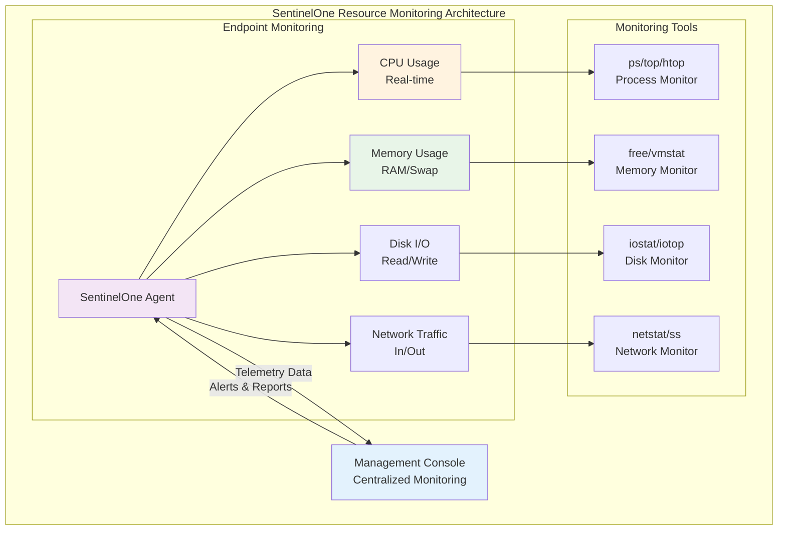
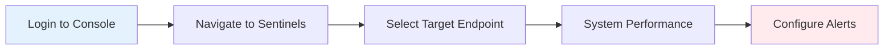
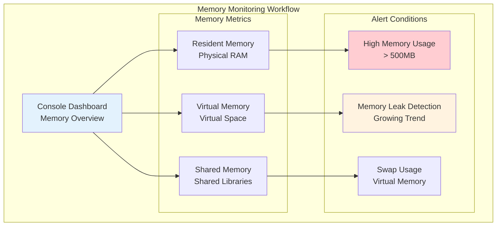
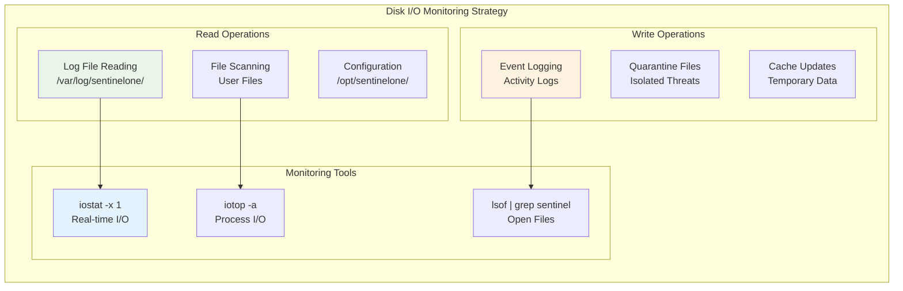
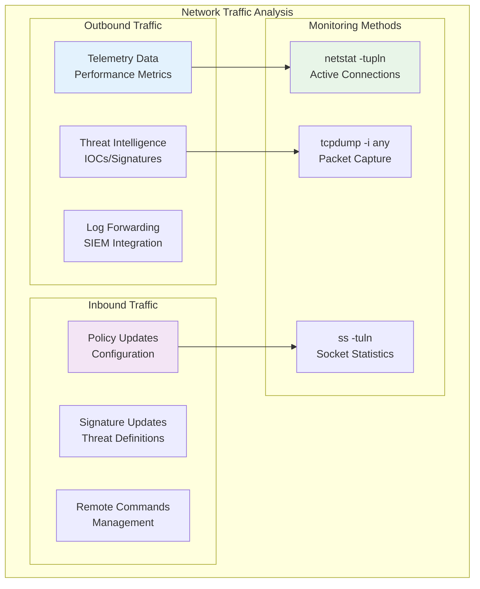

# Resource Utilization Monitoring

## 📊 Konsep Resource Monitoring

Resource monitoring SentinelOne EDR melibatkan **dual-layer monitoring** antara Management Console (terpusat) dan Endpoint (lokal) untuk memastikan performa optimal dan deteksi dini masalah.



## 🎯 Monitoring Objectives

<div class="testing-scenario">
<h4>🎯 Performance Targets</h4>
<p><strong>CPU Usage:</strong> < 5% average, < 15% peak</p>
<p><strong>Memory Usage:</strong> < 300MB resident, < 500MB virtual</p>
<p><strong>Disk I/O:</strong> < 10MB/s sustained</p>
<p><strong>Network:</strong> < 1MB/s telemetry upload</p>
</div>

---

## 💻 CPU Utilization Monitoring

### 📊 Console-Based Monitoring (Management Console)



**Step-by-Step Console Monitoring:**

1. **Login ke Management Console**
   ```
   URL: https://your-tenant.sentinelone.net
   Navigate: Sentinels → [Select Endpoint]
   ```

2. **View CPU Performance**
   ```
   Console Path: Sentinels → System Info → Performance Tab
   Real-time Graph: CPU Usage (last 24 hours)
   Historical Data: Up to 30 days
   ```

3. **Configure CPU Alerts**
   ```
   Settings → Alerts → Performance
   CPU Threshold: > 15% for 5 minutes
   Notification: Email + Console Alert
   ```

### 🔧 Endpoint-Based Monitoring (Command Line)

=== "Linux"
    ```bash
    #!/bin/bash
    echo "=== SENTINELONE CPU MONITORING SCRIPT (Linux) ==="
    
    # Monitor SentinelOne CPU usage
    echo "Current SentinelOne processes and CPU usage:"
    ps aux | grep sentinelone | grep -v grep | awk '{printf "%-20s %s%%\n", $11, $3}'
    
    echo -e "\n=== Top CPU-consuming SentinelOne processes ==="
    ps -eo pid,ppid,cmd,pcpu --sort=-pcpu | grep sentinelone | head -5
    
    echo -e "\n=== Real-time monitoring (5 seconds) ==="
    echo "Use 'top -p $(pgrep -d, sentinelone 2>/dev/null || echo 1)' for interactive monitoring"
    
    # System load average
    echo -e "\n=== System Load Average ==="
    uptime
    
    # CPU core information
    echo -e "\n=== CPU Information ==="
    nproc --all
    grep 'model name' /proc/cpuinfo | head -1
    ```

=== "Windows"
    ```powershell
    # SentinelOne CPU Monitoring Script for Windows
    Write-Host "=== SENTINELONE CPU MONITORING SCRIPT (Windows) ===" -ForegroundColor Green
    
    # Monitor SentinelOne CPU usage
    Write-Host "\nCurrent SentinelOne processes and CPU usage:" -ForegroundColor Yellow
    Get-Process | Where-Object {$_.ProcessName -like "*Sentinel*"} | 
        Select-Object ProcessName, CPU, @{Name="CPU%";Expression={[math]::Round($_.CPU,2)}} |
        Format-Table -AutoSize
    
    # Top CPU-consuming SentinelOne processes
    Write-Host "\n=== Top CPU-consuming SentinelOne processes ===" -ForegroundColor Yellow
    Get-Process | Where-Object {$_.ProcessName -like "*Sentinel*"} |
        Sort-Object CPU -Descending | Select-Object -First 5 |
        Select-Object ProcessName, Id, CPU, WorkingSet | Format-Table -AutoSize
    
    # System performance counters
    Write-Host "\n=== System CPU Information ===" -ForegroundColor Yellow
    Get-WmiObject -Class Win32_Processor | Select-Object Name, NumberOfCores, NumberOfLogicalProcessors
    
    # Current CPU usage
    Write-Host "\n=== Current System CPU Usage ===" -ForegroundColor Yellow
    Get-Counter "\Processor(_Total)\% Processor Time" -SampleInterval 1 -MaxSamples 1 |
        Select-Object -ExpandProperty CounterSamples | 
        Select-Object @{Name="CPU Usage %";Expression={[math]::Round(100 - $_.CookedValue,2)}}
    ```

=== "Cross-Platform Script"
    ```bash
    #!/bin/bash
    # Cross-platform SentinelOne monitoring script
    
    detect_os() {
        if [[ "$OSTYPE" == "linux-gnu"* ]]; then
            echo "linux"
        elif [[ "$OSTYPE" == "darwin"* ]]; then
            echo "macos"
        elif [[ "$OSTYPE" == "msys" ]] || [[ "$OSTYPE" == "cygwin" ]]; then
            echo "windows"
        else
            echo "unknown"
        fi
    }
    
    OS=$(detect_os)
    echo "=== SENTINELONE MONITORING - $OS ==="
    
    case $OS in
        "linux")
            ps aux | grep sentinelone | grep -v grep
            ;;
        "macos")
            ps aux | grep -i sentinel | grep -v grep
            ;;
        "windows")
            echo "Use PowerShell script for Windows monitoring"
            ;;
        *)
            echo "Unsupported operating system: $OSTYPE"
            ;;
    esac
    ```

**Advanced CPU Monitoring:**

```bash
# Continuous CPU monitoring
while true; do
    SENTINEL_CPU=$(ps aux | grep sentinelone | grep -v grep | awk '{sum+=$3} END {print sum+0}')
    echo "$(date): SentinelOne Total CPU: ${SENTINEL_CPU}%"
    
    if (( $(echo "$SENTINEL_CPU > 15" | bc -l) )); then
        echo "⚠️  HIGH CPU ALERT: SentinelOne using ${SENTINEL_CPU}%"
    fi
    
    sleep 60
done
```

---

## 💾 Memory Utilization Monitoring

### 📊 Console Memory Monitoring



**Console Steps:**
1. **Memory Dashboard**: `Console → Sentinels → Performance → Memory Tab`
2. **Historical Analysis**: View 7-day memory trend
3. **Alert Configuration**: Set threshold > 400MB for 10 minutes
4. **Memory Leak Detection**: Monitor growing trend over time

### 🔧 Endpoint Memory Analysis

```bash
#!/bin/bash
echo "=== SENTINELONE MEMORY ANALYSIS ==="

# Overall system memory
echo "=== System Memory Status ==="
free -h
echo

# SentinelOne memory usage details
echo "=== SentinelOne Memory Usage ==="
ps -o pid,ppid,cmd,rss,vsz,pmem --sort=-rss | grep sentinelone | head -10
echo

# Memory usage summary
SENTINEL_RSS=$(ps -o rss --no-headers --pid $(pgrep sentinelone) 2>/dev/null | awk '{sum+=$1} END {print sum+0}')
SENTINEL_MB=$(echo "scale=2; $SENTINEL_RSS/1024" | bc)
echo "Total SentinelOne Memory Usage: ${SENTINEL_MB} MB"

# Memory percentage
TOTAL_MEM=$(free -m | awk 'NR==2{print $2}')
MEM_PERCENT=$(echo "scale=2; ($SENTINEL_RSS/1024)/$TOTAL_MEM*100" | bc)
echo "Memory Percentage: ${MEM_PERCENT}%"

# Alert if memory usage is high
if (( $(echo "$SENTINEL_MB > 400" | bc -l) )); then
    echo "⚠️  HIGH MEMORY ALERT: ${SENTINEL_MB} MB"
fi
```

---

## 💿 Disk I/O Monitoring



**Disk I/O Monitoring Commands:**

```bash
# Monitor disk I/O by SentinelOne
sudo iotop -a -o -p $(pgrep sentinelone | tr '\n' ',' | sed 's/,$//')

# Check open files by SentinelOne
lsof | grep sentinelone | wc -l
echo "SentinelOne open files count: $(lsof | grep sentinelone | wc -l)"

# Monitor specific directories
watch -n 2 "du -sh /var/log/sentinelone /opt/sentinelone"
```

---

## 🌐 Network Traffic Monitoring



**Network Monitoring Script:**

```bash
#!/bin/bash
echo "=== SENTINELONE NETWORK MONITORING ==="

# Check SentinelOne network connections
echo "=== Active Network Connections ==="
ss -tuln | grep -E ':(443|80|8080|8443)' | head -10

# Monitor bandwidth usage
echo -e "\n=== Network Interface Statistics ==="
cat /proc/net/dev | grep -E 'eth0|ens|enp' | head -5

# SentinelOne specific connections
echo -e "\n=== SentinelOne Network Activity ==="
netstat -tupln | grep sentinelone

# Check connectivity to SentinelOne cloud
echo -e "\n=== Connectivity Test ==="
ping -c 3 api.sentinelone.net 2>/dev/null && echo "✅ Cloud connectivity OK" || echo "❌ Cloud connectivity FAILED"
```

---

## 📈 Performance Baselines & Thresholds

<table class="metrics-table">
<thead>
<tr>
<th>Resource</th>
<th>Normal Range</th>
<th>Warning Threshold</th>
<th>Critical Threshold</th>
<th>Action Required</th>
</tr>
</thead>
<tbody>
<tr>
<td>CPU Usage</td>
<td>2-5%</td>
<td>> 10%</td>
<td>> 20%</td>
<td><span class="status-warning">⚠️ Investigate</span></td>
</tr>
<tr>
<td>Memory (RSS)</td>
<td>150-250MB</td>
<td>> 400MB</td>
<td>> 600MB</td>
<td><span class="status-error">❌ Restart Agent</span></td>
</tr>
<tr>
<td>Disk I/O</td>
<td>< 5MB/s</td>
<td>> 15MB/s</td>
<td>> 30MB/s</td>
<td><span class="status-warning">⚠️ Check Scanning</span></td>
</tr>
<tr>
<td>Network</td>
<td>< 100KB/s</td>
<td>> 1MB/s</td>
<td>> 5MB/s</td>
<td><span class="status-success">✅ Normal Upload</span></td>
</tr>
</tbody>
</table>

---

## 🔗 Related Testing & Validation

!!! info "Performance Testing References"
    
    - **[Kategori E - Performance Impact Testing](../testing/kategori-e-performance.md)**: Komprehensif performance testing procedures
    - **[Linux Performance Testing](../testing/linux/linux-overview.md#linux-performance-monitoring)**: Linux-specific resource monitoring
    - **[Windows Performance Testing](../testing/windows/windows-overview.md)**: Windows resource monitoring procedures
    - **[Cross-Platform Performance](../testing/cross-platform/cross-platform-testing.md)**: Unified performance testing across platforms

---

## ⚡ Quick Performance Check Script

```bash
#!/bin/bash
echo "🔍 SentinelOne Quick Performance Check"
echo "==========================================="

# Function to check if value exceeds threshold
check_threshold() {
    local value=$1
    local threshold=$2
    local metric=$3
    
    if (( $(echo "$value > $threshold" | bc -l) )); then
        echo "❌ $metric: ${value} (> ${threshold})"
        return 1
    else
        echo "✅ $metric: ${value} (OK)"
        return 0
    fi
}

# Check CPU
CPU_USAGE=$(ps aux | grep sentinelone | grep -v grep | awk '{sum+=$3} END {print sum+0}')
check_threshold "$CPU_USAGE" "10" "CPU Usage (%)"

# Check Memory
MEM_MB=$(ps -o rss --no-headers --pid $(pgrep sentinelone 2>/dev/null) 2>/dev/null | awk '{sum+=$1} END {print sum/1024}')
check_threshold "$MEM_MB" "400" "Memory Usage (MB)"

# Check Connectivity
ping -c 1 -W 3 api.sentinelone.net &>/dev/null
if [ $? -eq 0 ]; then
    echo "✅ Network Connectivity: OK"
else
    echo "❌ Network Connectivity: FAILED"
fi

echo "==========================================="
echo "📊 Run complete performance tests: [Performance Testing Guide](../testing/kategori-e-performance.md)"
```

## 📋 Performance Monitoring Checklist

<div class="demo-checklist">
<h4>Daily Performance Monitoring</h4>
<ul>
<li>[ ] Check CPU usage < 5% average</li>
<li>[ ] Verify memory usage < 300MB</li>
<li>[ ] Monitor disk I/O < 10MB/s</li>
<li>[ ] Confirm network connectivity</li>
<li>[ ] Review console alerts</li>
<li>[ ] Validate agent responsiveness</li>
</ul>
</div>

<div class="demo-checklist">
<h4>Weekly Performance Review</h4>
<ul>
<li>[ ] Analyze performance trends</li>
<li>[ ] Review baseline metrics</li>
<li>[ ] Update alert thresholds if needed</li>
<li>[ ] Document performance anomalies</li>
<li>[ ] Plan optimization if required</li>
</ul>
</div>

*Last updated: {{ git_revision_date_localized }}*
