# Strategi Deteksi dan Respons Offline SentinelOne

Panduan komprehensif untuk menghadapi situasi deteksi ancaman dan incident response ketika sistem dalam mode offline atau terputus dari management console.

---

## 📡 Arsitektur Offline Detection & Response


---

## 🔧 Konfigurasi Offline Mode

### 1.1 Console Configuration

#### Offline Policy Setup


#### Step-by-Step Configuration

**Step 1: Enable Offline Detection**
```
Console Navigation:
1. Navigate to Policies > [Your Policy Name]
2. Go to Detection tab
3. Enable "Offline Detection Mode"
4. Set detection sensitivity: Conservative / Balanced / Aggressive
```

**Step 2: Configure Offline Response**
```json
{
  "offline_policy": {
    "detection": {
      "mode": "autonomous",
      "sensitivity": "balanced",
      "cache_duration": "7d",
      "signature_updates": "daily"
    },
    "response": {
      "automatic_quarantine": true,
      "network_isolation": false,
      "file_rollback": true,
      "collect_forensics": true
    },
    "buffering": {
      "max_events": 10000,
      "max_storage": "500MB",
      "retention_period": "30d"
    }
  }
}
```

### 1.2 Agent-Level Configuration

#### sentinelctl Offline Configuration
```bash
# Enable offline detection mode
sudo sentinelctl offline enable \
  --detection-mode "autonomous" \
  --cache-policies \
  --buffer-events

# Configure offline behavior
sudo sentinelctl offline configure \
  --max-buffer-size "500MB" \
  --max-offline-days "30" \
  --auto-quarantine \
  --collect-forensics

# Set offline response actions
sudo sentinelctl offline response \
  --quarantine-threats \
  --rollback-changes \
  --preserve-evidence \
  --local-logging

# View offline configuration
sudo sentinelctl offline status
```

#### Offline Policy Cache Management
```bash
# Force policy cache update (while online)
sudo sentinelctl cache update-policies

# View cached policies
sudo sentinelctl cache list-policies

# Check cache expiration
sudo sentinelctl cache check-expiry

# Manually refresh signatures cache
sudo sentinelctl cache update-signatures
```

---

## 🚨 Offline Threat Detection

### 2.1 Detection Capabilities in Offline Mode

#### Detection Matrix

```mermaid
graph TB
    subgraph "Offline Detection Capabilities"
        STATIC["Static Analysis<br/>✅ Signature-based<br/>✅ Hash matching<br/>✅ File reputation"]
        
        BEHAVIORAL["Behavioral Analysis<br/>✅ Process behavior<br/>✅ System calls<br/>⚠️ Limited ML models"]
        
        HEURISTIC["Heuristic Detection<br/>✅ Pattern matching<br/>✅ Anomaly detection<br/>✅ Rule-based logic"]
        
        NETWORK["Network Monitoring<br/>⚠️ Local traffic only<br/>❌ Cloud reputation<br/>✅ Cached IOCs"]
    end
    
    subgraph "Detection Limitations"
        CLOUD_INTEL["❌ Real-time Threat Intel"]
        REPUTATION["❌ Live File Reputation"]
        GLOBAL_CONTEXT["❌ Global Attack Context"]
        CLOUD_ML["❌ Cloud ML Models"]
    end
    
    STATIC -.->|"Limited by"| CLOUD_INTEL
    BEHAVIORAL -.->|"Limited by"| CLOUD_ML
    HEURISTIC -.->|"Limited by"| REPUTATION
    NETWORK -.->|"Limited by"| GLOBAL_CONTEXT
    
    style STATIC fill:#e8f5e8
    style BEHAVIORAL fill:#fff3e0
    style CLOUD_INTEL fill:#ffebee
```


### 2.2 Offline Detection Scenarios

#### Scenario A: Malware Detection While Offline

```bash
#!/bin/bash
# Simulate offline malware detection

echo "=== Offline Malware Detection Scenario ==="

# Step 1: Verify agent is in offline mode
echo "Checking agent offline status:"
sudo sentinelctl status | grep -i offline

# Step 2: Create EICAR test file (safe malware sample)
echo "Creating EICAR test file:"
echo 'X5O!P%@AP[4\PZX54(P^)7CC)7}$EICAR-STANDARD-ANTIVIRUS-TEST-FILE!$H+H*' > /tmp/eicar_offline.txt

# Step 3: Monitor detection
echo "Monitoring for offline detection:"
sudo sentinelctl logs --tail 10 --follow &
LOG_PID=$!

sleep 10
kill $LOG_PID

# Step 4: Check quarantine status
echo "Checking quarantine:"
sudo sentinelctl quarantine list

# Step 5: Review offline events
echo "Offline events buffer:"
sudo sentinelctl offline events --count
```

#### Scenario B: Behavioral Threat Detection

```powershell
# PowerShell script for Windows offline behavioral testing
Write-Host "=== Offline Behavioral Detection Test ===" -ForegroundColor Green

# Step 1: Verify offline mode
$status = & "C:\Program Files\SentinelOne\Sentinel Agent\SentinelCtl.exe" status
Write-Host "Agent Status: $status"

# Step 2: Simulate suspicious behavior
Write-Host "Simulating suspicious process behavior..." -ForegroundColor Yellow

# Create suspicious process chain
$proc1 = Start-Process cmd.exe -ArgumentList "/c timeout 30" -PassThru
$proc2 = Start-Process powershell.exe -ArgumentList "-Command Start-Sleep 30" -PassThru

# Step 3: Monitor behavioral detection
Start-Sleep 5
& "C:\Program Files\SentinelOne\Sentinel Agent\SentinelCtl.exe" logs --tail 5

# Step 4: Cleanup
$proc1 | Stop-Process -Force -ErrorAction SilentlyContinue
$proc2 | Stop-Process -Force -ErrorAction SilentlyContinue

Write-Host "Behavioral test completed" -ForegroundColor Green
```

---

## ⚡ Automated Response Actions

### 3.1 Offline Response Workflow


### 3.2 Response Action Configuration

#### Automated Response Rules
```yaml
# offline-response-rules.yaml
response_rules:
  critical_threats:
    - threat_types: ["malware", "ransomware"]
      actions:
        - "quarantine_immediately"
        - "rollback_file_changes"
        - "collect_forensics"
        - "log_incident"
      
  suspicious_behavior:
    - threat_types: ["behavioral", "anomalous"]
      actions:
        - "enhance_monitoring"
        - "collect_process_tree"
        - "log_detailed_activity"
        
  policy_violations:
    - threat_types: ["policy_breach", "unauthorized_access"]
      actions:
        - "block_action"
        - "log_violation"
        - "alert_local_admin"
        
  network_threats:
    - threat_types: ["c2_communication", "data_exfiltration"]
      actions:
        - "block_network_connection"
        - "quarantine_process"
        - "collect_network_forensics"
```

```bash
# Apply offline response rules
sudo sentinelctl offline response-rules apply --config offline-response-rules.yaml

# Test response actions
sudo sentinelctl offline test-response --threat-type malware

# View response history
sudo sentinelctl offline response-history --last 24h
```

---

## 📱 Manual Response Procedures

### 4.1 Offline Incident Response Playbook

#### Phase 1: Detection and Assessment
```bash
#!/bin/bash
# Offline Incident Response - Phase 1: Detection

echo "=== Phase 1: Offline Threat Detection ==="

# Step 1: Check for active threats
echo "Checking for active threats:"
sudo sentinelctl threats list --status active

# Step 2: Review recent detections
echo "Recent detections (last 1 hour):"
sudo sentinelctl threats list --since 1h

# Step 3: Analyze threat severity
echo "Threat severity breakdown:"
sudo sentinelctl threats stats --group-by severity

# Step 4: Check quarantine status
echo "Current quarantine status:"
sudo sentinelctl quarantine list --status active

# Step 5: System health check
echo "System health status:"
sudo sentinelctl health check --offline-mode
```

#### Phase 2: Containment and Mitigation
```bash
#!/bin/bash
# Offline Incident Response - Phase 2: Containment

echo "=== Phase 2: Offline Threat Containment ==="

# Function to contain threats
contain_threat() {
    local threat_id=$1
    
    echo "Containing threat: $threat_id"
    
    # Quarantine the threat
    sudo sentinelctl threats quarantine --id $threat_id
    
    # Rollback file changes if needed
    sudo sentinelctl threats rollback --id $threat_id
    
    # Collect forensic data
    sudo sentinelctl forensics collect --threat-id $threat_id
    
    echo "Threat $threat_id contained successfully"
}

# Get active threats
active_threats=$(sudo sentinelctl threats list --status active --format json | jq -r '.[].id')

# Contain each active threat
for threat_id in $active_threats; do
    contain_threat $threat_id
done

echo "All active threats contained"
```

#### Phase 3: Evidence Collection
```bash
#!/bin/bash
# Offline Incident Response - Phase 3: Evidence Collection

echo "=== Phase 3: Evidence Collection ==="

# Create forensics package
FORENSICS_DIR="/tmp/offline_forensics_$(date +%Y%m%d_%H%M%S)"
mkdir -p $FORENSICS_DIR

echo "Collecting evidence in: $FORENSICS_DIR"

# Collect system state
sudo sentinelctl system snapshot --output $FORENSICS_DIR/system_snapshot.json

# Collect threat artifacts
sudo sentinelctl threats export --format json --output $FORENSICS_DIR/threats.json

# Collect quarantine information
sudo sentinelctl quarantine export --output $FORENSICS_DIR/quarantine.json

# Collect agent logs
sudo sentinelctl logs export --output $FORENSICS_DIR/agent_logs.zip

# Collect process tree
sudo sentinelctl processes export --output $FORENSICS_DIR/process_tree.json

# Create evidence package
tar -czf $FORENSICS_DIR.tar.gz -C /tmp $(basename $FORENSICS_DIR)

echo "Evidence package created: $FORENSICS_DIR.tar.gz"
```

### 4.2 Emergency Response Procedures

#### Network Isolation (Critical Situations)
```bash
#!/bin/bash
# Emergency Network Isolation Script

echo "=== EMERGENCY: Network Isolation Procedure ==="

# WARNING: This will disconnect the system from network
read -p "Are you sure you want to isolate this system? (yes/no): " confirm

if [ "$confirm" = "yes" ]; then
    echo "Initiating network isolation..."
    
    # Method 1: Using SentinelOne (if available)
    sudo sentinelctl network isolate --reason "Emergency containment"
    
    # Method 2: System-level isolation (backup)
    if [ $? -ne 0 ]; then
        echo "Using system-level network isolation"
        
        # Disable network interfaces (Linux)
        for interface in $(ip link show | grep -E '^[0-9]+:' | cut -d: -f2 | grep -v lo); do
            sudo ip link set $interface down
            echo "Disabled interface: $interface"
        done
        
        # Block all traffic (iptables)
        sudo iptables -P INPUT DROP
        sudo iptables -P OUTPUT DROP
        sudo iptables -P FORWARD DROP
        
        echo "Network isolation completed using system controls"
    fi
    
    # Log the isolation
    echo "$(date): Emergency network isolation activated" | sudo tee -a /var/log/sentinelone_isolation.log
    
else
    echo "Network isolation cancelled"
fi
```

#### System Recovery Procedure
```powershell
# Windows Emergency Recovery Script
Write-Host "=== Emergency System Recovery ===" -ForegroundColor Red

# Step 1: Stop suspicious processes
Write-Host "Stopping suspicious processes..." -ForegroundColor Yellow
$suspiciousProcesses = Get-Process | Where-Object {
    $_.ProcessName -match "(temp|malware|suspicious)"
}

foreach ($proc in $suspiciousProcesses) {
    try {
        Stop-Process -Id $proc.Id -Force
        Write-Host "Stopped process: $($proc.ProcessName)" -ForegroundColor Green
    }
    catch {
        Write-Host "Failed to stop process: $($proc.ProcessName)" -ForegroundColor Red
    }
}

# Step 2: Check and restore system files
Write-Host "Running system file check..." -ForegroundColor Yellow
Start-Process sfc -ArgumentList "/scannow" -Wait -NoNewWindow

# Step 3: Create system restore point
Write-Host "Creating system restore point..." -ForegroundColor Yellow
Checkpoint-Computer -Description "SentinelOne Emergency Recovery" -RestorePointType "MODIFY_SETTINGS"

# Step 4: Collect recovery information
$recoveryInfo = @{
    'timestamp' = Get-Date
    'processes_stopped' = $suspiciousProcesses.Count
    'system_status' = 'recovering'
    'next_steps' = 'Wait for network recovery and sync with console'
}

$recoveryInfo | ConvertTo-Json | Out-File "C:\temp\recovery_info.json"

Write-Host "Emergency recovery procedures completed" -ForegroundColor Green
Write-Host "Recovery information saved to C:\temp\recovery_info.json" -ForegroundColor Cyan
```

---

## 🔄 Recovery and Synchronization

### 5.1 Network Recovery Detection


### 5.2 Automatic Synchronization Process

```bash
#!/bin/bash
# Automated Recovery and Sync Script

echo "=== SentinelOne Offline Recovery ==="

# Function to test connectivity
test_connectivity() {
    echo "Testing network connectivity..."
    
    # Test console connectivity
    if sudo sentinelctl network test --timeout 10; then
        echo "✅ Console connectivity restored"
        return 0
    else
        echo "❌ Console still unreachable"
        return 1
    fi
}

# Function to sync offline data
sync_offline_data() {
    echo "Starting offline data synchronization..."
    
    # Upload buffered events
    echo "Uploading buffered events..."
    sudo sentinelctl offline sync-events
    
    # Upload threat data
    echo "Uploading threat detections..."
    sudo sentinelctl offline sync-threats
    
    # Upload forensic data
    echo "Uploading forensic evidence..."
    sudo sentinelctl offline sync-forensics
    
    # Refresh policies
    echo "Updating policies from console..."
    sudo sentinelctl policy refresh
    
    echo "✅ Offline data sync completed"
}

# Function to validate recovery
validate_recovery() {
    echo "Validating recovery status..."
    
    # Check agent status
    local status=$(sudo sentinelctl status | grep -i "mode")
    echo "Agent mode: $status"
    
    # Check threat sync status
    local pending=$(sudo sentinelctl offline pending-events)
    echo "Pending events: $pending"
    
    # Check policy freshness
    local policy_age=$(sudo sentinelctl policy age)
    echo "Policy age: $policy_age"
    
    if [[ "$status" == *"online"* && "$pending" == "0" ]]; then
        echo "✅ Recovery successful"
        return 0
    else
        echo "⚠️ Recovery incomplete"
        return 1
    fi
}

# Main recovery loop
while true; do
    if test_connectivity; then
        sync_offline_data
        if validate_recovery; then
            echo "🎉 Full recovery completed successfully"
            break
        else
            echo "⚠️ Recovery issues detected, retrying..."
            sleep 30
        fi
    else
        echo "⏳ Waiting for connectivity... (checking again in 60 seconds)"
        sleep 60
    fi
done
```

---

## 📊 Offline Operations Monitoring

### 6.1 Offline Status Dashboard

```bash
#!/bin/bash
# Offline Operations Status Script

echo "=== SentinelOne Offline Operations Dashboard ==="
echo "Generated: $(date)"
echo "================================================"

# Agent Status
echo "🤖 AGENT STATUS:"
sudo sentinelctl status | grep -E "(Status|Mode|Version|Last Connection)"
echo

# Threat Summary
echo "🚨 THREAT SUMMARY:"
echo "Active Threats: $(sudo sentinelctl threats count --status active)"
echo "Quarantined: $(sudo sentinelctl quarantine count)"
echo "Total Offline Detections: $(sudo sentinelctl offline events count)"
echo

# Buffer Status
echo "💾 BUFFER STATUS:"
sudo sentinelctl offline buffer-status
echo

# System Health
echo "💚 SYSTEM HEALTH:"
sudo sentinelctl health check --offline-mode | grep -E "(CPU|Memory|Disk|Status)"
echo

# Recent Activity
echo "📋 RECENT ACTIVITY (Last 4 hours):"
sudo sentinelctl logs --since 4h --level warn,error | head -10
echo

# Pending Sync
echo "⏳ PENDING SYNCHRONIZATION:"
echo "Events: $(sudo sentinelctl offline pending-events)"
echo "Threats: $(sudo sentinelctl offline pending-threats)"
echo "Forensics: $(sudo sentinelctl offline pending-forensics)"
echo

echo "================================================"
echo "Next update: $(date -d '+5 minutes')"
```

### 6.2 Offline Performance Metrics

```python
#!/usr/bin/env python3
"""
SentinelOne Offline Performance Monitor
"""

import subprocess
import json
import time
from datetime import datetime, timedelta

class OfflineMonitor:
    def __init__(self):
        self.metrics = {}
        
    def collect_metrics(self):
        """Collect offline performance metrics"""
        
        # Detection metrics
        detection_stats = self.get_detection_stats()
        
        # Performance metrics
        performance_stats = self.get_performance_stats()
        
        # Buffer metrics
        buffer_stats = self.get_buffer_stats()
        
        self.metrics = {
            'timestamp': datetime.now().isoformat(),
            'detection': detection_stats,
            'performance': performance_stats,
            'buffer': buffer_stats
        }
        
        return self.metrics
    
    def get_detection_stats(self):
        """Get offline detection statistics"""
        try:
            # Run sentinelctl to get detection stats
            result = subprocess.run(
                ['sudo', 'sentinelctl', 'offline', 'stats', '--json'],
                capture_output=True, text=True
            )
            
            if result.returncode == 0:
                return json.loads(result.stdout)
            else:
                return {'error': result.stderr}
                
        except Exception as e:
            return {'error': str(e)}
    
    def get_performance_stats(self):
        """Get offline performance impact"""
        try:
            result = subprocess.run(
                ['sudo', 'sentinelctl', 'performance', 'offline', '--json'],
                capture_output=True, text=True
            )
            
            if result.returncode == 0:
                return json.loads(result.stdout)
            else:
                return {'error': result.stderr}
                
        except Exception as e:
            return {'error': str(e)}
    
    def get_buffer_stats(self):
        """Get event buffer statistics"""
        try:
            result = subprocess.run(
                ['sudo', 'sentinelctl', 'offline', 'buffer-info', '--json'],
                capture_output=True, text=True
            )
            
            if result.returncode == 0:
                return json.loads(result.stdout)
            else:
                return {'error': result.stderr}
                
        except Exception as e:
            return {'error': str(e)}
    
    def generate_report(self):
        """Generate offline operations report"""
        metrics = self.collect_metrics()
        
        report = f"""
=== SentinelOne Offline Operations Report ===
Generated: {metrics['timestamp']}

📊 Detection Performance:
- Threats Detected: {metrics['detection'].get('total_threats', 'N/A')}
- Response Time: {metrics['detection'].get('avg_response_time', 'N/A')}s
- Success Rate: {metrics['detection'].get('success_rate', 'N/A')}%

💻 System Performance:
- CPU Usage: {metrics['performance'].get('cpu_usage', 'N/A')}%
- Memory Usage: {metrics['performance'].get('memory_usage', 'N/A')}MB
- Disk I/O: {metrics['performance'].get('disk_io', 'N/A')}MB/s

💾 Buffer Status:
- Events Buffered: {metrics['buffer'].get('event_count', 'N/A')}
- Buffer Size: {metrics['buffer'].get('size_mb', 'N/A')}MB
- Buffer Utilization: {metrics['buffer'].get('utilization', 'N/A')}%

================================================
        """
        
        return report

if __name__ == "__main__":
    monitor = OfflineMonitor()
    print(monitor.generate_report())
```

---

## ✅ Validation Checklist

### Offline Preparedness
- [ ] **Offline Mode Enabled**: Agent configured for offline operation
- [ ] **Policies Cached**: Latest policies stored locally
- [ ] **Signatures Updated**: Recent signature databases cached
- [ ] **Response Rules**: Automated response actions configured
- [ ] **Buffer Configuration**: Adequate storage for offline events

### Detection Capabilities
- [ ] **Static Detection**: Signature-based detection functional
- [ ] **Behavioral Analysis**: Behavioral engine operational offline
- [ ] **Heuristic Detection**: Pattern recognition working
- [ ] **Quarantine Function**: Threat isolation capabilities active
- [ ] **Rollback Ability**: File system rollback functional

### Response Procedures
- [ ] **Manual Playbooks**: Offline incident response documented
- [ ] **Emergency Procedures**: Critical response actions defined
- [ ] **Evidence Collection**: Forensics collection procedures ready
- [ ] **Communication Plans**: Alternative communication channels established
- [ ] **Recovery Procedures**: Network recovery and sync processes tested

### Testing and Validation
- [ ] **Offline Testing**: Regular offline scenarios tested
- [ ] **Recovery Testing**: Network recovery procedures validated
- [ ] **Sync Validation**: Data synchronization accuracy verified
- [ ] **Performance Impact**: Offline mode performance acceptable
- [ ] **Documentation**: All procedures documented and accessible

---

*Untuk bantuan lebih lanjut dengan offline detection dan response, hubungi Security Team atau rujuk ke SentinelOne Offline Operations Guide.*

*Last updated: {{ git_revision_date_localized }}*
