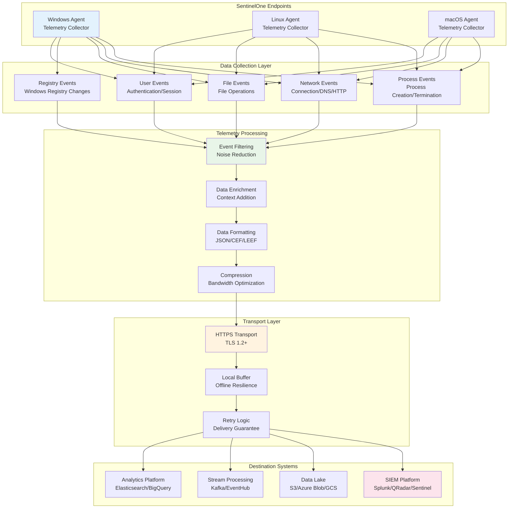
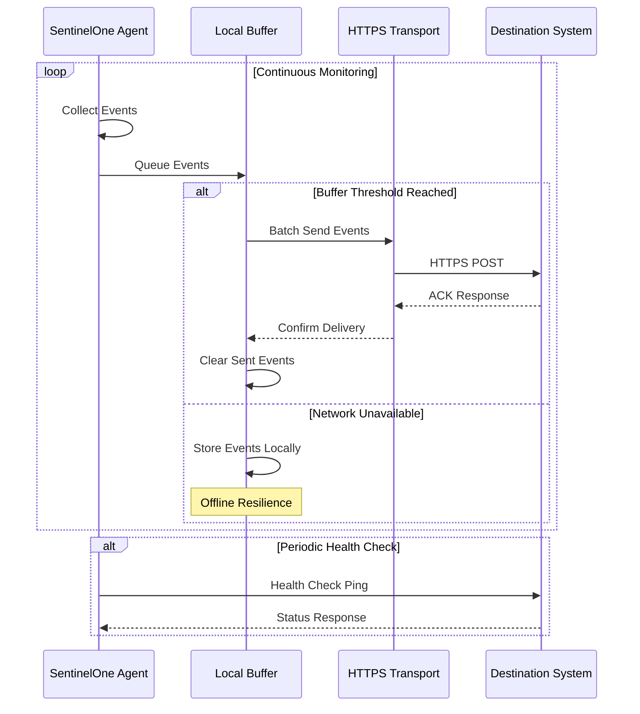
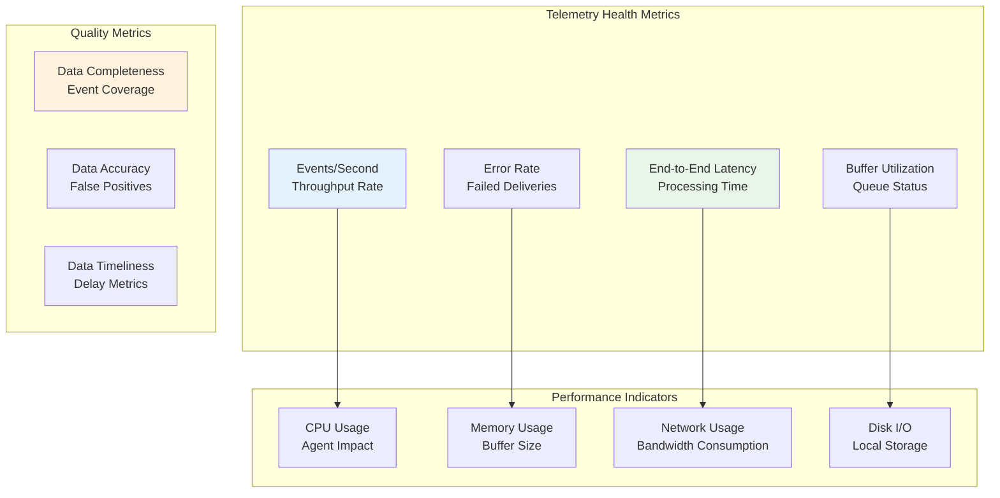

# Konfigurasi Real-Time Telemetry SentinelOne

Panduan komprehensif untuk mengkonfigurasi, mengelola, dan mengoptimalkan real-time telemetry streaming untuk monitoring kontinyu dan analitik keamanan.

---

## 📶 Arsitektur Real-Time Telemetry



---

## 🔧 Konfigurasi Real-Time Telemetry

### 1.1 Setup via Management Console

#### Console Navigation Flow

```mermaid
flowchart LR
    LOGIN["Management Console<br/>Login"] --> SETTINGS["Settings<br/>Menu"]
    SETTINGS --> TELEMETRY["Telemetry<br/>Configuration"]
    TELEMETRY --> ENABLE["Enable Streaming<br/>Toggle"]
    ENABLE --> ENDPOINT["Configure Endpoint<br/>Destination"]
    ENDPOINT --> FORMAT["Data Format<br/>Selection"]
    FORMAT --> TEST["Test Connection<br/>Validation"]
    TEST --> APPLY["Apply Configuration<br/>Deployment"]
    
    style LOGIN fill:#e3f2fd
    style ENABLE fill:#e8f5e8
    style TEST fill:#fff3e0
    style APPLY fill:#fce4ec
```


#### Step-by-Step Configuration

**Step 1: Enable Real-Time Telemetry**
```
Console Navigation:
1. Login to SentinelOne Management Console
2. Navigate to Settings > Endpoints > Telemetry
3. Enable "Real-Time Telemetry Streaming"
4. Select telemetry scope: All Agents / Specific Groups
```

**Step 2: Configure Destination Endpoint**
```json
{
  "telemetry_config": {
    "enabled": true,
    "destinations": [
      {
        "name": "Primary SIEM",
        "type": "https",
        "url": "https://siem.company.com/api/events",
        "format": "json",
        "authentication": {
          "type": "bearer_token",
          "token": "your-api-token"
        },
        "retry_policy": {
          "max_retries": 3,
          "backoff_seconds": 60
        }
      }
    ],
    "event_types": [
      "process",
      "network",
      "file",
      "registry",
      "authentication"
    ],
    "compression": {
      "enabled": true,
      "algorithm": "gzip"
    }
  }
}
```

### 1.2 Configuration via sentinelctl

#### Command-Line Configuration
```bash
# Enable real-time telemetry
sudo sentinelctl telemetry enable \
  --destination "https://siem.company.com/api/events" \
  --format "json" \
  --auth-type "bearer" \
  --auth-token "your-api-token"

# Configure specific event types
sudo sentinelctl telemetry configure \
  --events "process,network,file,registry" \
  --compression "gzip" \
  --buffer-size "10MB" \
  --retry-attempts "3"

# Test telemetry connection
sudo sentinelctl telemetry test

# View telemetry status
sudo sentinelctl telemetry status
```

#### Advanced Configuration Options
```bash
# Configure multiple destinations
sudo sentinelctl telemetry add-destination \
  --name "backup-siem" \
  --url "https://backup.siem.com/events" \
  --format "cef" \
  --priority "secondary"

# Set bandwidth throttling
sudo sentinelctl telemetry throttle \
  --max-bandwidth "10Mbps" \
  --burst-limit "50MB"

# Configure event filtering
sudo sentinelctl telemetry filter \
  --exclude-processes "chrome.exe,firefox.exe" \
  --exclude-extensions ".tmp,.log" \
  --min-severity "medium"
```

---

## 📈 Data Streaming Architecture

### 2.1 Event Types and Data Models

#### Process Events Schema
```json
{
  "event_type": "process",
  "timestamp": "2024-01-15T10:30:45.123Z",
  "endpoint": {
    "agent_id": "abc123-def456-ghi789",
    "hostname": "WORKSTATION-01",
    "os": "Windows 10 Pro",
    "ip_address": "192.168.1.100"
  },
  "process": {
    "pid": 1234,
    "parent_pid": 5678,
    "name": "notepad.exe",
    "path": "C:\\Windows\\System32\\notepad.exe",
    "command_line": "notepad.exe C:\\temp\\document.txt",
    "user": "DOMAIN\\user123",
    "hash": {
      "md5": "5d41402abc4b2a76b9719d911017c592",
      "sha1": "aaf4c61ddcc5e8a2dabede0f3b482cd9aea9434d",
      "sha256": "e3b0c44298fc1c149afbf4c8996fb92427ae41e4649b934ca495991b7852b855"
    },
    "action": "created",
    "integrity_level": "medium"
  },
  "metadata": {
    "rule_id": "R001",
    "confidence": 0.95,
    "tags": ["process-creation", "user-initiated"]
  }
}
```

#### Network Events Schema
```json
{
  "event_type": "network",
  "timestamp": "2024-01-15T10:31:00.456Z",
  "endpoint": {
    "agent_id": "abc123-def456-ghi789",
    "hostname": "WORKSTATION-01"
  },
  "network": {
    "connection_id": "conn_789123",
    "protocol": "TCP",
    "src_ip": "192.168.1.100",
    "src_port": 52341,
    "dst_ip": "8.8.8.8",
    "dst_port": 443,
    "direction": "outbound",
    "bytes_sent": 1024,
    "bytes_received": 2048,
    "domain": "google.com",
    "action": "established"
  },
  "process": {
    "pid": 1234,
    "name": "chrome.exe",
    "path": "C:\\Program Files\\Google\\Chrome\\Application\\chrome.exe"
  }
}
```

### 2.2 Real-Time Streaming Flow



---

## 🔍 Data Formats and Integration

### 3.1 Supported Output Formats

#### JSON Format (Recommended)
```json
{
  "version": "1.0",
  "source": "SentinelOne",
  "events": [
    {
      "id": "evt_123456789",
      "type": "process",
      "timestamp": "2024-01-15T10:30:45.123Z",
      "data": {
        // Event-specific data
      }
    }
  ],
  "metadata": {
    "agent_version": "21.7.5",
    "batch_id": "batch_987654321",
    "compression": "gzip"
  }
}
```

#### CEF Format (SIEM Compatible)
```
CEF:0|SentinelOne|EDR|21.7.5|Process Creation|Process created|Medium|src=192.168.1.100 dst=192.168.1.1 suser=user123 fname=notepad.exe fpath=C:\\Windows\\System32\\notepad.exe msg=Process created by user
```

#### LEEF Format (IBM QRadar)
```
LEEF:2.0|SentinelOne|EDR|21.7.5|Process|devTime=Jan 15 2024 10:30:45|src=192.168.1.100|usrName=user123|fileName=notepad.exe|filePath=C:\\Windows\\System32\\notepad.exe
```

### 3.2 SIEM Integration Examples

#### Splunk HEC Integration
```bash
# Configure Splunk HTTP Event Collector
sudo sentinelctl telemetry configure \
  --destination "https://splunk.company.com:8088/services/collector" \
  --format "json" \
  --auth-type "splunk-hec" \
  --auth-token "your-hec-token" \
  --index "sentinelone" \
  --source "sentinelone:telemetry" \
  --sourcetype "sentinelone:events"
```

#### QRadar Syslog Integration
```bash
# Configure QRadar syslog forwarding
sudo sentinelctl telemetry configure \
  --destination "syslog://qradar.company.com:514" \
  --format "leef" \
  --facility "local0" \
  --severity "info" \
  --transport "tcp"
```

#### Azure Sentinel Integration
```bash
# Configure Azure Sentinel Data Connector
sudo sentinelctl telemetry configure \
  --destination "https://workspace.ods.opinsights.azure.com/api/logs" \
  --format "json" \
  --auth-type "azure-workspace" \
  --workspace-id "your-workspace-id" \
  --shared-key "your-shared-key" \
  --log-type "SentinelOne"
```

---

## 🚀 Performance Optimization

### 4.1 Bandwidth Management

#### Bandwidth Optimization Settings
```bash
# Configure bandwidth throttling
sudo sentinelctl telemetry bandwidth \
  --max-rate "5Mbps" \
  --burst-allowance "20MB" \
  --congestion-control "adaptive"

# Enable smart compression
sudo sentinelctl telemetry compression \
  --algorithm "gzip" \
  --level "6" \
  --min-size "1KB"

# Configure batching for efficiency
sudo sentinelctl telemetry batching \
  --batch-size "100" \
  --batch-timeout "30s" \
  --max-memory "50MB"
```

#### Network Usage Monitoring
```bash
#!/bin/bash
# Monitor SentinelOne telemetry network usage

echo "=== SentinelOne Telemetry Network Monitoring ==="

# Monitor network connections
echo "Current telemetry connections:"
sudo netstat -an | grep :443 | grep sentinelone

# Monitor bandwidth usage
echo "Bandwidth usage (last 5 minutes):"
sudo sentinelctl telemetry stats --period 5m

# Check buffer status
echo "Buffer status:"
sudo sentinelctl telemetry buffer-status

# Network latency test
echo "Testing destination latency:"
sudo sentinelctl telemetry ping --destination primary
```

### 4.2 Event Filtering and Sampling

#### Advanced Filtering Configuration
```yaml
# telemetry-filters.yaml
filters:
  global:
    exclude_processes:
      - "chrome.exe"
      - "firefox.exe"
      - "teams.exe"
    exclude_file_extensions:
      - ".tmp"
      - ".log"
      - ".cache"
    min_severity: "medium"
    
  event_specific:
    process:
      exclude_system_processes: true
      track_parent_child: true
      
    network:
      exclude_internal_traffic: true
      track_dns_queries: true
      min_connection_duration: "5s"
      
    file:
      exclude_temp_directories: true
      track_executable_creation: true
      min_file_size: "1KB"
      
  sampling:
    enabled: true
    rate: 0.1  # 10% sampling
    preserve_threats: true
    preserve_alerts: true
```

```bash
# Apply filtering configuration
sudo sentinelctl telemetry filters apply --config-file telemetry-filters.yaml

# Enable intelligent sampling
sudo sentinelctl telemetry sampling \
  --enable \
  --rate "10%" \
  --preserve-threats \
  --preserve-high-confidence
```

---

## 📊 Monitoring and Analytics

### 5.1 Telemetry Health Monitoring

#### Health Dashboard Metrics


#### Monitoring Script
```bash
#!/bin/bash
# SentinelOne Telemetry Health Monitor

echo "=== SentinelOne Telemetry Health Check ==="

# Check telemetry service status
echo "Telemetry Service Status:"
sudo sentinelctl telemetry status

# Monitor event throughput
echo "Event Throughput (last hour):"
sudo sentinelctl telemetry metrics --metric throughput --period 1h

# Check destination connectivity
echo "Destination Connectivity:"
sudo sentinelctl telemetry test-destinations

# Buffer status and health
echo "Buffer Status:"
sudo sentinelctl telemetry buffer-info

# Error analysis
echo "Recent Errors:"
sudo sentinelctl telemetry errors --last 24h

# Performance impact
echo "Performance Impact:"
sudo sentinelctl performance telemetry
```

### 5.2 Alerting and Notifications

#### Telemetry Alerting Rules
```yaml
# telemetry-alerts.yaml
alerting_rules:
  - name: "High Error Rate"
    condition: "error_rate > 5%"
    duration: "5m"
    severity: "warning"
    notification:
      - email: "security-team@company.com"
      - slack: "#security-alerts"
      
  - name: "Telemetry Service Down"
    condition: "service_status != 'running'"
    duration: "1m"
    severity: "critical"
    notification:
      - pagerduty: "telemetry-service"
      
  - name: "High Latency"
    condition: "avg_latency > 30s"
    duration: "10m"
    severity: "warning"
    notification:
      - email: "operations@company.com"
      
  - name: "Buffer Near Full"
    condition: "buffer_utilization > 90%"
    duration: "5m"
    severity: "warning"
    notification:
      - slack: "#infrastructure-alerts"
```

---

## 🔒 Security and Compliance

### 6.1 Data Privacy and Encryption

#### Encryption in Transit
```bash
# Configure TLS encryption
sudo sentinelctl telemetry security \
  --tls-version "1.2" \
  --cipher-suites "ECDHE-RSA-AES256-GCM-SHA384,ECDHE-RSA-AES128-GCM-SHA256" \
  --verify-certificates \
  --pin-certificates

# Certificate management
sudo sentinelctl telemetry certificates \
  --ca-bundle "/etc/ssl/certs/ca-bundle.crt" \
  --client-cert "/etc/sentinelone/client.crt" \
  --client-key "/etc/sentinelone/client.key"
```

#### Data Masking and Anonymization
```yaml
# data-masking.yaml
data_masking:
  enabled: true
  rules:
    - field: "process.command_line"
      mask_patterns:
        - regex: "password=\S+"
          replacement: "password=***"
        - regex: "api_key=\S+"
          replacement: "api_key=***"
          
    - field: "user.username"
      anonymization:
        method: "hash"
        salt: "telemetry-salt-key"
        
    - field: "network.src_ip"
      anonymization:
        method: "subnet_mask"
        mask: "/24"
        
  sensitive_fields:
    - "user.password"
    - "registry.value"  # Only if contains credentials
    - "file.content"    # Never send file contents
```

### 6.2 Compliance and Audit

#### GDPR Compliance Configuration
```bash
# Configure GDPR compliance settings
sudo sentinelctl telemetry gdpr \
  --enable-anonymization \
  --data-retention "30d" \
  --right-to-erasure \
  --consent-tracking

# Configure data residency
sudo sentinelctl telemetry residency \
  --region "eu-west-1" \
  --cross-border-restriction \
  --data-sovereignty
```

---

## 🔧 Troubleshooting

### Common Issues and Solutions

| Issue | Symptoms | Solution |
|-------|----------|----------|
| **High Latency** | Events delayed > 30s | Check network, increase bandwidth, optimize filters |
| **Connection Failures** | HTTP 4xx/5xx errors | Verify credentials, check firewall, validate endpoints |
| **Buffer Overflow** | Events dropped | Increase buffer size, improve filtering, add destinations |
| **High CPU Usage** | Agent CPU > 20% | Enable sampling, reduce event types, optimize filters |
| **Certificate Errors** | TLS handshake failures | Update certificates, check expiration, verify CA chain |

### Diagnostic Commands
```bash
# Comprehensive diagnostics
sudo sentinelctl telemetry diagnose --full-report

# Network connectivity test
sudo sentinelctl telemetry network-test --verbose

# Performance analysis
sudo sentinelctl telemetry performance-profile --duration 5m

# Log analysis
sudo sentinelctl logs --component telemetry --level error --tail 100
```

### Validation Checklist

- [ ] **Telemetry Enabled**: Real-time streaming activated
- [ ] **Destinations Configured**: All target systems receiving data
- [ ] **Authentication Working**: API keys and certificates valid
- [ ] **Data Format Correct**: Events parsing correctly at destination
- [ ] **Performance Acceptable**: CPU/memory/network impact within limits
- [ ] **Error Rate Low**: < 1% failed event deliveries
- [ ] **Latency Acceptable**: End-to-end latency < 10 seconds
- [ ] **Filtering Optimized**: Noise reduced without losing important events
- [ ] **Security Compliant**: Encryption and privacy controls in place
- [ ] **Monitoring Active**: Health checks and alerting configured

---

*Untuk bantuan lebih lanjut dengan real-time telemetry, hubungi Security Team atau rujuk ke SentinelOne Telemetry Documentation.*

*Last updated: {{ git_revision_date_localized }}*
