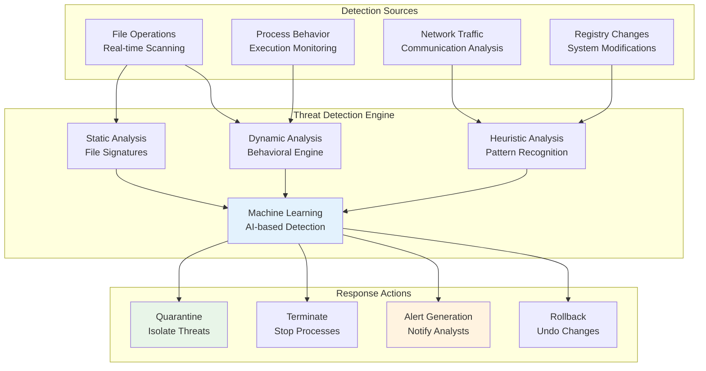

# Konfigurasi Deteksi Ancaman di SentinelOne

Panduan komprehensif untuk mengkonfigurasi, mengelola, dan mengoptimalkan sistem deteksi ancaman SentinelOne EDR.

---

## 🎯 Arsitektur Deteksi Ancaman



---

## 🔧 Konfigurasi Deteksi Melalui Management Console

### 1. Akses Pengaturan Deteksi

```
Console Navigation:
Management Console > Sentinels > [Select Site/Group] > Policies > Threat Detection
```

### 2. Konfigurasi Detection Modes

#### Mode Proteksi

| Mode | Deskripsi | Penggunaan | Dampak Performa |
|------|-----------|------------|------------------|
| **Detect Only** | Hanya deteksi, tidak blocking | Testing, compliance | Minimal |
| **Protect** | Deteksi + blocking otomatis | Production (recommended) | Low |
| **Advanced** | Full protection + advanced features | High-security environments | Medium |

**Konfigurasi melalui Console:**
```
Policies > Protection Mode
┌─ Detection Mode: Protect
├─ Real-time Protection: Enabled
├─ Behavioral Analysis: Enabled
└─ Cloud Intelligence: Enabled
```

### 3. Pengaturan Sensitivitas Deteksi

#### Tingkat Sensitivitas

**Low Sensitivity (Recommended for Production):**
```
Threshold Settings:
┌─ False Positive Rate: < 0.1%
├─ Detection Confidence: > 90%
├─ Behavioral Score: > 8.0
└─ Machine Learning Threshold: Conservative
```

**Medium Sensitivity (Balanced):**
```
Threshold Settings:
┌─ False Positive Rate: < 0.5%
├─ Detection Confidence: > 85%
├─ Behavioral Score: > 6.5
└─ Machine Learning Threshold: Moderate
```

**High Sensitivity (Security-focused):**
```
Threshold Settings:
┌─ False Positive Rate: < 1.0%
├─ Detection Confidence: > 80%
├─ Behavioral Score: > 5.0
└─ Machine Learning Threshold: Aggressive
```

---

## ⚙️ Konfigurasi Detection Rules via sentinelctl

### 1. Melihat Konfigurasi Deteksi Saat Ini

```bash
# Linux/macOS
sudo /opt/sentinelone/bin/sentinelctl policy show --section detection

# Windows
"C:\Program Files\SentinelOne\Sentinel Agent\SentinelCtl.exe" policy show --section detection
```

### 2. Mengatur Detection Sensitivity

```bash
# Set detection sensitivity level
sudo sentinelctl detection sensitivity --level medium

# Enable/disable specific detection types
sudo sentinelctl detection enable --type behavioral
sudo sentinelctl detection enable --type static
sudo sentinelctl detection enable --type heuristic

# Configure detection thresholds
sudo sentinelctl detection threshold --behavioral 7.0 --confidence 85
```

### 3. Mengelola Detection Exclusions

```bash
# Add process exclusion
sudo sentinelctl exclusions add --type process --value "trusted_app.exe"

# Add path exclusion
sudo sentinelctl exclusions add --type path --value "/opt/trusted_software/*"

# Add hash exclusion
sudo sentinelctl exclusions add --type hash --value "sha1:a1b2c3d4e5f6..."

# List all exclusions
sudo sentinelctl exclusions list
```

---

## 🎛️ Advanced Detection Configuration

### 1. Behavioral Analysis Tuning

#### Behavioral Indicators Configuration

```bash
# Configure behavioral detection parameters
sudo sentinelctl detection behavioral --config "
{
    'process_injection': {
        'enabled': true,
        'sensitivity': 'medium',
        'threshold': 7.5
    },
    'credential_access': {
        'enabled': true,
        'sensitivity': 'high',
        'threshold': 8.0
    },
    'lateral_movement': {
        'enabled': true,
        'sensitivity': 'medium',
        'threshold': 7.0
    },
    'persistence': {
        'enabled': true,
        'sensitivity': 'high',
        'threshold': 8.5
    }
}"
```

#### Custom Behavioral Rules

```json
{
    "custom_rules": [
        {
            "name": "Suspicious PowerShell Activity",
            "description": "Detect encoded PowerShell commands",
            "conditions": [
                {
                    "process_name": "powershell.exe",
                    "command_line_contains": "-EncodedCommand",
                    "parent_process_not": ["explorer.exe", "cmd.exe"]
                }
            ],
            "action": "alert_and_log",
            "severity": "high"
        },
        {
            "name": "Unusual Network Beaconing",
            "description": "Detect consistent outbound connections",
            "conditions": [
                {
                    "network_frequency": "> 10 connections per minute",
                    "destination_type": "external",
                    "duration": "> 5 minutes"
                }
            ],
            "action": "alert",
            "severity": "medium"
        }
    ]
}
```

### 2. Machine Learning Model Tuning

```bash
# Configure ML detection parameters
sudo sentinelctl detection ml --config "
{
    'model_update_frequency': '24h',
    'confidence_threshold': 0.85,
    'false_positive_learning': true,
    'local_learning': true,
    'cloud_intelligence': true
}"

# View ML model status
sudo sentinelctl detection ml status
```

### 3. Network Detection Configuration

```bash
# Configure network monitoring
sudo sentinelctl detection network --enable

# Set network detection parameters
sudo sentinelctl detection network --config "
{
    'monitor_dns': true,
    'monitor_http': true,
    'monitor_ssl': true,
    'deep_packet_inspection': false,
    'c2_detection': true,
    'data_exfiltration_detection': true
}"
```

---

## 🚨 Detection Response Configuration

### 1. Automated Response Actions

#### Mengatur Response per Threat Type

```bash
# Configure response actions
sudo sentinelctl response configure --threat-type malware --action quarantine
sudo sentinelctl response configure --threat-type suspicious --action alert
sudo sentinelctl response configure --threat-type pua --action log

# Advanced response configuration
sudo sentinelctl response advanced --config "
{
    'malware': {
        'action': 'quarantine_and_rollback',
        'notify': true,
        'isolate_endpoint': false
    },
    'ransomware': {
        'action': 'terminate_and_quarantine',
        'notify': true,
        'isolate_endpoint': true,
        'backup_files': true
    },
    'lateral_movement': {
        'action': 'alert_and_monitor',
        'notify': true,
        'isolate_endpoint': false,
        'collect_forensics': true
    }
}"
```

### 2. Alert and Notification Configuration

#### SIEM Integration

```bash
# Configure SIEM forwarding
sudo sentinelctl integration siem --type splunk --config "
{
    'endpoint': 'https://splunk.company.com:8088',
    'token': 'your-hec-token',
    'index': 'sentinelone',
    'source': 'sentinelone_edr',
    'sourcetype': 'sentinelone:threat'
}"

# Configure email notifications
sudo sentinelctl notifications email --config "
{
    'smtp_server': 'mail.company.com',
    'port': 587,
    'username': 'alerts@company.com',
    'recipients': [
        'security-team@company.com',
        'soc@company.com'
    ],
    'severity_threshold': 'medium'
}"
```

---

## 📊 Detection Performance Monitoring

### 1. Monitoring Detection Effectiveness

```bash
# Detection statistics
sudo sentinelctl stats detection --period 24h

# Output example:
Detection Statistics (Last 24 hours):
┌────────────────────┬─────────┬─────────────┬──────────────┐
│ Detection Type     │ Count   │ True Pos.   │ False Pos.   │
├────────────────────┼─────────┼─────────────┼──────────────┤
│ Static Analysis    │ 1,247   │ 1,245       │ 2 (0.16%)    │
│ Behavioral         │ 89      │ 85          │ 4 (4.49%)    │
│ Machine Learning   │ 156     │ 152         │ 4 (2.56%)    │
│ Heuristic         │ 234     │ 230         │ 4 (1.71%)    │
└────────────────────┴─────────┴─────────────┴──────────────┘

Total Detections: 1,726
Overall Accuracy: 98.2%
False Positive Rate: 0.8%
```

### 2. Performance Impact Assessment

```bash
# Detection performance impact
sudo sentinelctl performance detection

Detection Performance Impact:
┌─────────────────────┬─────────────┬─────────────┐
│ Metric              │ Average     │ Peak        │
├─────────────────────┼─────────────┼─────────────┤
│ CPU Usage           │ 3.2%        │ 8.1%        │
│ Memory Usage        │ 245 MB      │ 312 MB      │
│ Disk I/O            │ 2.1 MB/s    │ 15.8 MB/s   │
│ Detection Latency   │ 1.2s        │ 3.8s        │
└─────────────────────┴─────────────┴─────────────┘
```

---

## 🔍 Threat Hunting Integration

### 1. Custom Hunting Queries

```sql
-- Deep Visibility Query Examples

-- Detect suspicious process chains
SELECT * FROM processes 
WHERE (cmdline LIKE '%powershell%' AND cmdline LIKE '%-enc%') 
   OR (cmdline LIKE '%wmic%' AND cmdline LIKE '%process%')
   AND parent_name NOT IN ('explorer.exe', 'cmd.exe')
ORDER BY timestamp DESC
LIMIT 100;

-- Identify lateral movement attempts
SELECT src_ip, dst_ip, dst_port, COUNT(*) as connection_count
FROM network_connections 
WHERE dst_port IN (135, 139, 445, 3389)
  AND src_ip != dst_ip
  AND timestamp > NOW() - INTERVAL '1 hour'
GROUP BY src_ip, dst_ip, dst_port
HAVING COUNT(*) > 5
ORDER BY connection_count DESC;
```

### 2. Automated Threat Hunting Rules

```bash
# Deploy custom hunting rules
sudo sentinelctl hunting deploy --rule-file custom_hunting_rules.json

# Schedule automated hunting
sudo sentinelctl hunting schedule --rule "lateral_movement_detection" --interval "1h"
sudo sentinelctl hunting schedule --rule "credential_dumping" --interval "30m"

# View hunting results
sudo sentinelctl hunting results --rule "lateral_movement_detection" --last 24h
```

---

## 📈 Detection Optimization

### 1. False Positive Reduction

```bash
# Analyze false positives
sudo sentinelctl analytics false-positives --period 7d

# Add whitelist based on analysis
sudo sentinelctl whitelist add --process "legitimate_app.exe" --reason "Business application"
sudo sentinelctl whitelist add --hash "sha256:abc123..." --reason "Signed company binary"

# Tune detection sensitivity based on environment
sudo sentinelctl detection tune --environment production --target-fp-rate 0.1
```

### 2. Coverage Gap Analysis

```bash
# Identify detection gaps
sudo sentinelctl analytics gaps --assess-coverage

# Coverage report example:
Detection Coverage Assessment:
┌──────────────────────┬─────────────┬─────────────┐
│ Attack Technique     │ Coverage    │ Confidence  │
├──────────────────────┼─────────────┼─────────────┤
│ T1055 Process Inj.   │ 95%         │ High        │
│ T1003 Credential     │ 89%         │ High        │
│ T1021 Remote Svc.    │ 78%         │ Medium      │
│ T1027 Obfuscation    │ 67%         │ Medium      │
│ T1090 Proxy          │ 45%         │ Low         │
└──────────────────────┴─────────────┴─────────────┘

Recommendations:
• Enable network monitoring for T1090 coverage
• Deploy additional behavioral rules for T1027
• Consider third-party integration for T1021
```

---

## ✅ Validation dan Testing

### 1. Detection Testing dengan MITRE ATT&CK

```bash
# Run MITRE ATT&CK evaluation
sudo sentinelctl test mitre --framework att&ck --techniques T1055,T1003,T1021

# Automated red team simulation
sudo sentinelctl test redteam --scenario lateral_movement --duration 1h

# Purple team exercises
sudo sentinelctl test purple --playbook "ransomware_simulation"
```

### 2. Detection Validation Checklist

#### Teknis Validation
- [ ] **Static Detection**: File signatures updated dan berfungsi
- [ ] **Behavioral Detection**: Anomaly detection sensitivity optimal
- [ ] **Machine Learning**: Model accuracy > 95%
- [ ] **Network Detection**: Traffic analysis aktif
- [ ] **False Positive Rate**: < 1% untuk environment production

#### Operational Validation
- [ ] **Response Time**: Alert response < 5 minutes
- [ ] **Coverage Assessment**: MITRE ATT&CK coverage > 80%
- [ ] **Integration Testing**: SIEM forwarding berfungsi
- [ ] **Performance Impact**: CPU overhead < 5%
- [ ] **Threat Intelligence**: IOC feeds terintegrasi

---

## 🎯 Best Practices

### 1. Strategi Deteksi yang Efektif

!!! tip "Rekomendasi Konfigurasi"
    - **Start Conservative**: Mulai dengan sensitivity rendah, naikkan secara bertahap
    - **Monitor FP Rate**: Target false positive rate < 0.5% untuk production
    - **Regular Tuning**: Review dan tune setiap bulan
    - **Test Before Deploy**: Selalu test di lab environment dulu
    - **Document Changes**: Catat semua perubahan konfigurasi

### 2. Monitoring dan Maintenance

!!! warning "Peringatan Penting"
    - **Jangan disable detection** tanpa approval keamanan
    - **Monitor performance impact** setelah perubahan konfigurasi
    - **Backup configuration** sebelum melakukan perubahan major
    - **Regular signature updates** untuk detection effectiveness optimal
    - **Test disaster recovery** untuk detection system

### 3. Incident Response Integration

```bash
# Automated incident creation
sudo sentinelctl integration incident --system servicenow --config "
{
    'endpoint': 'https://company.service-now.com/api',
    'username': 'sentinelone_integration',
    'severity_mapping': {
        'critical': 'P1',
        'high': 'P2',
        'medium': 'P3',
        'low': 'P4'
    },
    'auto_assign': true
}"
```

---

## 🔧 Troubleshooting

### Common Detection Issues

| Masalah | Penyebab | Solusi |
|---------|----------|--------|
| **High False Positives** | Sensitivity terlalu tinggi | Turunkan threshold, tambah exclusions |
| **Missed Detections** | Sensitivity terlalu rendah | Naikkan sensitivity, update signatures |
| **Performance Impact** | Detection overhead tinggi | Optimize rules, disable unused features |
| **Detection Delay** | Processing queue backup | Check system resources, tune thresholds |

### Diagnostic Commands

```bash
# Detection engine status
sudo sentinelctl diagnostics detection

# Performance analysis
sudo sentinelctl diagnostics performance --focus detection

# Rule effectiveness analysis
sudo sentinelctl diagnostics rules --analyze-effectiveness
```

---

*Untuk bantuan lebih lanjut dengan konfigurasi deteksi, hubungi Security Team atau rujuk ke SentinelOne Knowledge Base.*

*Last updated: {{ git_revision_date_localized }}*
