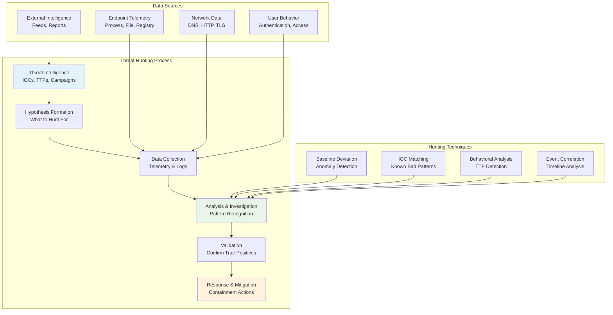

# Teknik Threat Hunting di SentinelOne

Panduan lengkap untuk melakukan threat hunting proaktif menggunakan SentinelOne EDR untuk mendeteksi ancaman tersembunyi dan meningkatkan postur keamanan organisasi.

---

## 🎯 Threat Hunting Methodology



---

## 🔍 Deep Visibility Query Interface

### 1. Accessing SentinelOne Deep Visibility

```
Management Console Navigation:
Console > Visibility > Deep Visibility > Query Builder
```

**Alternatif melalui sentinelctl:**
```bash
# Access query interface via CLI
sudo sentinelctl query --interface deep-visibility

# Run saved queries
sudo sentinelctl query --run "lateral_movement_hunt"

# Export query results
sudo sentinelctl query --run "suspicious_processes" --export csv
```

### 2. Query Syntax dan Structure

#### Basic Query Structure
```sql
-- Basic SELECT query
SELECT column1, column2, column3
FROM table_name
WHERE condition
ORDER BY column ASC/DESC
LIMIT number;

-- Time-based filtering
SELECT *
FROM processes
WHERE createdAt BETWEEN '2024-01-01' AND '2024-01-07'
ORDER BY createdAt DESC;
```

#### Available Data Tables
| Table | Description | Key Fields |
|-------|-------------|------------|
| **processes** | Process execution data | `processName`, `cmdLine`, `parentName`, `user` |
| **network** | Network connections | `srcIp`, `dstIp`, `dstPort`, `direction` |
| **files** | File operations | `filePath`, `fileType`, `action`, `hash` |
| **registry** | Registry modifications | `registryPath`, `registryKey`, `action` |
| **dns** | DNS queries | `dnsRequest`, `dnsResponse`, `queryType` |
| **events** | Security events | `eventType`, `description`, `severity` |

---

## 🕵️ Threat Hunting Scenarios

### Scenario 1: Hunting for Lateral Movement

#### 1.1 Suspicious Remote Connections

```sql
-- Detect potential lateral movement via RDP/SMB
SELECT 
    srcIp,
    dstIp,
    dstPort,
    COUNT(*) as connection_count,
    MIN(createdAt) as first_seen,
    MAX(createdAt) as last_seen
FROM network
WHERE 
    dstPort IN (445, 3389, 135, 139)
    AND direction = 'OUTGOING'
    AND createdAt > '2024-01-01'
GROUP BY srcIp, dstIp, dstPort
HAVING COUNT(*) > 5
ORDER BY connection_count DESC
LIMIT 50;
```

#### 1.2 Credential Access Patterns

```sql
-- Hunt for credential dumping activities
SELECT 
    processName,
    cmdLine,
    parentName,
    user,
    createdAt,
    endpointName
FROM processes
WHERE (
    (processName = 'rundll32.exe' AND cmdLine LIKE '%comsvcs%MiniDump%')
    OR (processName = 'tasklist.exe' AND cmdLine LIKE '%lsass%')
    OR (cmdLine LIKE '%sekurlsa%')
    OR (cmdLine LIKE '%mimikatz%')
    OR (filePath LIKE '%procdump%' AND cmdLine LIKE '%lsass%')
)
AND createdAt > '2024-01-01'
ORDER BY createdAt DESC;
```

#### 1.3 Anomalous Administrative Activity

```sql
-- Detect unusual administrative tool usage
SELECT 
    user,
    processName,
    cmdLine,
    parentName,
    COUNT(*) as execution_count,
    COUNT(DISTINCT endpointName) as endpoint_count
FROM processes
WHERE (
    processName IN ('psexec.exe', 'wmic.exe', 'net.exe', 'schtasks.exe')
    OR cmdLine LIKE '%powershell%Invoke-Command%'
    OR cmdLine LIKE '%wmic%process%'
)
AND user NOT LIKE '%SYSTEM%'
AND createdAt > '2024-01-01'
GROUP BY user, processName
HAVING COUNT(*) > 10 OR COUNT(DISTINCT endpointName) > 3
ORDER BY execution_count DESC;
```

### Scenario 2: Hunting for Persistence Mechanisms

#### 2.1 Registry-based Persistence

```sql
-- Hunt for registry persistence modifications
SELECT 
    registryPath,
    registryKey,
    registryValue,
    processName,
    user,
    endpointName,
    createdAt
FROM registry
WHERE (
    registryPath LIKE '%\\CurrentVersion\\Run%'
    OR registryPath LIKE '%\\CurrentVersion\\RunOnce%'
    OR registryPath LIKE '%\\Winlogon%'
    OR registryPath LIKE '%\\Image File Execution Options%'
    OR registryPath LIKE '%\\Services%'
)
AND action = 'Modified'
AND createdAt > '2024-01-01'
ORDER BY createdAt DESC;
```

#### 2.2 Scheduled Task Persistence

```sql
-- Detect suspicious scheduled tasks
SELECT 
    processName,
    cmdLine,
    user,
    parentName,
    endpointName,
    createdAt
FROM processes
WHERE (
    (processName = 'schtasks.exe' AND cmdLine LIKE '%create%')
    OR (processName = 'at.exe')
    OR (cmdLine LIKE '%Register-ScheduledTask%')
)
AND user NOT LIKE '%SYSTEM%'
AND createdAt > '2024-01-01'
ORDER BY createdAt DESC;
```

#### 2.3 Service-based Persistence

```sql
-- Hunt for suspicious service installations
SELECT 
    processName,
    cmdLine,
    user,
    parentName,
    endpointName,
    createdAt
FROM processes
WHERE (
    (processName = 'sc.exe' AND cmdLine LIKE '%create%')
    OR (cmdLine LIKE '%New-Service%')
    OR (processName = 'net.exe' AND cmdLine LIKE '%service%')
)
AND createdAt > '2024-01-01'
ORDER BY createdAt DESC;
```

### Scenario 3: Hunting for Data Exfiltration

#### 3.1 Large Data Transfers

```sql
-- Detect potential data exfiltration
SELECT 
    srcIp,
    dstIp,
    dstPort,
    processName,
    SUM(bytesOut) as total_bytes_out,
    COUNT(*) as connection_count,
    endpointName
FROM network
WHERE 
    direction = 'OUTGOING'
    AND dstIp NOT LIKE '10.%'
    AND dstIp NOT LIKE '192.168.%'
    AND dstIp NOT LIKE '172.%'
    AND createdAt > '2024-01-01'
GROUP BY srcIp, dstIp, processName, endpointName
HAVING SUM(bytesOut) > 100000000  -- > 100MB
ORDER BY total_bytes_out DESC;
```

#### 3.2 Suspicious File Operations

```sql
-- Hunt for potential data staging
SELECT 
    filePath,
    processName,
    action,
    user,
    fileSize,
    endpointName,
    createdAt
FROM files
WHERE (
    (filePath LIKE '%.zip%' OR filePath LIKE '%.rar%' OR filePath LIKE '%.7z%')
    AND fileSize > 50000000  -- > 50MB
)
OR (
    filePath LIKE '%temp%' 
    AND fileSize > 100000000  -- > 100MB
    AND action = 'Created'
)
AND createdAt > '2024-01-01'
ORDER BY fileSize DESC;
```

---

## 📊 Advanced Hunting Techniques

### 1. Behavioral Pattern Analysis

#### Process Chain Analysis
```sql
-- Analyze suspicious process execution chains
WITH ProcessChain AS (
    SELECT 
        p1.processName as parent_process,
        p2.processName as child_process,
        p3.processName as grandchild_process,
        p1.cmdLine as parent_cmd,
        p2.cmdLine as child_cmd,
        p3.cmdLine as grandchild_cmd,
        p1.createdAt,
        p1.endpointName
    FROM processes p1
    JOIN processes p2 ON p1.processUuid = p2.parentProcessUuid
    LEFT JOIN processes p3 ON p2.processUuid = p3.parentProcessUuid
    WHERE p1.createdAt > '2024-01-01'
)
SELECT *
FROM ProcessChain
WHERE (
    parent_process = 'winword.exe' AND child_process = 'powershell.exe'
    OR parent_process = 'excel.exe' AND child_process = 'cmd.exe'
    OR parent_process = 'outlook.exe' AND child_process = 'wscript.exe'
    OR (child_process = 'powershell.exe' AND grandchild_process = 'rundll32.exe')
)
ORDER BY createdAt DESC;
```

#### Time-based Anomaly Detection
```sql
-- Detect processes running at unusual times
SELECT 
    processName,
    COUNT(*) as execution_count,
    EXTRACT(HOUR FROM createdAt) as execution_hour,
    EXTRACT(DOW FROM createdAt) as day_of_week,
    endpointName
FROM processes
WHERE 
    createdAt > '2024-01-01'
    AND processName IN ('powershell.exe', 'cmd.exe', 'wscript.exe', 'cscript.exe')
GROUP BY processName, EXTRACT(HOUR FROM createdAt), EXTRACT(DOW FROM createdAt), endpointName
HAVING (
    (EXTRACT(HOUR FROM createdAt) BETWEEN 22 AND 6)  -- Night time
    OR EXTRACT(DOW FROM createdAt) IN (0, 6)         -- Weekend
)
AND COUNT(*) > 5
ORDER BY execution_count DESC;
```

### 2. Statistical Analysis

#### Frequency Analysis
```sql
-- Identify rare but suspicious processes
WITH ProcessFrequency AS (
    SELECT 
        processName,
        COUNT(*) as total_executions,
        COUNT(DISTINCT endpointName) as endpoint_count,
        COUNT(DISTINCT user) as user_count
    FROM processes
    WHERE createdAt > '2024-01-01'
    GROUP BY processName
)
SELECT 
    pf.processName,
    pf.total_executions,
    pf.endpoint_count,
    pf.user_count,
    p.cmdLine,
    p.filePath,
    p.user,
    p.endpointName,
    p.createdAt
FROM ProcessFrequency pf
JOIN processes p ON pf.processName = p.processName
WHERE 
    pf.total_executions BETWEEN 1 AND 10  -- Rare processes
    AND pf.endpoint_count = 1              -- Only on one endpoint
    AND p.createdAt > '2024-01-01'
    AND p.processName NOT LIKE '%.tmp%'
    AND p.filePath NOT LIKE '%\\Windows\\%'
ORDER BY pf.total_executions ASC;
```

---

## 🎨 Custom Hunting Rules

### 1. Creating Custom Hunting Rules

#### Rule Template Structure
```json
{
    "rule_name": "Custom_Hunting_Rule",
    "description": "Description of what this rule hunts for",
    "author": "Security Team",
    "severity": "medium",
    "query": {
        "sql": "SELECT * FROM table WHERE condition",
        "timeframe": "24h"
    },
    "schedule": {
        "frequency": "1h",
        "enabled": true
    },
    "actions": {
        "alert": true,
        "notify_email": ["security@company.com"],
        "create_incident": false
    }
}
```

#### Example: Lateral Movement Detection Rule
```json
{
    "rule_name": "Lateral_Movement_Hunt",
    "description": "Detects potential lateral movement via administrative tools",
    "author": "SOC Team",
    "severity": "high",
    "query": {
        "sql": "SELECT user, processName, cmdLine, endpointName, createdAt FROM processes WHERE (processName IN ('psexec.exe', 'wmic.exe') OR cmdLine LIKE '%powershell%Invoke-Command%') AND user NOT LIKE '%SYSTEM%' AND createdAt > NOW() - INTERVAL '1 hour'",
        "timeframe": "1h"
    },
    "schedule": {
        "frequency": "15m",
        "enabled": true
    },
    "actions": {
        "alert": true,
        "notify_email": ["soc@company.com"],
        "create_incident": true
    }
}
```

### 2. Deploying Custom Rules via sentinelctl

```bash
# Deploy custom hunting rule
sudo sentinelctl hunting rule deploy --file lateral_movement_hunt.json

# List active hunting rules
sudo sentinelctl hunting rule list

# Enable/disable hunting rule
sudo sentinelctl hunting rule enable --name "Lateral_Movement_Hunt"
sudo sentinelctl hunting rule disable --name "Lateral_Movement_Hunt"

# View rule execution results
sudo sentinelctl hunting rule results --name "Lateral_Movement_Hunt" --last 24h
```

---

## 📈 Hunting Campaign Management

### 1. Structured Hunting Campaigns

#### Campaign Planning Template
```yaml
campaign_name: "APT_Hunting_Campaign_Q1_2024"
description: "Hunt for APT techniques based on recent threat intelligence"
start_date: "2024-01-01"
end_date: "2024-03-31"

objectives:
  - Hunt for lateral movement techniques
  - Identify persistence mechanisms
  - Detect data exfiltration attempts
  - Validate detection coverage

hypotheses:
  - Adversaries are using WMI for lateral movement
  - Persistence is established via scheduled tasks
  - Data is staged in temp directories before exfiltration

queries:
  - lateral_movement_wmi.sql
  - persistence_schtasks.sql
  - data_staging_temp.sql

schedule:
  daily_hunts: ["lateral_movement_wmi", "persistence_schtasks"]
  weekly_hunts: ["data_staging_temp"]
  ad_hoc_hunts: ["custom_ioc_search"]

reporting:
  frequency: "weekly"
  stakeholders: ["CISO", "SOC Manager", "Incident Response"]
  format: "executive_summary"
```

#### Campaign Execution Commands
```bash
# Initialize hunting campaign
sudo sentinelctl hunting campaign create --config apt_hunting_q1.yaml

# Execute campaign hunts
sudo sentinelctl hunting campaign run --name "APT_Hunting_Campaign_Q1_2024"

# Generate campaign report
sudo sentinelctl hunting campaign report --name "APT_Hunting_Campaign_Q1_2024" --format pdf

# Export campaign results
sudo sentinelctl hunting campaign export --name "APT_Hunting_Campaign_Q1_2024" --format json
```

### 2. Threat Intelligence Integration

#### IOC-based Hunting
```bash
# Import threat intelligence IOCs
sudo sentinelctl threat-intel import --feed misp --url https://misp.company.com/feeds
sudo sentinelctl threat-intel import --file apt_iocs.json

# Run IOC hunting across endpoints
sudo sentinelctl hunting ioc-search --indicators-file latest_iocs.txt

# Automated IOC hunting
sudo sentinelctl hunting schedule --type ioc-match --interval 4h --feed misp
```

#### YARA Rule Integration
```bash
# Deploy YARA rules for hunting
sudo sentinelctl hunting yara deploy --rule-file custom_hunt_rules.yar

# Run YARA-based memory hunting
sudo sentinelctl hunting yara scan --target memory --rule-name "apt_memory_hunt"

# Scheduled YARA hunts
sudo sentinelctl hunting schedule --type yara --rule-name "malware_hunt" --interval 24h
```

---

## 🔬 Investigation and Analysis

### 1. Incident Timeline Reconstruction

```sql
-- Reconstruct timeline for specific endpoint
SELECT 
    'PROCESS' as event_type,
    processName as description,
    cmdLine as details,
    user,
    createdAt as timestamp
FROM processes
WHERE endpointName = 'ENDPOINT-001'
    AND createdAt BETWEEN '2024-01-15 08:00:00' AND '2024-01-15 18:00:00'

UNION ALL

SELECT 
    'NETWORK' as event_type,
    CONCAT(dstIp, ':', dstPort) as description,
    CONCAT('Direction: ', direction, ', Bytes: ', bytesOut) as details,
    '' as user,
    createdAt as timestamp
FROM network
WHERE endpointName = 'ENDPOINT-001'
    AND createdAt BETWEEN '2024-01-15 08:00:00' AND '2024-01-15 18:00:00'

UNION ALL

SELECT 
    'FILE' as event_type,
    filePath as description,
    CONCAT('Action: ', action, ', Size: ', fileSize) as details,
    '' as user,
    createdAt as timestamp
FROM files
WHERE endpointName = 'ENDPOINT-001'
    AND createdAt BETWEEN '2024-01-15 08:00:00' AND '2024-01-15 18:00:00'

ORDER BY timestamp ASC;
```

### 2. Correlation Analysis

```bash
# Correlate events across multiple endpoints
sudo sentinelctl hunting correlate --timeframe 1h --events "process,network,file"

# Cross-endpoint correlation
sudo sentinelctl hunting correlate --pattern lateral_movement --endpoints "ENDPOINT-001,ENDPOINT-002"

# User behavior correlation
sudo sentinelctl hunting correlate --user "admin@company.com" --timeframe 24h
```

---

## 📊 Hunting Metrics and KPIs

### 1. Hunting Effectiveness Metrics

```bash
# Generate hunting statistics
sudo sentinelctl hunting stats --period 30d

# Example output:
Hunting Statistics (Last 30 days):
┌─────────────────────┬────────┬──────────────┬─────────────┐
│ Metric              │ Count  │ Percentage   │ Trend       │
├─────────────────────┼────────┼──────────────┼─────────────┤
│ Total Hunts         │ 456    │ -            │ ↑ +12%      │
│ Successful Hunts    │ 89     │ 19.5%        │ ↑ +8%       │
│ True Positives      │ 67     │ 14.7%        │ ↑ +15%      │
│ False Positives     │ 22     │ 4.8%         │ ↓ -5%       │
│ New IOCs Generated  │ 34     │ -            │ ↑ +20%      │
│ Incidents Created   │ 12     │ 2.6%         │ ↑ +25%      │
└─────────────────────┴────────┴──────────────┴─────────────┘

Top Hunting Categories:
• Lateral Movement: 28 successful hunts
• Persistence: 19 successful hunts  
• Credential Access: 15 successful hunts
• Data Exfiltration: 12 successful hunts
• Command & Control: 8 successful hunts
```

### 2. ROI and Impact Metrics

```bash
# Calculate hunting ROI
sudo sentinelctl hunting metrics roi --period quarterly

# Time-to-detection improvements
sudo sentinelctl hunting metrics ttd --baseline 2024-Q1 --current 2024-Q2

# Coverage assessment
sudo sentinelctl hunting metrics coverage --framework mitre-attack
```

---

## 🎯 Best Practices untuk Threat Hunting

### 1. Structured Approach

!!! tip "Hunting Methodology"
    - **Start with Intelligence**: Base hunts on current threat landscape
    - **Hypothesis-Driven**: Form clear hypotheses before hunting
    - **Data-First Approach**: Understand your data sources and limitations
    - **Document Everything**: Keep detailed logs of hunts and findings
    - **Iterate and Improve**: Refine techniques based on results

### 2. Query Optimization

!!! warning "Performance Considerations"
    - **Use time bounds**: Always include time filters in queries
    - **Index awareness**: Understand which fields are indexed
    - **Limit result sets**: Use LIMIT to prevent overwhelming results
    - **Test in dev**: Always test complex queries in non-production first
    - **Monitor performance**: Watch for queries that impact system performance

### 3. Collaborative Hunting

```bash
# Share hunting queries with team
sudo sentinelctl hunting query share --name "lateral_movement_hunt" --team soc

# Collaborative hunting sessions
sudo sentinelctl hunting session create --name "apt_hunt" --participants "analyst1,analyst2"

# Knowledge sharing
sudo sentinelctl hunting knowledge export --format wiki
```

---

## 🔧 Automation and Orchestration

### 1. Automated Hunting Workflows

```python
# Python script for automated hunting
#!/usr/bin/env python3
import subprocess
import json
from datetime import datetime, timedelta

def run_hunting_campaign():
    """Execute daily hunting campaign"""
    
    # Define hunting queries
    hunts = [
        "lateral_movement_detection",
        "credential_access_hunt", 
        "persistence_mechanisms",
        "data_staging_hunt"
    ]
    
    results = {}
    
    for hunt in hunts:
        print(f"Running hunt: {hunt}")
        
        # Execute hunt via sentinelctl
        cmd = f"sentinelctl hunting run --name {hunt} --format json"
        result = subprocess.run(cmd, shell=True, capture_output=True, text=True)
        
        if result.returncode == 0:
            hunt_data = json.loads(result.stdout)
            results[hunt] = hunt_data
            
            # Check for positive hits
            if hunt_data.get('hit_count', 0) > 0:
                print(f"🚨 Positive hits in {hunt}: {hunt_data['hit_count']}")
                send_alert(hunt, hunt_data)
        else:
            print(f"❌ Error in hunt {hunt}: {result.stderr}")
    
    return results

def send_alert(hunt_name, data):
    """Send alert for positive hunting results"""
    # Implementation for alerting (email, Slack, etc.)
    pass

if __name__ == "__main__":
    results = run_hunting_campaign()
    print(f"Hunting campaign completed. Total hunts: {len(results)}")
```

### 2. Integration dengan SOAR Platforms

```bash
# Integrate with Phantom/SOAR
sudo sentinelctl integration soar --platform phantom --config "
{
    'endpoint': 'https://phantom.company.com',
    'api_key': 'your-api-key',
    'auto_create_containers': true,
    'severity_mapping': {
        'high': 'high',
        'medium': 'medium',
        'low': 'informational'
    }
}"

# Trigger SOAR playbooks from hunting results
sudo sentinelctl hunting action --result-id hunt-123 --soar-playbook "investigate_lateral_movement"
```

---

## ✅ Validation Checklist

### Hunting Program Maturity
- [ ] **Threat Intelligence Integration**: IOC feeds aktif dan terupdate
- [ ] **Custom Query Library**: Repository query hunting yang terorganisir
- [ ] **Automated Hunts**: Hunting otomatis untuk TTPs umum
- [ ] **Metrics and Reporting**: KPI hunting dilacak dan dilaporkan
- [ ] **Team Training**: Analyst terlatih dalam teknik hunting
- [ ] **Tool Proficiency**: Tim mahir menggunakan Deep Visibility
- [ ] **Documentation**: Prosedur dan playbook hunting terdokumentasi

### Technical Validation
- [ ] **Query Performance**: Semua query berjalan dalam waktu < 30 detik
- [ ] **Data Coverage**: Telemetry lengkap dari semua critical assets
- [ ] **False Positive Rate**: FP rate hunting < 10%
- [ ] **Detection Coverage**: Coverage MITRE ATT&CK > 70%
- [ ] **Integration Testing**: SIEM/SOAR integration berfungsi

---

*Untuk advanced hunting techniques dan custom development, hubungi Security Team atau rujuk ke SentinelOne Developer Documentation.*

*Last updated: {{ git_revision_date_localized }}*
