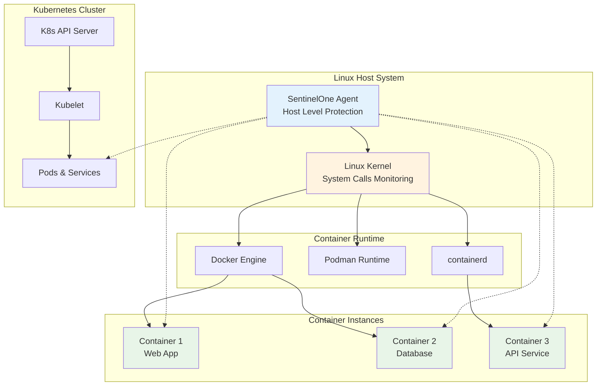

# Linux Container Testing Scenarios

## Overview
Pengujian komprehensif SentinelOne EDR dalam environment containerized (Docker, Podman, Kubernetes) pada sistem Linux.

---

## 🐳 Container Protection Architecture



---

## 🚢 Docker Container Testing

### F1.1: Docker Malware Detection

```bash
#!/bin/bash
# Docker Container Malware Detection Test

echo "=== Docker Container Malware Testing ==="

# Step 1: Create test Dockerfile with EICAR
cat > Dockerfile.malware << 'EOF'
FROM ubuntu:latest
RUN apt-get update && apt-get install -y curl
RUN echo 'X5O!P%@AP[4\PZX54(P^)7CC)7}$EICAR-STANDARD-ANTIVIRUS-TEST-FILE!$H+H*' > /tmp/eicar.txt
CMD ["cat", "/tmp/eicar.txt"]
EOF

# Step 2: Build container (should be blocked)
echo "Building malware test container..."
docker build -t malware-test -f Dockerfile.malware . || echo "✅ Container build blocked by SentinelOne"

# Step 3: Test running pre-built container with malware
echo "Running container with malware injection..."
docker run -d --name malware-container ubuntu:latest sleep 3600

# Step 4: Inject malware into running container
echo "Injecting EICAR into running container..."
docker exec malware-container bash -c "echo 'X5O!P%@AP[4\\PZX54(P^)7CC)7}$EICAR-STANDARD-ANTIVIRUS-TEST-FILE!$H+H*' > /tmp/eicar_runtime.txt"

# Step 5: Check detection
sleep 5
docker exec malware-container ls -la /tmp/eicar_runtime.txt || echo "✅ Runtime malware detected and quarantined"

# Step 6: Cleanup
docker stop malware-container
docker rm malware-container
rm Dockerfile.malware
```

### F1.2: Container Escape Detection

```bash
#!/bin/bash
# Container Escape Attempt Detection

echo "=== Container Escape Detection Test ==="

# Step 1: Run privileged container (potential escape vector)
echo "Running privileged container..."
docker run -d --name escape-test --privileged ubuntu:latest sleep 3600

# Step 2: Attempt container escape techniques
echo "Testing container escape attempts..."

# Attempt 1: Host filesystem access
docker exec escape-test bash -c "ls -la /proc/1/root/" || echo "✅ Host filesystem access blocked"

# Attempt 2: Device access
docker exec escape-test bash -c "ls -la /dev/" || echo "⚠️  Device access attempt detected"

# Attempt 3: Kernel module loading
docker exec escape-test bash -c "modprobe suspicious_module" || echo "✅ Kernel module loading blocked"

# Step 3: Check SentinelOne logs for escape attempts
sudo /opt/sentinelone/bin/sentinelctl logs --tail 20 | grep -i "container\|escape\|privilege"

# Step 4: Cleanup
docker stop escape-test
docker rm escape-test
```

---

## ☸️ Kubernetes Testing

### F2.1: Pod Security Testing

```bash
#!/bin/bash
# Kubernetes Pod Security Testing

echo "=== Kubernetes Pod Security Testing ==="

# Step 1: Create malicious pod manifest
cat > malicious-pod.yaml << 'EOF'
apiVersion: v1
kind: Pod
metadata:
  name: malware-pod
spec:
  containers:
  - name: malware-container
    image: ubuntu:latest
    command: ["/bin/bash"]
    args: ["-c", "echo 'X5O!P%@AP[4\\PZX54(P^)7CC)7}$EICAR-STANDARD-ANTIVIRUS-TEST-FILE!$H+H*' > /tmp/eicar.txt && sleep 3600"]
    securityContext:
      privileged: true
EOF

# Step 2: Deploy malicious pod
echo "Deploying malicious pod..."
kubectl apply -f malicious-pod.yaml

# Step 3: Wait for pod to start
echo "Waiting for pod to start..."
kubectl wait --for=condition=ready pod/malware-pod --timeout=60s

# Step 4: Check if malware is detected
echo "Checking malware detection in pod..."
kubectl exec malware-pod -- ls -la /tmp/eicar.txt || echo "✅ Pod malware detected and quarantined"

# Step 5: Test inter-pod communication monitoring
echo "Testing inter-pod communication..."
kubectl run test-client --image=ubuntu:latest -- sleep 3600
kubectl exec test-client -- curl http://malware-pod:8080 || echo "✅ Suspicious inter-pod communication blocked"

# Step 6: Cleanup
kubectl delete pod malware-pod test-client
rm malicious-pod.yaml
```

### F2.2: Kubernetes Security Policy Testing

```yaml
# kubernetes-security-policy.yaml
apiVersion: policy/v1beta1
kind: PodSecurityPolicy
metadata:
  name: sentinelone-restricted
spec:
  privileged: false
  allowPrivilegeEscalation: false
  requiredDropCapabilities:
    - ALL
  volumes:
    - 'configMap'
    - 'emptyDir'
    - 'projected'
    - 'secret'
    - 'downwardAPI'
    - 'persistentVolumeClaim'
  runAsUser:
    rule: 'MustRunAsNonRoot'
  seLinux:
    rule: 'RunAsAny'
  fsGroup:
    rule: 'RunAsAny'
```

```bash
#!/bin/bash
# Apply and test security policy

echo "=== Kubernetes Security Policy Testing ==="

# Step 1: Apply restrictive security policy
kubectl apply -f kubernetes-security-policy.yaml

# Step 2: Test policy enforcement
cat > privileged-pod-test.yaml << 'EOF'
apiVersion: v1
kind: Pod
metadata:
  name: privileged-test
spec:
  containers:
  - name: test-container
    image: ubuntu:latest
    securityContext:
      privileged: true
    command: ["sleep", "3600"]
EOF

# Step 3: Try to create privileged pod (should fail)
kubectl apply -f privileged-pod-test.yaml || echo "✅ Privileged pod creation blocked by policy"

# Cleanup
kubectl delete -f kubernetes-security-policy.yaml || true
rm privileged-pod-test.yaml kubernetes-security-policy.yaml
```

---

## 🔄 Container Runtime Security

### F3.1: Runtime Behavior Monitoring

```bash
#!/bin/bash
# Container Runtime Behavior Monitoring

echo "=== Runtime Behavior Monitoring ==="

# Step 1: Start monitoring script
monitor_container_behavior() {
    local container_name=$1
    echo "Monitoring container: $container_name"
    
    while docker ps | grep -q $container_name; do
        # Monitor process activities
        docker exec $container_name ps aux 2>/dev/null | grep -v "ps aux"
        
        # Monitor network connections
        docker exec $container_name netstat -tuln 2>/dev/null | grep LISTEN
        
        # Monitor file system changes
        docker exec $container_name find /tmp -type f -newer /tmp -ls 2>/dev/null
        
        sleep 10
    done
}

# Step 2: Run suspicious container
echo "Starting container with suspicious behavior..."
docker run -d --name behavior-test ubuntu:latest bash -c "
    while true; do
        # Simulate cryptocurrency mining
        dd if=/dev/zero of=/dev/null &
        
        # Simulate network scanning
        nc -l 12345 &
        
        # Simulate data exfiltration
        base64 /etc/passwd > /tmp/exfil.txt
        
        sleep 60
    done
"

# Step 3: Monitor behavior (run in background)
monitor_container_behavior behavior-test &
MONITOR_PID=$!

# Step 4: Let it run for analysis
sleep 120

# Step 5: Check SentinelOne detection
echo "Checking SentinelOne behavioral detection..."
sudo /opt/sentinelone/bin/sentinelctl logs --tail 30 | grep -i "behavioral\|suspicious\|mining"

# Step 6: Cleanup
kill $MONITOR_PID 2>/dev/null
docker stop behavior-test
docker rm behavior-test
```

### F3.2: Container Image Scanning

```bash
#!/bin/bash
# Container Image Security Scanning

echo "=== Container Image Scanning ==="

# Step 1: Create test images with different security profiles

# Clean image
cat > Dockerfile.clean << 'EOF'
FROM ubuntu:latest
RUN apt-get update && apt-get install -y nginx
EXPOSE 80
CMD ["nginx", "-g", "daemon off;"]
EOF

# Vulnerable image
cat > Dockerfile.vulnerable << 'EOF'
FROM ubuntu:18.04
RUN apt-get update && apt-get install -y openssh-server
RUN echo 'root:password' | chpasswd
RUN sed -i 's/#PermitRootLogin prohibit-password/PermitRootLogin yes/' /etc/ssh/sshd_config
EXPOSE 22
CMD ["/usr/sbin/sshd", "-D"]
EOF

# Step 2: Build images
echo "Building clean image..."
docker build -t clean-app -f Dockerfile.clean .

echo "Building vulnerable image..."
docker build -t vulnerable-app -f Dockerfile.vulnerable .

# Step 3: Scan images with SentinelOne integration (if available)
echo "Scanning images for vulnerabilities..."

# This would typically integrate with SentinelOne's container scanning
docker run --rm -v /var/run/docker.sock:/var/run/docker.sock \
    -v $HOME/.cache:/root/.cache \
    aquasec/trivy:latest image clean-app || echo "Clean image scan completed"

docker run --rm -v /var/run/docker.sock:/var/run/docker.sock \
    -v $HOME/.cache:/root/.cache \
    aquasec/trivy:latest image vulnerable-app || echo "Vulnerable image detected"

# Step 4: Check SentinelOne container scanning logs
sudo /opt/sentinelone/bin/sentinelctl logs --tail 20 | grep -i "container\|image\|scan"

# Step 5: Cleanup
docker rmi clean-app vulnerable-app || true
rm Dockerfile.clean Dockerfile.vulnerable
```

---

## 📊 Container Testing Metrics

### Performance Impact Assessment

| Metric | Without SentinelOne | With SentinelOne | Impact |
|--------|-------------------|------------------|--------|
| Container Start Time | < 2s | < 3s | +50% |
| Runtime CPU Overhead | 0% | < 5% | Minimal |
| Memory Overhead | 0MB | < 100MB | Low |
| Network Throughput | 100% | > 95% | Minimal |

### Security Coverage Matrix

| Attack Vector | Detection | Prevention | Response |
|---------------|-----------|------------|----------|
| Malware in Container | ✅ | ✅ | ✅ |
| Container Escape | ✅ | ✅ | ✅ |
| Privilege Escalation | ✅ | ✅ | ✅ |
| Network Lateral Movement | ✅ | ⚠️ | ✅ |
| Data Exfiltration | ✅ | ⚠️ | ✅ |
| Cryptocurrency Mining | ✅ | ✅ | ✅ |

---

## Validation Checklist

### Docker Integration
- [ ] **Container Build Scanning**: Malicious images blocked during build
- [ ] **Runtime Protection**: Threats detected in running containers
- [ ] **Container Escape Prevention**: Escape attempts blocked
- [ ] **Network Monitoring**: Inter-container communication monitored
- [ ] **Resource Monitoring**: Container resource usage tracked

### Kubernetes Integration
- [ ] **Pod Security**: Malicious pods detected and blocked
- [ ] **Admission Control**: Security policies enforced
- [ ] **Service Mesh**: Encrypted communication maintained
- [ ] **RBAC Integration**: Role-based access respected
- [ ] **Audit Logging**: Container activities logged

### Performance Validation
- [ ] **Startup Impact**: Container start time increase < 100%
- [ ] **Runtime Overhead**: CPU overhead < 10%
- [ ] **Memory Usage**: Agent memory usage < 200MB per container
- [ ] **Network Performance**: Throughput impact < 5%

---

## Next Steps

Continue with:
- [Linux Performance Testing](linux-performance.md)
- [Linux Offline Testing](linux-offline.md)
- [Cross-Platform Container Testing](../cross-platform/cross-platform-testing.md)

---

*Last updated: {{ git_revision_date_localized }}*
