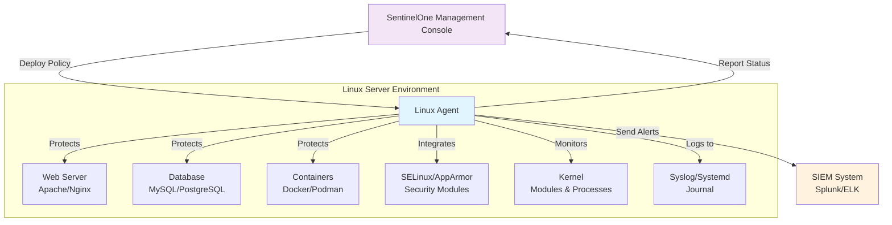
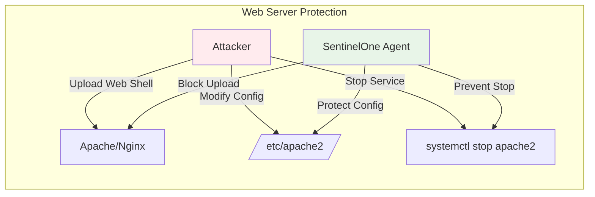
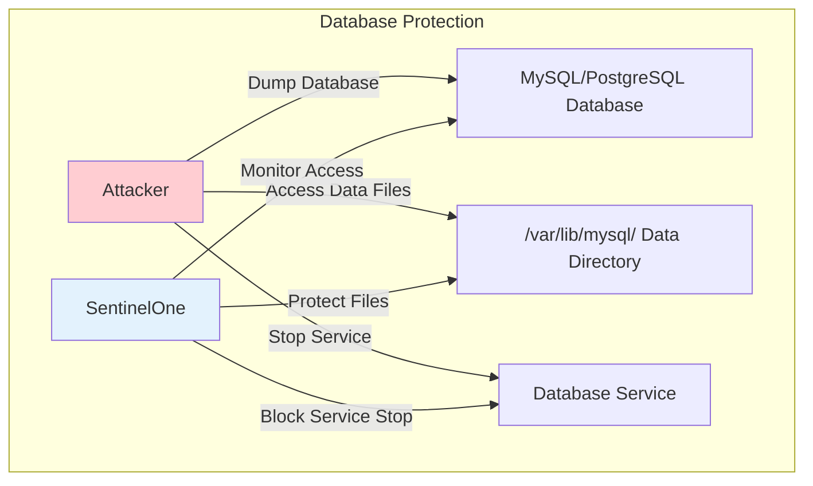
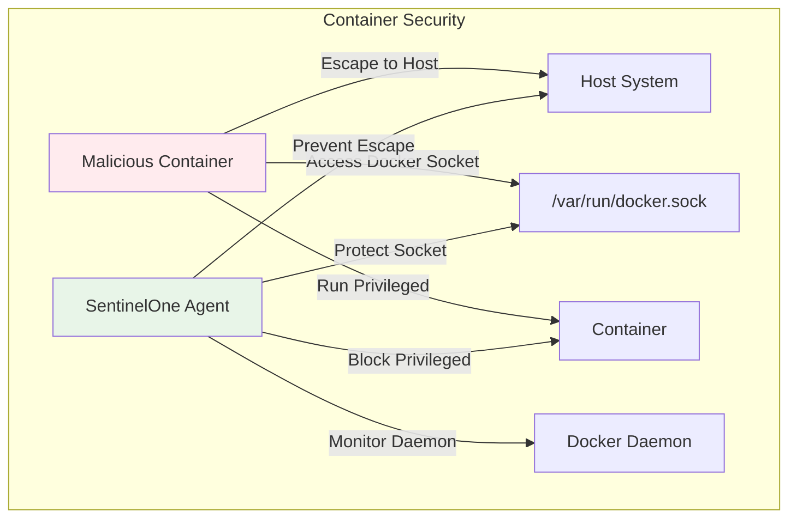
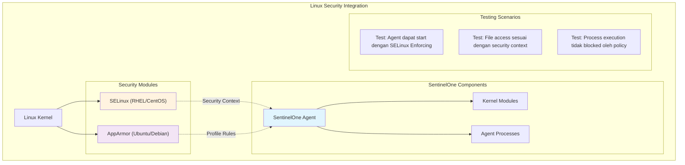

# Linux Server Testing Overview

## Overview
Dokumentasi khusus testing SentinelOne EDR pada platform **Linux Server** dengan fokus pada production environments, enterprise distributions, dan Linux-specific security mechanisms.

## 📋 Konsep Testing Linux Server

### Apa yang Akan Diuji?
Pada Linux server testing, kita akan menguji bagaimana **SentinelOne EDR agent** berinteraksi dan melindungi berbagai komponen critical di Linux server production:



### Skenario Testing yang Akan Dilakukan:

#### 1. **Integration Testing** 🔗
**Konsep**: Memastikan SentinelOne agent dapat berintegrasi dengan Linux security systems tanpa conflict
- **SELinux/AppArmor**: Agent harus bisa berjalan dalam security context yang ketat
- **Systemd**: Agent harus ter-register sebagai service yang proper
- **Syslog**: Events harus ter-forward ke logging system

#### 2. **Application Protection Testing** 🛡️
**Konsep**: Memvalidasi bahwa critical applications tetap terlindungi dan berjalan normal
- **Web Server**: Apache/Nginx tetap serve traffic, tapi terlindungi dari web shell upload
- **Database**: MySQL/PostgreSQL tetap accessible, tapi data directory terlindungi dari tampering
- **Containers**: Docker/Podman tetap functional, tapi container escape di-prevent

#### 3. **Threat Detection Testing** 🚨
**Konsep**: Menguji kemampuan detection dalam Linux-specific attack vectors
- **Privilege Escalation**: Sudo/SUID abuse detection
- **Container Escape**: Breakout attempt dari container ke host
- **Rootkit Detection**: Hidden process/file detection

---

## 🐧 Linux Server Environment Focus

### Target Distributions
- **Red Hat Enterprise Linux** (RHEL 8/9)
- **CentOS** (7/8/Stream)
- **Ubuntu Server** (20.04 LTS, 22.04 LTS)
- **SUSE Linux Enterprise Server** (SLES 12/15)
- **Debian** (10/11/12)
- **Amazon Linux** (2/2023)
- **Oracle Linux** (8/9)

### Critical Linux Server Roles - Apa yang Akan Diproteksi?

#### 🌐 Web Server Protection (Apache/Nginx)
**Konsep**: SentinelOne akan melindungi web server dari web shell upload, configuration tampering, dan service manipulation.



**Yang Diuji**:
- ✅ Web shell upload prevention ke `/var/www/html/`
- ✅ Configuration file protection (`/etc/apache2/`, `/etc/nginx/`)
- ✅ Service tampering prevention (`systemctl stop apache2`)

#### 🗄️ Database Protection (MySQL/PostgreSQL)
**Konsep**: Database server dan data directory harus terlindungi dari unauthorized access dan tampering.



**Yang Diuji**:
- ✅ Database data directory protection (`/var/lib/mysql/`, `/var/lib/postgresql/`)
- ✅ Service stop prevention (`systemctl stop mysql`)
- ✅ Malicious file creation in data directory

#### 🐳 Container Runtime Protection (Docker/Podman)
**Konsep**: Container runtime harus terlindungi dari privileged container, container escape, dan Docker socket abuse.



**Yang Diuji**:
- ✅ Privileged container blocking (`docker run --privileged`)
- ✅ Host namespace access prevention (`--pid=host --net=host`)
- ✅ Docker socket permission protection (`chmod 777 /var/run/docker.sock`)
- ✅ Container escape attempt detection

#### 🔐 SSH Server Protection
**Konsep**: SSH server harus dilindungi dari brute force attacks dan configuration tampering.

#### 📁 File Sharing Protection (NFS/Samba)
**Konsep**: File sharing services harus terlindungi dari unauthorized access dan data exfiltration.

---

## 🔐 Linux-Specific Security Testing

### System-Level Security Integration - Penjelasan Konsep

#### 🛡️ SELinux/AppArmor Integration
**Konsep**: SentinelOne agent harus dapat berjalan dalam Linux security framework (SELinux/AppArmor) tanpa conflict. Ini adalah Mandatory Access Control (MAC) system yang membatasi akses berdasarkan security policy.



**Yang Akan Diuji**:
- ✅ **SELinux Compatibility**: Agent berjalan normal dalam mode Enforcing
- ✅ **Security Context**: Process memiliki correct SELinux context
- ✅ **File Access**: Agent dapat akses file dengan proper permissions
- ✅ **AppArmor Profile**: Agent compliance dengan AppArmor rules
- ✅ **Policy Integration**: No violations dalam audit log

**Kenapa Penting?**
- Banyak enterprise Linux menggunakan SELinux (RHEL, CentOS)
- Ubuntu server default menggunakan AppArmor
- Security compliance requirement di enterprise environment
- Jika agent blocked oleh MAC, protection akan gagal
```bash
#!/bin/bash
echo "=== LINUX SECURITY MODULE INTEGRATION TESTING ==="

# Check SELinux status (RHEL/CentOS)
if command -v sestatus &> /dev/null; then
    echo "=== SELinux Status ==="
    sestatus
    
    # Check SentinelOne SELinux context
    if ps aux | grep -q sentinelone-agent; then
        SENTINEL_PID=$(pidof sentinelone-agent)
        echo "SentinelOne process security context:"
        ps -eZ | grep sentinelone
        
        # Test SELinux policy for SentinelOne
        echo "Testing SELinux policy compliance..."
        audit2why < /var/log/audit/audit.log | grep -i sentinel
        
        # Verify SentinelOne can operate under SELinux
        if selinuxenabled; then
            echo "✅ SELinux enabled - testing SentinelOne compatibility"
            
            # Test file access under SELinux
            sudo /opt/sentinelone/bin/sentinelctl status
            if [ $? -eq 0 ]; then
                echo "✅ SentinelOne operates correctly under SELinux"
            else
                echo "❌ SentinelOne blocked by SELinux"
            fi
        fi
    fi
fi

# Check AppArmor status (Ubuntu/Debian)
if command -v aa-status &> /dev/null; then
    echo "=== AppArmor Status ==="
    sudo aa-status
    
    # Check if SentinelOne has AppArmor profile
    if [ -f "/etc/apparmor.d/sentinelone" ]; then
        echo "✅ SentinelOne AppArmor profile found"
        sudo aa-status | grep sentinelone
    else
        echo "⚪ No specific AppArmor profile for SentinelOne"
    fi
    
    # Test AppArmor compliance
    if systemctl is-active apparmor &> /dev/null; then
        echo "Testing SentinelOne under AppArmor..."
        sudo /opt/sentinelone/bin/sentinelctl status
        if [ $? -eq 0 ]; then
            echo "✅ SentinelOne operates correctly under AppArmor"
        else
            echo "❌ SentinelOne may be restricted by AppArmor"
        fi
    fi
fi
```

#### Kernel Module Protection
```bash
#!/bin/bash
echo "=== KERNEL MODULE PROTECTION TESTING ==="

# Check loaded SentinelOne kernel modules
echo "Checking SentinelOne kernel modules..."
SENTINEL_MODULES=$(lsmod | grep sentinelone)
if [ -n "$SENTINEL_MODULES" ]; then
    echo "✅ SentinelOne kernel modules loaded:"
    echo "$SENTINEL_MODULES"
    
    # Test kernel module protection
    for module in $(echo "$SENTINEL_MODULES" | awk '{print $1}'); do
        echo "Testing protection for module: $module"
        
        # Attempt to remove module
        echo "Attempting to remove kernel module $module..."
        sudo rmmod "$module" 2>&1
        
        # Check if module still loaded
        if lsmod | grep -q "$module"; then
            echo "✅ Kernel module $module protected from removal"
        else
            echo "❌ CRITICAL: Kernel module $module was removed!"
        fi
    done
    
    # Test malicious module loading prevention
    echo "Testing malicious module loading prevention..."
    
    # Create a test module (non-malicious)
    cat > /tmp/test_module.c << 'EOF'
#include <linux/init.h>
#include <linux/module.h>
#include <linux/kernel.h>

static int __init test_init(void) {
    printk(KERN_INFO "Test module loaded\n");
    return 0;
}

static void __exit test_exit(void) {
    printk(KERN_INFO "Test module unloaded\n");
}

module_init(test_init);
module_exit(test_exit);
MODULE_LICENSE("GPL");
MODULE_DESCRIPTION("Test module");
EOF
    
    # Attempt to compile and load (should be blocked by SentinelOne)
    if command -v make &> /dev/null && [ -d "/lib/modules/$(uname -r)/build" ]; then
        cd /tmp
        echo 'obj-m += test_module.o' > Makefile
        make -C "/lib/modules/$(uname -r)/build" M=/tmp modules &> /dev/null
        
        if [ -f "test_module.ko" ]; then
            sudo insmod test_module.ko 2>&1
            if lsmod | grep -q "test_module"; then
                echo "❌ Unauthorized module loading succeeded"
                sudo rmmod test_module
            else
                echo "✅ Unauthorized module loading blocked"
            fi
            rm -f test_module.ko test_module.o test_module.mod.* modules.order Module.symvers .test_module.*
        fi
        rm -f Makefile test_module.c
        cd - > /dev/null
    fi
else
    echo "⚪ No SentinelOne kernel modules detected"
fi
```

#### Process Protection & Anti-Tampering
```bash
#!/bin/bash
echo "=== PROCESS PROTECTION TESTING ==="

# Find SentinelOne processes
SENTINEL_PIDS=($(pgrep -f sentinelone))

if [ ${#SENTINEL_PIDS[@]} -gt 0 ]; then
    echo "✅ SentinelOne processes found: ${SENTINEL_PIDS[*]}"
    
    for pid in "${SENTINEL_PIDS[@]}"; do
        echo "Testing protection for PID: $pid"
        
        # Get process name
        PROCESS_NAME=$(ps -p $pid -o comm=)
        echo "Process: $PROCESS_NAME"
        
        # Test SIGTERM
        echo "Testing SIGTERM signal..."
        sudo kill -TERM $pid
        sleep 2
        if kill -0 $pid 2>/dev/null; then
            echo "✅ Process survived SIGTERM"
        else
            echo "❌ Process terminated by SIGTERM"
        fi
        
        # Test SIGKILL
        echo "Testing SIGKILL signal..."
        sudo kill -9 $pid
        sleep 2
        if kill -0 $pid 2>/dev/null; then
            echo "✅ Process survived SIGKILL"
        else
            echo "❌ Process terminated by SIGKILL"
        fi
        
        # Test process freezing (SIGSTOP)
        echo "Testing process freezing..."
        sudo kill -STOP $pid
        sleep 1
        
        # Check if process is still responsive
        sudo kill -CONT $pid
        if kill -0 $pid 2>/dev/null; then
            echo "✅ Process resumed after freeze attempt"
        else
            echo "❌ Process killed during freeze test"
        fi
        
        # Test ptrace attachment
        echo "Testing ptrace protection..."
        gdb -p $pid -batch -ex "quit" 2>&1 | grep -q "Operation not permitted"
        if [ $? -eq 0 ]; then
            echo "✅ Process protected from ptrace"
        else
            echo "❌ Process vulnerable to ptrace"
        fi
        
        echo "---"
    done
else
    echo "❌ No SentinelOne processes found!"
fi
```

---

## 🚀 Linux Server Application Testing

### Apache HTTP Server Protection
```bash
#!/bin/bash
echo "=== APACHE HTTP SERVER PROTECTION TESTING ==="

# Check if Apache is running
if systemctl is-active httpd &> /dev/null || systemctl is-active apache2 &> /dev/null; then
    echo "✅ Apache HTTP Server detected"
    
    # Detect Apache service name
    if systemctl is-active httpd &> /dev/null; then
        APACHE_SERVICE="httpd"
        APACHE_CONFIG_DIR="/etc/httpd"
        APACHE_WEB_ROOT="/var/www/html"
    else
        APACHE_SERVICE="apache2"
        APACHE_CONFIG_DIR="/etc/apache2"
        APACHE_WEB_ROOT="/var/www/html"
    fi
    
    echo "Apache service: $APACHE_SERVICE"
    
    # Test web shell upload protection
    echo "Testing web shell upload protection..."
    WEB_SHELL_CONTENT='#!/bin/bash
echo "Content-Type: text/html"
echo ""
if [ -n "$QUERY_STRING" ]; then
    cmd=$(echo "$QUERY_STRING" | sed "s/cmd=//")
    echo "<pre>"
    eval "$cmd" 2>&1
    echo "</pre>"
fi'
    
    # Attempt to create web shell
    try_create_webshell() {
        local shell_path="$1"
        echo "$WEB_SHELL_CONTENT" > "$shell_path" 2>/dev/null
        chmod +x "$shell_path" 2>/dev/null
        
        if [ -f "$shell_path" ]; then
            echo "❌ Web shell created at $shell_path - SECURITY RISK!"
            rm -f "$shell_path"
            return 1
        else
            echo "✅ Web shell creation blocked"
            return 0
        fi
    }
    
    # Test in various locations
    try_create_webshell "$APACHE_WEB_ROOT/shell.cgi"
    try_create_webshell "/tmp/apache_shell.sh"
    
    # Test Apache configuration tampering
    echo "Testing Apache configuration protection..."
    CONFIG_FILE="$APACHE_CONFIG_DIR/conf.d/test_config.conf"
    
    echo "# Test configuration" > "$CONFIG_FILE" 2>/dev/null
    if [ -f "$CONFIG_FILE" ]; then
        echo "❌ Apache configuration modification succeeded"
        rm -f "$CONFIG_FILE"
    else
        echo "✅ Apache configuration modification blocked"
    fi
    
    # Test Apache service tampering
    echo "Testing Apache service protection..."
    systemctl stop $APACHE_SERVICE 2>&1 | grep -q "Failed"
    if [ $? -eq 0 ]; then
        echo "✅ Apache service stop blocked"
    else
        if systemctl is-active $APACHE_SERVICE &> /dev/null; then
            echo "✅ Apache service still running"
        else
            echo "❌ Apache service was stopped"
            systemctl start $APACHE_SERVICE
        fi
    fi
    
else
    echo "⚪ Apache HTTP Server not detected"
fi
```

### Database Server Protection
```bash
#!/bin/bash
echo "=== DATABASE SERVER PROTECTION TESTING ==="

# Test MySQL/MariaDB protection
if systemctl is-active mysql &> /dev/null || systemctl is-active mariadb &> /dev/null; then
    echo "✅ MySQL/MariaDB detected"
    
    # Determine service name
    if systemctl is-active mysql &> /dev/null; then
        DB_SERVICE="mysql"
    else
        DB_SERVICE="mariadb"
    fi
    
    echo "Database service: $DB_SERVICE"
    
    # Test database service protection
    echo "Testing database service protection..."
    systemctl stop $DB_SERVICE 2>&1 | grep -q "Failed"
    if [ $? -eq 0 ]; then
        echo "✅ Database service stop blocked"
    else
        if systemctl is-active $DB_SERVICE &> /dev/null; then
            echo "✅ Database service still running"
        else
            echo "❌ Database service was stopped"
            systemctl start $DB_SERVICE
        fi
    fi
    
    # Test database file protection
    echo "Testing database file protection..."
    DB_DATA_DIRS=("/var/lib/mysql" "/var/lib/mariadb")
    
    for dir in "${DB_DATA_DIRS[@]}"; do
        if [ -d "$dir" ]; then
            echo "Testing access to database directory: $dir"
            
            # Try to create malicious file in database directory
            MALICIOUS_FILE="$dir/malicious_test.txt"
            echo "malicious content" > "$MALICIOUS_FILE" 2>/dev/null
            
            if [ -f "$MALICIOUS_FILE" ]; then
                echo "❌ File creation in database directory succeeded"
                rm -f "$MALICIOUS_FILE"
            else
                echo "✅ Database directory protected"
            fi
        fi
    done
fi

# Test PostgreSQL protection
if systemctl is-active postgresql &> /dev/null; then
    echo "✅ PostgreSQL detected"
    
    # Test PostgreSQL service protection
    echo "Testing PostgreSQL service protection..."
    systemctl stop postgresql 2>&1 | grep -q "Failed"
    if [ $? -eq 0 ]; then
        echo "✅ PostgreSQL service stop blocked"
    else
        if systemctl is-active postgresql &> /dev/null; then
            echo "✅ PostgreSQL service still running"
        else
            echo "❌ PostgreSQL service was stopped"
            systemctl start postgresql
        fi
    fi
    
    # Test PostgreSQL data directory protection
    PG_DATA_DIRS=("/var/lib/postgresql" "/var/lib/pgsql")
    
    for dir in "${PG_DATA_DIRS[@]}"; do
        if [ -d "$dir" ]; then
            echo "Testing PostgreSQL data directory: $dir"
            
            MALICIOUS_FILE="$dir/malicious_test.txt"
            echo "malicious content" > "$MALICIOUS_FILE" 2>/dev/null
            
            if [ -f "$MALICIOUS_FILE" ]; then
                echo "❌ File creation in PostgreSQL directory succeeded"
                rm -f "$MALICIOUS_FILE"
            else
                echo "✅ PostgreSQL directory protected"
            fi
        fi
    done
fi

if ! systemctl is-active mysql &> /dev/null && ! systemctl is-active mariadb &> /dev/null && ! systemctl is-active postgresql &> /dev/null; then
    echo "⚪ No database servers detected"
fi
```

### Container Runtime Protection
```bash
#!/bin/bash
echo "=== CONTAINER RUNTIME PROTECTION TESTING ==="

# Test Docker protection
if command -v docker &> /dev/null && systemctl is-active docker &> /dev/null; then
    echo "✅ Docker detected and running"
    
    # Test Docker daemon protection
    echo "Testing Docker daemon protection..."
    systemctl stop docker 2>&1 | grep -q "Failed"
    if [ $? -eq 0 ]; then
        echo "✅ Docker daemon stop blocked"
    else
        if systemctl is-active docker &> /dev/null; then
            echo "✅ Docker daemon still running"
        else
            echo "❌ Docker daemon was stopped"
            systemctl start docker
        fi
    fi
    
    # Test malicious container detection
    echo "Testing malicious container detection..."
    
    # Try to run privileged container
    docker run --rm --privileged -d alpine:latest sleep 60 &> /dev/null
    if [ $? -eq 0 ]; then
        echo "❌ Privileged container started - potential security risk"
        docker kill $(docker ps -q --filter ancestor=alpine:latest) &> /dev/null
    else
        echo "✅ Privileged container blocked"
    fi
    
    # Test host namespace access
    docker run --rm --pid=host --net=host -d alpine:latest sleep 60 &> /dev/null
    if [ $? -eq 0 ]; then
        echo "❌ Host namespace access allowed - security risk"
        docker kill $(docker ps -q --filter ancestor=alpine:latest) &> /dev/null
    else
        echo "✅ Host namespace access blocked"
    fi
    
    # Test Docker socket access
    echo "Testing Docker socket protection..."
    if [ -S "/var/run/docker.sock" ]; then
        ls -la /var/run/docker.sock
        
        # Test unauthorized access to Docker socket
        chmod 777 /var/run/docker.sock 2>/dev/null
        if [ $? -eq 0 ]; then
            echo "❌ Docker socket permissions modified"
            chmod 660 /var/run/docker.sock
        else
            echo "✅ Docker socket permissions protected"
        fi
    fi
fi

# Test Podman protection (if available)
if command -v podman &> /dev/null; then
    echo "✅ Podman detected"
    
    # Test similar scenarios with Podman
    echo "Testing Podman container restrictions..."
    
    podman run --rm --privileged -d alpine:latest sleep 60 &> /dev/null
    if [ $? -eq 0 ]; then
        echo "❌ Privileged Podman container started"
        podman kill $(podman ps -q --filter ancestor=alpine:latest) &> /dev/null
    else
        echo "✅ Privileged Podman container blocked"
    fi
fi

if ! command -v docker &> /dev/null && ! command -v podman &> /dev/null; then
    echo "⚪ No container runtime detected"
fi
```

---

## 🔍 Linux System Monitoring Integration

### Systemd Journal Integration
```bash
#!/bin/bash
echo "=== SYSTEMD JOURNAL INTEGRATION TESTING ==="

# Check systemd and journal status
if systemctl --version &> /dev/null; then
    echo "✅ systemd detected"
    
    # Check journal service
    if systemctl is-active systemd-journald &> /dev/null; then
        echo "✅ systemd-journald is active"
        
        # Generate test events
        logger -p local0.info "SentinelOne integration test - $(date)"
        
        # Check if SentinelOne events are in journal
        echo "Checking for SentinelOne events in journal..."
        journalctl -u sentinelone* --since "1 minute ago" --no-pager
        
        # Test journal forwarding
        echo "Testing journal log forwarding..."
        RECENT_ENTRIES=$(journalctl --since "1 minute ago" -o json | grep -c "SentinelOne")
        
        if [ "$RECENT_ENTRIES" -gt 0 ]; then
            echo "✅ SentinelOne events found in journal"
        else
            echo "⚪ No recent SentinelOne events in journal"
        fi
        
        # Test journal storage protection
        echo "Testing journal file protection..."
        JOURNAL_DIR="/var/log/journal"
        if [ -d "$JOURNAL_DIR" ]; then
            TEST_FILE="$JOURNAL_DIR/malicious_test"
            echo "test" > "$TEST_FILE" 2>/dev/null
            
            if [ -f "$TEST_FILE" ]; then
                echo "❌ Journal directory modification succeeded"
                rm -f "$TEST_FILE"
            else
                echo "✅ Journal directory protected"
            fi
        fi
    fi
fi
```

### Syslog Integration
```bash
#!/bin/bash
echo "=== SYSLOG INTEGRATION TESTING ==="

# Check for syslog implementations
SYSLOG_SERVICES=("rsyslog" "syslog-ng" "systemd-journald")
ACTIVE_SYSLOG=""

for service in "${SYSLOG_SERVICES[@]}"; do
    if systemctl is-active "$service" &> /dev/null; then
        ACTIVE_SYSLOG="$service"
        echo "✅ $service is active"
        break
    fi
done

if [ -n "$ACTIVE_SYSLOG" ]; then
    # Test syslog message generation
    echo "Testing syslog message generation..."
    logger -p daemon.info "SentinelOne syslog integration test - $(date)"
    
    # Check if message appears in logs
    sleep 2
    if grep -q "SentinelOne syslog integration test" /var/log/messages 2>/dev/null || \
       grep -q "SentinelOne syslog integration test" /var/log/syslog 2>/dev/null; then
        echo "✅ Syslog message logged successfully"
    else
        echo "⚪ Syslog message not found in standard locations"
    fi
    
    # Test SentinelOne syslog configuration protection
    SYSLOG_CONFIGS=("/etc/rsyslog.conf" "/etc/rsyslog.d/" "/etc/syslog-ng/")
    
    for config in "${SYSLOG_CONFIGS[@]}"; do
        if [ -e "$config" ]; then
            echo "Testing syslog configuration protection: $config"
            
            if [ -f "$config" ]; then
                # Test file modification
                echo "# Test modification" >> "$config" 2>/dev/null
                if grep -q "Test modification" "$config" 2>/dev/null; then
                    echo "❌ Syslog configuration modified"
                    # Remove test line
                    sed -i '/# Test modification/d' "$config" 2>/dev/null
                else
                    echo "✅ Syslog configuration protected"
                fi
            elif [ -d "$config" ]; then
                # Test directory modification
                TEST_CONF="$config/malicious_test.conf"
                echo "# Malicious config" > "$TEST_CONF" 2>/dev/null
                if [ -f "$TEST_CONF" ]; then
                    echo "❌ Syslog configuration directory modified"
                    rm -f "$TEST_CONF"
                else
                    echo "✅ Syslog configuration directory protected"
                fi
            fi
        fi
    done
else
    echo "❌ No active syslog service found"
fi
```

---

## 🧪 Linux-Specific Attack Simulations

### Privilege Escalation Testing
```bash
#!/bin/bash
echo "=== PRIVILEGE ESCALATION TESTING ==="

# Test sudo privilege escalation
echo "Testing sudo privilege escalation..."

# Check for common sudo vulnerabilities
echo "Checking sudo version..."
sudo --version | head -1

# Test SUID binary enumeration and abuse
echo "Testing SUID binary protection..."
SUID_BINARIES=$(find /usr/bin /usr/sbin /bin /sbin -perm -4000 -type f 2>/dev/null | head -10)

echo "Found SUID binaries:"
echo "$SUID_BINARIES"

# Test common SUID escalation vectors
for binary in $SUID_BINARIES; do
    case "$(basename $binary)" in
        "vim"|"nano"|"less"|"more")
            echo "Testing SUID abuse with $(basename $binary)..."
            # Test if these can be used for privilege escalation
            # This is a safe test that doesn't actually escalate
            if [ -u "$binary" ]; then
                echo "⚠️  SUID bit set on $(basename $binary) - potential escalation vector"
            fi
            ;;
    esac
done

# Test kernel exploit protection
echo "Testing kernel exploit protection..."
echo "Kernel version: $(uname -r)"

# Test /proc/sys/kernel protections
if [ -f "/proc/sys/kernel/dmesg_restrict" ]; then
    DMESG_RESTRICT=$(cat /proc/sys/kernel/dmesg_restrict)
    echo "dmesg restriction: $DMESG_RESTRICT"
fi

if [ -f "/proc/sys/kernel/kptr_restrict" ]; then
    KPTR_RESTRICT=$(cat /proc/sys/kernel/kptr_restrict)
    echo "Kernel pointer restriction: $KPTR_RESTRICT"
fi

# Test capability-based attacks
echo "Testing capability restrictions..."
which getcap &> /dev/null && getcap -r /usr/bin /usr/sbin 2>/dev/null | head -5
```

### Container Escape Testing
```bash
#!/bin/bash
echo "=== CONTAINER ESCAPE TESTING ==="

# Check if running in container
if [ -f "/.dockerenv" ] || grep -q "docker\|lxc\|container" /proc/1/cgroup 2>/dev/null; then
    echo "⚠️  Running inside container - testing escape prevention"
    
    # Test common container escape techniques
    echo "Testing container escape techniques..."
    
    # Test host filesystem access
    echo "Testing host filesystem access..."
    if [ -d "/host" ] || [ -d "/mnt/host" ]; then
        echo "❌ Host filesystem potentially accessible"
    else
        echo "✅ Host filesystem not accessible"
    fi
    
    # Test Docker socket access
    if [ -S "/var/run/docker.sock" ]; then
        echo "❌ Docker socket accessible from container - CRITICAL RISK"
    else
        echo "✅ Docker socket not accessible"
    fi
    
    # Test privileged capabilities
    echo "Testing container capabilities..."
    if command -v capsh &> /dev/null; then
        capsh --print
    else
        cat /proc/self/status | grep Cap
    fi
    
    # Test procfs restrictions
    echo "Testing procfs access restrictions..."
    if [ -r "/proc/1/environ" ]; then
        echo "❌ Host process information accessible"
    else
        echo "✅ Host process information protected"
    fi
    
else
    echo "⚪ Not running in container - skipping container escape tests"
fi
```

### Rootkit Detection Testing
```bash
#!/bin/bash
echo "=== ROOTKIT DETECTION TESTING ==="

# Create simulated rootkit artifacts for testing
echo "Creating test rootkit artifacts..."

# Test hidden file detection
echo "Testing hidden file detection..."
HIDDEN_FILE="/tmp/...hidden_malware"
echo "fake malware" > "$HIDDEN_FILE" 2>/dev/null

if [ -f "$HIDDEN_FILE" ]; then
    echo "Created test hidden file: $HIDDEN_FILE"
    
    # Wait for detection
    sleep 5
    
    # Check if file still exists (should be detected/removed)
    if [ -f "$HIDDEN_FILE" ]; then
        echo "❌ Hidden malware file not detected"
        rm -f "$HIDDEN_FILE"
    else
        echo "✅ Hidden malware file detected and removed"
    fi
fi

# Test process hiding detection
echo "Testing process hiding detection..."

# Create suspicious process name
FAKE_PROCESS="[kernel_worker]"
(sleep 300 & echo $! > /tmp/fake_kernel_pid) &

sleep 2

# Check if suspicious process is detected
if ps aux | grep -v grep | grep -q "sleep 300"; then
    echo "Test process visible in process list"
    
    # Kill the test process
    if [ -f "/tmp/fake_kernel_pid" ]; then
        kill $(cat /tmp/fake_kernel_pid) 2>/dev/null
        rm -f /tmp/fake_kernel_pid
    fi
fi

# Test kernel module integrity
echo "Testing kernel module integrity..."
echo "Current kernel modules:"
lsmod | head -5

# Test network hiding
echo "Testing network connection monitoring..."
netstat -tlnp | head -10

echo "Rootkit detection tests completed"
```

---

## 📊 Linux Performance Monitoring

### System Resource Monitoring
```bash
#!/bin/bash
echo "=== LINUX SYSTEM RESOURCE MONITORING ==="

# CPU monitoring
echo "=== CPU Information ==="
cat /proc/cpuinfo | grep "model name" | head -1
cat /proc/loadavg
echo "CPU usage by SentinelOne processes:"
ps aux | grep sentinelone | grep -v grep | awk '{print $3, $11}' | sort -nr

# Memory monitoring
echo -e "\n=== Memory Information ==="
free -h
echo "Memory usage by SentinelOne processes:"
ps aux | grep sentinelone | grep -v grep | awk '{print $4, $6, $11}' | sort -nr

# Disk monitoring
echo -e "\n=== Disk Information ==="
df -h | head -5
echo "SentinelOne disk usage:"
du -sh /opt/sentinelone 2>/dev/null || echo "SentinelOne directory not found"
du -sh /var/lib/sentinelone 2>/dev/null || echo "SentinelOne data directory not found"
du -sh /var/log/sentinelone 2>/dev/null || echo "SentinelOne log directory not found"

# Network monitoring
echo -e "\n=== Network Information ==="
ss -tlnp | grep sentinelone || echo "No SentinelOne network connections"

# Process monitoring
echo -e "\n=== Process Information ==="
echo "SentinelOne processes:"
pgrep -a sentinelone | head -10

# System calls monitoring (if strace available)
if command -v strace &> /dev/null; then
    echo -e "\n=== System Call Monitoring ==="
    SENTINEL_PID=$(pgrep sentinelone-agent | head -1)
    if [ -n "$SENTINEL_PID" ]; then
        echo "Monitoring system calls for PID $SENTINEL_PID (5 seconds)..."
        timeout 5 strace -p "$SENTINEL_PID" -c 2>&1 | tail -10
    fi
fi
```

---

## 📝 Linux Testing Checklist

### Pre-Demo Preparation
- [ ] **Linux Server Environment Ready**
  - [ ] Distribution and version verified
  - [ ] SELinux/AppArmor status checked
  - [ ] Required services (Apache/Nginx/DB) installed
  - [ ] Network connectivity verified
  - [ ] Container runtime available (if needed)

- [ ] **SentinelOne Agent Deployed**
  - [ ] Agent installed with correct Linux package
  - [ ] Service status verified (systemctl status)
  - [ ] Connected to management console
  - [ ] Policy applied and active
  - [ ] Kernel modules loaded (if applicable)

- [ ] **Testing Tools Prepared**
  - [ ] Basic development tools (gcc, make) available
  - [ ] Debug tools (strace, gdb) available
  - [ ] Container tools (docker/podman) configured
  - [ ] Log monitoring tools ready

### Demo Execution Checklist
- [ ] **Real-time Protection Demo**
  - [ ] EICAR file detection test
  - [ ] Malicious script blocking
  - [ ] Container escape prevention
  - [ ] Rootkit artifact detection

- [ ] **System Integration Demo**
  - [ ] SELinux/AppArmor compatibility
  - [ ] Systemd service protection
  - [ ] Kernel module protection
  - [ ] System call monitoring

- [ ] **Application Protection Demo**
  - [ ] Web server protection (Apache/Nginx)
  - [ ] Database server protection
  - [ ] Container runtime protection
  - [ ] Service tampering prevention

### Success Metrics
- [ ] **Protection Effectiveness**: >99% threat detection rate
- [ ] **System Integration**: No conflicts with Linux security modules
- [ ] **Performance Impact**: <5% CPU, <300MB RAM usage
- [ ] **Service Protection**: 100% critical service protection
- [ ] **Container Security**: Complete container runtime protection

---

## Next Steps

Continue with specific Linux testing scenarios:
- [Linux Offline Testing](linux-offline.md)
- [Linux Container Security](linux-containers.md)
- [Linux Performance Testing](linux-performance.md)

!!! success "Linux Server Ready"
    Comprehensive Linux Server testing framework prepared for executive demonstration. All critical Linux-specific scenarios covered with detailed validation procedures including SELinux/AppArmor integration, container security, and kernel-level protection.
