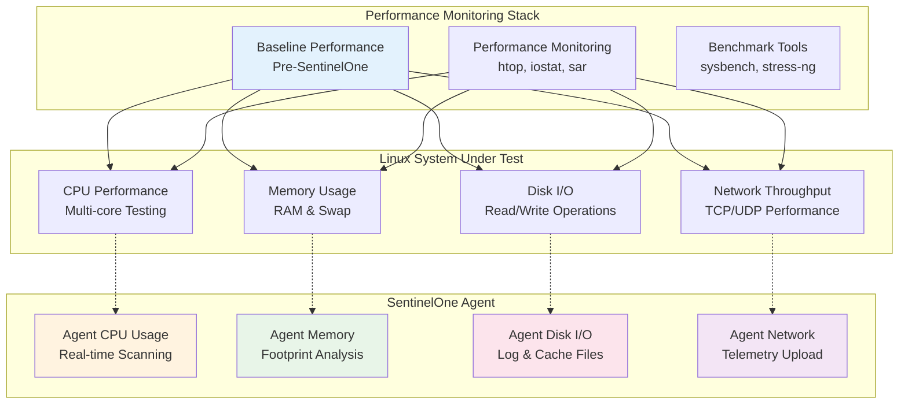

# Linux Performance Testing Scenarios

## Overview
Pengujian komprehensif dampak performa SentinelOne EDR terhadap sistem Linux server dalam berbagai skenario beban kerja.

---

## 🎯 Performance Testing Architecture



---

## 📊 E1: CPU Performance Testing

### E1.1: Baseline CPU Performance Measurement

```bash
#!/bin/bash
# CPU Performance Baseline Test

echo "=== CPU Performance Baseline Test ==="

# System information
echo "System Information:"
lscpu | grep -E "Architecture|CPU|Thread|Socket|Core"
cat /proc/cpuinfo | grep "model name" | head -1

# Install benchmark tools if needed
install_tools() {
    if ! command -v sysbench &> /dev/null; then
        echo "Installing sysbench..."
        sudo apt-get update && sudo apt-get install -y sysbench || \
        sudo yum install -y sysbench || \
        sudo dnf install -y sysbench
    fi
    
    if ! command -v stress-ng &> /dev/null; then
        echo "Installing stress-ng..."
        sudo apt-get install -y stress-ng || \
        sudo yum install -y stress-ng || \
        sudo dnf install -y stress-ng
    fi
}

install_tools

# CPU benchmark without SentinelOne (if not installed)
echo "=== CPU Benchmark Results ==="
sysbench cpu --cpu-max-prime=20000 --threads=$(nproc) run

# Multi-threading stress test
echo "=== Multi-threading Stress Test (60 seconds) ==="
timeout 60s stress-ng --cpu $(nproc) --metrics-brief

# Context switching performance
echo "=== Context Switching Performance ==="
sysbench threads --thread-locks=1 --max-time=30 run
```

### E1.2: CPU Performance with SentinelOne Agent

```bash
#!/bin/bash
# CPU Performance with SentinelOne Agent

echo "=== CPU Performance with SentinelOne Agent ==="

# Check SentinelOne agent status
echo "SentinelOne Agent Status:"
sudo /opt/sentinelone/bin/sentinelctl status

# Monitor SentinelOne CPU usage during stress test
monitor_sentinelone_cpu() {
    echo "Monitoring SentinelOne CPU usage..."
    while true; do
        SENTINEL_CPU=$(ps aux | grep sentinelone | grep -v grep | awk '{sum+=$3} END {print sum+0}')
        TIMESTAMP=$(date '+%Y-%m-%d %H:%M:%S')
        echo "$TIMESTAMP - SentinelOne CPU: ${SENTINEL_CPU}%"
        sleep 5
    done
}

# Start monitoring in background
monitor_sentinelone_cpu &
MONITOR_PID=$!

# Run CPU benchmark with agent active
echo "=== CPU Benchmark with SentinelOne Active ==="
sysbench cpu --cpu-max-prime=20000 --threads=$(nproc) run

echo "=== Stress Test with SentinelOne Active ==="
timeout 60s stress-ng --cpu $(nproc) --metrics-brief

# Stop monitoring
kill $MONITOR_PID 2>/dev/null

# Compare results
echo "=== Performance Impact Analysis ==="
echo "Check the CPU usage difference between baseline and with-agent results"
```

### E1.3: Real-time CPU Impact During File Operations

```bash
#!/bin/bash
# Real-time CPU monitoring during file operations

echo "=== CPU Impact During File Operations ==="

# Function to create large files for scanning
create_test_files() {
    mkdir -p /tmp/performance_test
    echo "Creating test files for real-time scanning..."
    
    # Create various file types
    dd if=/dev/urandom of=/tmp/performance_test/binary_file.bin bs=1M count=100
    dd if=/dev/zero of=/tmp/performance_test/zero_file.dat bs=1M count=100
    
    # Create text files
    for i in {1..50}; do
        cat /var/log/syslog > "/tmp/performance_test/text_file_$i.txt" 2>/dev/null || \
        dmesg > "/tmp/performance_test/text_file_$i.txt"
    done
    
    # Create executable files
    cp /bin/bash /tmp/performance_test/test_executable
    chmod +x /tmp/performance_test/test_executable
}

# Monitor CPU during file creation
echo "Starting CPU monitoring during file operations..."
sar -u 1 60 > /tmp/cpu_during_fileops.log &
SAR_PID=$!

# Create files (will trigger real-time scanning)
create_test_files

# Stop SAR monitoring
kill $SAR_PID 2>/dev/null

# Analyze results
echo "CPU usage during file operations:"
tail -20 /tmp/cpu_during_fileops.log

# Cleanup
rm -rf /tmp/performance_test
rm -f /tmp/cpu_during_fileops.log
```

---

## 🧠 E2: Memory Performance Testing

### E2.1: Memory Footprint Analysis

```bash
#!/bin/bash
# Memory footprint analysis

echo "=== Memory Footprint Analysis ==="

# System memory information
echo "System Memory Information:"
free -h
cat /proc/meminfo | grep -E "MemTotal|MemFree|MemAvailable"

# SentinelOne agent memory usage
echo "=== SentinelOne Agent Memory Usage ==="
ps aux | grep sentinelone | grep -v grep | awk '{print $11, "RSS:", $6"KB", "VSZ:", $5"KB"}'

# Detailed memory analysis
echo "=== Detailed Memory Analysis ==="
sudo pmap $(pgrep sentinelone | head -1) | tail -1

# Memory usage over time
echo "=== Memory Usage Monitoring (5 minutes) ==="
for i in {1..60}; do
    TIMESTAMP=$(date '+%H:%M:%S')
    SENTINEL_MEM=$(ps aux | grep sentinelone | grep -v grep | awk '{sum+=$6} END {print sum+0}')
    TOTAL_MEM=$(free | grep Mem | awk '{print $3}')
    PERCENTAGE=$(echo "scale=2; $SENTINEL_MEM * 100 / $TOTAL_MEM" | bc -l 2>/dev/null || echo "N/A")
    echo "$TIMESTAMP - SentinelOne Memory: ${SENTINEL_MEM}KB (${PERCENTAGE}% of used memory)"
    sleep 5
done
```

### E2.2: Memory Stress Testing with Agent

```bash
#!/bin/bash
# Memory stress testing with SentinelOne agent

echo "=== Memory Stress Testing ==="

# Baseline memory usage
echo "Baseline memory usage:"
free -h

# Memory stress test function
memory_stress_test() {
    local test_name=$1
    local duration=$2
    
    echo "=== $test_name ==="
    
    # Start memory monitoring
    vmstat 1 $duration > "/tmp/memtest_${test_name}.log" &
    VMSTAT_PID=$!
    
    # Run memory stress test
    timeout ${duration}s stress-ng --vm 2 --vm-bytes 75% --metrics-brief
    
    # Stop monitoring
    kill $VMSTAT_PID 2>/dev/null
    
    # Show results
    echo "Memory test results for $test_name:"
    tail -10 "/tmp/memtest_${test_name}.log"
    
    # Check SentinelOne agent stability
    echo "SentinelOne agent status after $test_name:"
    sudo /opt/sentinelone/bin/sentinelctl status | grep -E "Agent|Status"
    
    rm -f "/tmp/memtest_${test_name}.log"
}

# Run different memory stress scenarios
memory_stress_test "moderate_load" 60
sleep 10
memory_stress_test "heavy_load" 120

echo "=== Memory Impact Summary ==="
echo "Check if SentinelOne agent maintained stability during memory pressure"
```

### E2.3: Memory Leak Detection

```bash
#!/bin/bash
# Memory leak detection for SentinelOne agent

echo "=== Memory Leak Detection ==="

# Function to monitor memory growth
monitor_memory_growth() {
    local duration_hours=$1
    local duration_seconds=$((duration_hours * 3600))
    local interval=300  # 5 minutes
    local iterations=$((duration_seconds / interval))
    
    echo "Monitoring memory growth for $duration_hours hours..."
    
    for i in $(seq 1 $iterations); do
        TIMESTAMP=$(date '+%Y-%m-%d %H:%M:%S')
        
        # Get SentinelOne process memory
        SENTINEL_PROCESSES=$(ps aux | grep sentinelone | grep -v grep)
        
        if [ -n "$SENTINEL_PROCESSES" ]; then
            TOTAL_RSS=$(echo "$SENTINEL_PROCESSES" | awk '{sum+=$6} END {print sum+0}')
            TOTAL_VSZ=$(echo "$SENTINEL_PROCESSES" | awk '{sum+=$5} END {print sum+0}')
            
            echo "$TIMESTAMP - RSS: ${TOTAL_RSS}KB, VSZ: ${TOTAL_VSZ}KB"
            echo "$TIMESTAMP,$TOTAL_RSS,$TOTAL_VSZ" >> /tmp/sentinelone_memory_growth.csv
        else
            echo "$TIMESTAMP - No SentinelOne processes found"
        fi
        
        sleep $interval
    done
}

# Create CSV header
echo "timestamp,rss_kb,vsz_kb" > /tmp/sentinelone_memory_growth.csv

# Monitor for 2 hours (adjust as needed)
monitor_memory_growth 2

# Analyze growth
echo "=== Memory Growth Analysis ==="
if [ -f /tmp/sentinelone_memory_growth.csv ]; then
    echo "Memory usage over time (last 10 entries):"
    tail -10 /tmp/sentinelone_memory_growth.csv
    
    # Simple growth calculation
    FIRST_RSS=$(head -2 /tmp/sentinelone_memory_growth.csv | tail -1 | cut -d',' -f2)
    LAST_RSS=$(tail -1 /tmp/sentinelone_memory_growth.csv | cut -d',' -f2)
    
    if [ -n "$FIRST_RSS" ] && [ -n "$LAST_RSS" ]; then
        GROWTH=$((LAST_RSS - FIRST_RSS))
        echo "Memory growth over monitoring period: ${GROWTH}KB"
        
        if [ $GROWTH -gt 10000 ]; then  # 10MB growth threshold
            echo "⚠️  WARNING: Significant memory growth detected"
        else
            echo "✅ Memory usage appears stable"
        fi
    fi
fi

# Cleanup
rm -f /tmp/sentinelone_memory_growth.csv
```

---

## 💾 E3: Disk I/O Performance Testing

### E3.1: Disk I/O Baseline and Impact

```bash
#!/bin/bash
# Disk I/O performance testing

echo "=== Disk I/O Performance Testing ==="

# System disk information
echo "Disk Information:"
df -h
lsblk

# Install fio if needed
install_fio() {
    if ! command -v fio &> /dev/null; then
        echo "Installing fio..."
        sudo apt-get update && sudo apt-get install -y fio || \
        sudo yum install -y fio || \
        sudo dnf install -y fio
    fi
}

install_fio

# Function to run disk I/O tests
run_disk_test() {
    local test_name=$1
    local test_type=$2
    
    echo "=== $test_name ==="
    
    # Start I/O monitoring
    iostat -x 1 60 > "/tmp/iostat_${test_name}.log" &
    IOSTAT_PID=$!
    
    # Monitor SentinelOne I/O impact
    sudo iotop -a -o -d 1 -n 60 | grep sentinelone > "/tmp/sentinelone_io_${test_name}.log" &
    IOTOP_PID=$!
    
    # Run fio test based on type
    case $test_type in
        "sequential_read")
            fio --name=seqread --rw=read --bs=1M --size=1G --numjobs=1 --runtime=60 --group_reporting
            ;;
        "sequential_write")
            fio --name=seqwrite --rw=write --bs=1M --size=1G --numjobs=1 --runtime=60 --group_reporting
            ;;
        "random_read")
            fio --name=randread --rw=randread --bs=4k --size=1G --numjobs=4 --runtime=60 --group_reporting
            ;;
        "random_write")
            fio --name=randwrite --rw=randwrite --bs=4k --size=1G --numjobs=4 --runtime=60 --group_reporting
            ;;
        "mixed")
            fio --name=mixed --rw=randrw --bs=4k --size=1G --numjobs=4 --runtime=60 --rwmixread=70 --group_reporting
            ;;
    esac
    
    # Stop monitoring
    kill $IOSTAT_PID $IOTOP_PID 2>/dev/null
    
    # Show results
    echo "I/O statistics for $test_name:"
    tail -10 "/tmp/iostat_${test_name}.log"
    
    echo "SentinelOne I/O impact during $test_name:"
    cat "/tmp/sentinelone_io_${test_name}.log" | head -10
    
    # Cleanup
    rm -f "/tmp/iostat_${test_name}.log" "/tmp/sentinelone_io_${test_name}.log"
    rm -f seqread.* seqwrite.* randread.* randwrite.* mixed.*
}

# Run various I/O tests
run_disk_test "Sequential_Read" "sequential_read"
sleep 10
run_disk_test "Sequential_Write" "sequential_write"
sleep 10
run_disk_test "Random_Read" "random_read"
sleep 10
run_disk_test "Random_Write" "random_write"
sleep 10
run_disk_test "Mixed_Workload" "mixed"
```

### E3.2: Real-time Scanning I/O Impact

```bash
#!/bin/bash
# Real-time scanning I/O impact test

echo "=== Real-time Scanning I/O Impact ==="

# Create directory for test files
mkdir -p /tmp/realtime_scan_test

# Monitor I/O during file creation and modification
echo "Starting I/O monitoring for real-time scanning..."
iostat -x 1 120 > /tmp/realtime_io.log &
IOSTAT_PID=$!

# Create various file types to trigger scanning
echo "Creating files to trigger real-time scanning..."

# Binary files
for i in {1..10}; do
    dd if=/dev/urandom of="/tmp/realtime_scan_test/binary_$i.bin" bs=1M count=10 2>/dev/null
    sleep 2
done

# Executable files
for i in {1..5}; do
    cp /bin/ls "/tmp/realtime_scan_test/executable_$i"
    chmod +x "/tmp/realtime_scan_test/executable_$i"
    sleep 1
done

# Archive files
for i in {1..3}; do
    tar -czf "/tmp/realtime_scan_test/archive_$i.tar.gz" /var/log/syslog 2>/dev/null
    sleep 2
done

# Large text files
for i in {1..5}; do
    cat /var/log/* > "/tmp/realtime_scan_test/large_text_$i.txt" 2>/dev/null
    sleep 1
done

# Stop monitoring
kill $IOSTAT_PID 2>/dev/null

# Analyze results
echo "=== I/O Impact Analysis ==="
echo "Average I/O statistics during real-time scanning:"
awk 'NR>3 {avg_read+=$4; avg_write+=$5; count++} END {print "Avg Read:", avg_read/count, "KB/s, Avg Write:", avg_write/count, "KB/s"}' /tmp/realtime_io.log

# Check SentinelOne scanning activity
echo "SentinelOne scanning activity:"
sudo /opt/sentinelone/bin/sentinelctl logs --tail 20 | grep -i "scan\|file"

# Cleanup
rm -rf /tmp/realtime_scan_test
rm -f /tmp/realtime_io.log
```

---

## 📊 Performance Impact Summary

### Expected Performance Targets

| Metric | Target Impact | Acceptable Range |
|--------|---------------|------------------|
| CPU Usage | < 5% average | < 10% peak |
| Memory Usage | < 300MB RSS | < 500MB RSS |
| Disk I/O Overhead | < 15% | < 25% |
| Network Bandwidth | < 1MB/s | < 2MB/s |

### Validation Checklist

#### CPU Performance
- [ ] **Baseline CPU**: Benchmark results recorded without agent
- [ ] **Agent CPU Impact**: CPU overhead < 5% during normal operations
- [ ] **Stress Test Stability**: Agent remains stable under CPU stress
- [ ] **Real-time Scanning**: File scanning CPU impact < 10%

#### Memory Performance
- [ ] **Memory Footprint**: Agent RSS memory < 300MB
- [ ] **Memory Stability**: No memory leaks over 24 hours
- [ ] **Stress Test Resilience**: Agent survives memory pressure tests
- [ ] **Growth Rate**: Memory growth < 1MB/hour

#### Disk I/O Performance
- [ ] **I/O Overhead**: Disk I/O impact < 15%
- [ ] **Real-time Scanning**: File scanning I/O overhead acceptable
- [ ] **Batch Operations**: Large file operations don't overwhelm system
- [ ] **Log Management**: Agent logs don't consume excessive disk space

---

## Next Steps

Continue with:
- [Linux Offline Testing](linux-offline.md)
- [Linux Container Testing](linux-containers.md)
- [Cross-Platform Performance Comparison](../cross-platform/cross-platform-testing.md)

---

*Last updated: {{ git_revision_date_localized }}*
