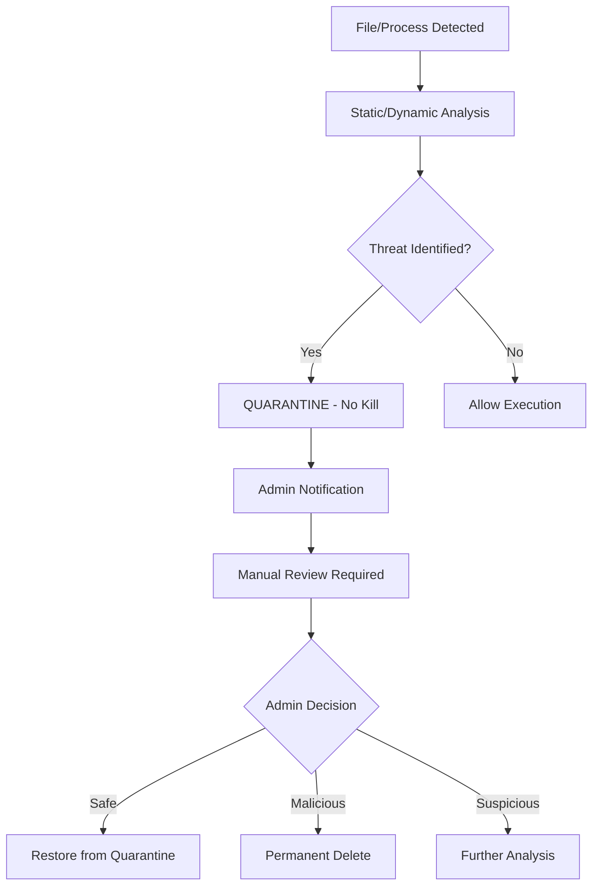
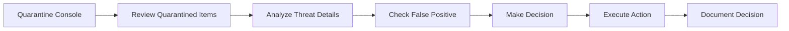

# Konfigurasi Manual Quarantine - Menghindari Auto-Kill

## Overview
Dokumentasi ini menjelaskan cara mengkonfigurasi SentinelOne EDR agar tidak melakukan auto-kill terhadap threat yang terdeteksi, melainkan melakukan quarantine terlebih dahulu untuk memungkinkan review manual dan mitigasi yang lebih terkontrol.

!!! warning "Penting untuk Produksi"
    Konfigurasi ini sangat penting untuk lingkungan production server di mana auto-kill dapat menyebabkan downtime yang tidak diinginkan. Dengan quarantine manual, administrator dapat melakukan review dan memutuskan tindakan yang tepat.

## Masalah dengan Auto-Kill Default

### Risiko Auto-Kill
- ❌ **Service Disruption**: Aplikasi penting bisa terhenti mendadak
- ❌ **False Positive Impact**: File legitimate bisa ikut ter-terminate  
- ❌ **No Recovery Window**: Tidak ada kesempatan untuk review sebelum action
- ❌ **Production Downtime**: Sistem kritis bisa down tanpa warning

### Keuntungan Manual Quarantine
- ✅ **Controlled Response**: Administrator bisa review threat sebelum action
- ✅ **Prevent False Positive**: Hindari terminasi file/aplikasi yang sebenarnya aman
- ✅ **Business Continuity**: Operasional tetap berjalan selama review
- ✅ **Manual Mitigation**: Pilihan tindakan yang tepat sesuai konteks

## Konfigurasi yang Diperlukan

### 1. Automatic Responses Setting
```json
{
  "automaticResponses": [
    "mitigation.quarantine"
  ]
}
```

**Penjelasan Perubahan:**
- **Before**: `"mitigation.rollbackThreat"` (auto-kill/rollback)
- **After**: `"mitigation.quarantine"` (quarantine dulu untuk review)

### 2. Validation Action Setting  
```json
{
  "onValidate": "quarantine"
}
```

**Penjelasan Perubahan:**
- **Before**: `"promoteToMitigate"` (langsung mitigasi/kill)
- **After**: `"quarantine"` (quarantine untuk review manual)

### 3. UI Configuration - Scan History
```json
{
  "uiConfig": {
    "capabilities": {
      "agentDetails": true,
      "deviceTab": true,
      "functionalProblem": true,
      "networkQuarantine": true,
      "overview": true,
      "quarantineTab": true,
      "scanHistory": true,
      "supportTab": true,
      "threatsHistory": true
    }
  }
}
```

**Penjelasan Menu:**
- **scanHistory**: `true` - Memungkinkan admin melihat riwayat scan
- **quarantineTab**: `true` - Akses ke quarantine management
- **overview**: `true` - Dashboard overview untuk monitoring
- **threatsHistory**: `true` - Riwayat threat untuk analisis

## Implementasi Konfigurasi

### Langkah 1: Backup Konfigurasi Existing
```bash
# Backup file konfigurasi original
cp agent-config.json agent-config.json.backup.$(date +%Y%m%d_%H%M%S)
```

### Langkah 2: Edit Konfigurasi
1. **Edit automaticResponses** (line 120-122):
```json
"automaticResponses": [
  "mitigation.quarantine"
],
```

2. **Edit onValidate** (line 1590):
```json
"onValidate": "quarantine",
```

3. **Edit UI capabilities** (line 2249-2257):
```json
"capabilities": {
  "agentDetails": true,
  "deviceTab": true,
  "functionalProblem": true,
  "networkQuarantine": true,
  "overview": true,
  "quarantineTab": true,
  "scanHistory": true,
  "supportTab": true,
  "threatsHistory": true
},
```

### Langkah 3: Validasi Konfigurasi
```bash
# Validasi JSON format
python3 -m json.tool agent-config.json > /dev/null && echo "JSON Valid" || echo "JSON Invalid"

# Restart agent service (sesuai platform)
# Windows:
# Restart-Service "SentinelAgent"

# Linux:
# sudo systemctl restart sentinelagent
```

## Workflow Manual Quarantine

### 1. Threat Detection Flow


### 2. Console Management Workflow


## Console Operations

### Mengakses Quarantine Management
1. **Login ke Management Console**
2. **Navigate**: Threats → Quarantine
3. **Review**: Quarantined files/processes
4. **Action Options**:
   - 🔍 **Investigate**: Detail analysis
   - ✅ **Restore**: Restore jika false positive  
   - ❌ **Delete**: Hapus permanent jika confirmed malicious
   - 📋 **Whitelist**: Tambah ke exclusion list

### Manual Mitigation Actions
```yaml
Available Actions:
  - restore: Mengembalikan file dari quarantine
  - delete: Hapus permanent dari sistem
  - whitelist: Tambahkan ke daftar pengecualian
  - investigate: Deep analysis dengan tools tambahan
```

## Testing & Validation

### Test Scenario 1: Malware Detection
```bash
# Simulasi malware detection
# Expected: File di-quarantine, tidak di-kill
# Admin dapat review dan putuskan tindakan
```

### Test Scenario 2: False Positive
```bash
# Simulasi false positive detection  
# Expected: File di-quarantine
# Admin dapat restore setelah review
```

### Test Scenario 3: Critical Process
```bash
# Simulasi detection pada critical service
# Expected: Service tetap running, file di-quarantine
# No service disruption
```

## Monitoring & Alerting

### Key Metrics to Monitor
- 📊 **Quarantine Queue**: Jumlah item dalam quarantine
- ⏱️ **Response Time**: Waktu dari detection ke quarantine
- 🎯 **False Positive Rate**: Rate dari restored items
- 🔄 **Manual Actions**: Frequency dari manual interventions

### Alert Configuration
```yaml
Alerts:
  - name: "High Quarantine Volume"
    condition: "quarantine_count > 50"
    action: "notify_admin"
    
  - name: "Unreviewed Items"
    condition: "quarantine_age > 4_hours"
    action: "escalate_notification"
    
  - name: "Critical Process Quarantined"
    condition: "process_type == critical"
    action: "immediate_notification"
```

## Best Practices

### Do's ✅
- Review quarantined items dalam 2-4 jam
- Document semua manual decisions
- Regular review false positive patterns
- Update whitelist berdasarkan legitimate findings
- Monitor quarantine queue size

### Don'ts ❌
- Jangan biarkan quarantine queue penuh
- Jangan auto-restore tanpa analysis
- Jangan ignore repeated false positives  
- Jangan skip documentation untuk decisions

## Troubleshooting

### Issue 1: Quarantine Not Working
**Symptoms**: Threats masih di-kill otomatis
**Solution**: 
1. Verify `automaticResponses` setting
2. Check `onValidate` configuration  
3. Restart agent service

### Issue 2: Console Access Issues
**Symptoms**: Tidak bisa akses quarantine tab
**Solution**:
1. Verify UI `capabilities` configuration
2. Check user permissions di console
3. Clear browser cache

### Issue 3: High False Positive Rate
**Symptoms**: Terlalu banyak legitimate files di-quarantine
**Solution**:
1. Review dan update exclusion lists
2. Tune detection sensitivity
3. Add legitimate applications to whitelist

---

!!! success "Configuration Success"
    Dengan konfigurasi ini, SentinelOne EDR akan melakukan quarantine terlebih dahulu alih-alih auto-kill, memberikan administrator kontrol penuh untuk melakukan review dan mitigasi yang tepat sesuai konteks bisnis.

!!! note "Production Deployment"
    Pastikan untuk test konfigurasi ini di environment non-production terlebih dahulu sebelum deploy ke production servers.
