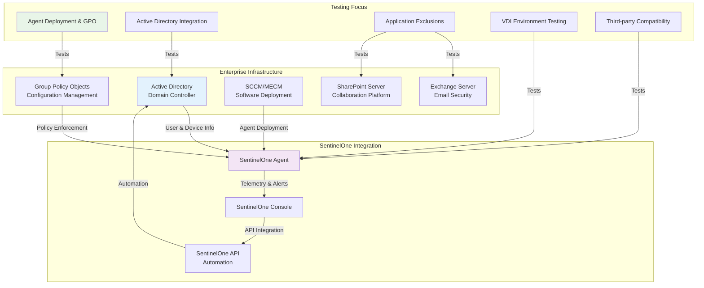

# Windows Enterprise Testing Scenarios

## Overview
Pengujian komprehensif SentinelOne EDR dalam environment enterprise Windows, termasuk integrasi dengan Active Directory, Group Policy, dan aplikasi enterprise.

---

## 🏢 Enterprise Integration Architecture



---

## 📦 F1: Agent Deployment and GPO Testing

### F1.1: Automated Deployment via SCCM/MECM

```powershell
# SCCM/MECM Deployment Script (Conceptual)
# This script would be packaged as an application in SCCM

param (
    [string]$SiteToken,
    [string]$InstallerPath
)

Write-Host "Starting SentinelOne EDR deployment via SCCM..."

# Check if agent is already installed
$agentInstalled = Get-WmiObject -Class Win32_Product | Where-Object {$_.Name -like "*SentinelOne*"}
if ($agentInstalled) {
    Write-Host "SentinelOne agent already installed. Exiting."
    exit 0
}

# Check for installer
if (-not (Test-Path $InstallerPath)) {
    Write-Host "Installer not found at $InstallerPath. Exiting."
    exit 1
}

# Silent installation command
$arguments = @(
    "/i",
    "`"$InstallerPath`"",
    "/quiet",
    "SITE_TOKEN=$SiteToken",
    "REBOOT=ReallySuppress"
)

Write-Host "Executing MSI installer..."
Start-Process msiexec.exe -ArgumentList $arguments -Wait -NoNewWindow

# Verification
if ($?) {
    Write-Host "Installation command executed successfully. Verifying status..."
    Start-Sleep -Seconds 30
    
    $sentinelCtl = "C:\Program Files\SentinelOne\Sentinel Agent\SentinelCtl.exe"
    if (Test-Path $sentinelCtl) {
        $status = & $sentinelCtl status
        if ($status -match "running") {
            Write-Host "✅ SentinelOne agent installed and running successfully."
            exit 0
        } else {
            Write-Host "⚠️  Installation complete, but agent not running. Check logs."
            exit 1
        }
    } else {
        Write-Host "⚠️  Installation complete, but sentinelctl not found."
        exit 1
    }
} else {
    Write-Host "❌ MSI installation failed."
    exit 1
}
```

### F1.2: Group Policy (GPO) Configuration Testing

```powershell
# PowerShell script to verify GPO settings for SentinelOne
Write-Host "=== GPO Configuration Validation for SentinelOne ===" -ForegroundColor Green

# 1. Verify SentinelOne Service Settings
Write-Host "Verifying service settings..." -ForegroundColor Yellow
$sentinelServices = Get-Service | Where-Object {$_.Name -like "*Sentinel*"}
foreach ($service in $sentinelServices) {
    if ($service.StartType -ne "Automatic") {
        Write-Host "⚠️  Service $($service.Name) is not set to Automatic start." -ForegroundColor Red
    } else {
        Write-Host "✅ Service $($service.Name) is configured for Automatic start."
    }
}

# 2. Verify Windows Firewall Rules for SentinelOne
Write-Host "Verifying Windows Firewall rules..." -ForegroundColor Yellow
$firewallRule = Get-NetFirewallRule | Where-Object {$_.DisplayName -like "*SentinelOne*" -and $_.Direction -eq "Outbound" -and $_.Action -eq "Allow"}
if ($firewallRule) {
    Write-Host "✅ Outbound firewall rule for SentinelOne communication found."
} else {
    Write-Host "⚠️  No outbound firewall rule for SentinelOne found." -ForegroundColor Yellow
}

# 3. Verify Application Whitelisting (AppLocker/WDAC)
Write-Host "Verifying AppLocker/WDAC policies..." -ForegroundColor Yellow
$sentinelPath = "C:\Program Files\SentinelOne\*"
$appLockerPolicy = Get-AppLockerPolicy -Effective | Test-AppLockerPolicy -Path $sentinelPath -User "Everyone"

if ($appLockerPolicy.PolicyDecision -eq "Allowed") {
    Write-Host "✅ SentinelOne path is whitelisted in AppLocker."
} else {
    Write-Host "⚠️  SentinelOne path may be blocked by AppLocker. Decision: $($appLockerPolicy.PolicyDecision)" -ForegroundColor Yellow
}

# 4. Verify Registry-based Policy Settings
Write-Host "Verifying registry-based policy settings..." -ForegroundColor Yellow
$sentinelPolicyPath = "HKLM:\SOFTWARE\Policies\SentinelOne"
if (Test-Path $sentinelPolicyPath) {
    $policySettings = Get-ItemProperty -Path $sentinelPolicyPath
    Write-Host "SentinelOne GPO policies found:"
    $policySettings | Format-List
} else {
    Write-Host "No custom GPO registry settings for SentinelOne found."
}
```

---

## 🤝 F2: Active Directory Integration Testing

### F2.1: Device and User Information Enrichment

```powershell
# Verify Active Directory information in SentinelOne console
# This is a conceptual test, as it requires checking the console UI

Write-Host "=== Active Directory Integration Validation ===" -ForegroundColor Green

# Step 1: Get local Active Directory information
Write-Host "Local AD Information:" -ForegroundColor Yellow
$computerInfo = Get-ADComputer -Identity $env:COMPUTERNAME -Properties *
Write-Host "Computer Name: $($computerInfo.Name)"
Write-Host "Distinguished Name: $($computerInfo.DistinguishedName)"
Write-Host "Operating System: $($computerInfo.OperatingSystem)"

$userInfo = Get-ADUser -Identity $env:USERNAME -Properties *
Write-Host "User Name: $($userInfo.SamAccountName)"
Write-Host "User Distinguished Name: $($userInfo.DistinguishedName)"
Write-Host "Member Of: $($userInfo.MemberOf -join ", ")"

# Step 2: Compare with information in SentinelOne console
Write-Host "`nSentinelOne Console Validation:" -ForegroundColor Yellow
Write-Host "1. Navigate to the endpoint in the SentinelOne console."
Write-Host "2. Verify that the endpoint details match the local AD information."
Write-Host "   - Check fields like 'Distinguished Name', 'Organizational Unit', 'Logged In User'."
Write-Host "3. Check for user group information in the user details."

# Step 3: Test dynamic updates
Write-Host "`nTesting Dynamic Updates:" -ForegroundColor Yellow
Write-Host "1. Move the computer object to a different OU in Active Directory."
Write-Host "2. Wait for the SentinelOne agent to sync (up to a few hours)."
Write-Host "3. Verify that the OU information is updated in the console."
```

### F2.2: Group-based Policy Assignment

```powershell
# Test policy assignment based on AD security groups
Write-Host "=== AD Group-based Policy Assignment Testing ===" -ForegroundColor Green

# Step 1: Create a test AD security group and add the user
Write-Host "Creating test AD security group..." -ForegroundColor Yellow
# (This step is performed by an AD administrator)
# New-ADGroup -Name "S1_Test_Policy_Group" -GroupScope Global
# Add-ADGroupMember -Identity "S1_Test_Policy_Group" -Members $env:USERNAME

# Step 2: Configure a policy in SentinelOne for this group
Write-Host "Configuring policy in SentinelOne console..." -ForegroundColor Yellow
Write-Host "1. Create a new policy in SentinelOne (e.g., 'Test Policy')."
Write-Host "2. Set a unique setting in this policy (e.g., enable 'Detect Only' mode)."
Write-Host "3. In the policy's scope, select 'Directory', and add the 'S1_Test_Policy_Group'."

# Step 3: Verify policy application on the endpoint
Write-Host "Verifying policy application..." -ForegroundColor Yellow
Write-Host "Forcing agent to sync with console..."
& "C:\Program Files\SentinelOne\Sentinel Agent\SentinelCtl.exe" policy refresh
Start-Sleep -Seconds 20

$policyStatus = & "C:\Program Files\SentinelOne\Sentinel Agent\SentinelCtl.exe" status
if ($policyStatus -match "Detect Only") {
    Write-Host "✅ Policy based on AD group membership applied successfully."
} else {
    Write-Host "⚠️  Policy not applied. Current status: $policyStatus" -ForegroundColor Red
}

# Step 4: Cleanup
Write-Host "Cleaning up test group..." -ForegroundColor Yellow
# (Performed by an AD administrator)
# Remove-ADGroup -Identity "S1_Test_Policy_Group" -Confirm:$false
```

---

## 🛡️ F3: Enterprise Application Compatibility

### F3.1: Microsoft Exchange Server Exclusions

```powershell
# Verify exclusions for Microsoft Exchange Server
Write-Host "=== Exchange Server Exclusion Validation ===" -ForegroundColor Green

# Microsoft's recommended antivirus exclusions for Exchange
$exchangePaths = @(
    "%SystemRoot%\System32\Inetsrv",
    "%ExchangeInstallPath%",
    "%SystemDrive%\inetpub\temp\IIS Temporary Compressed Files"
)

$exchangeProcesses = @(
    "EdgeTransport.exe",
    "MSExchangeADTopologyService.exe",
    "MSExchangeTransport.exe",
    "MSExchangeMailboxReplication.exe",
    "noderunner.exe"
)

$exchangeFileTypes = @(
    ".config",
    ".dia",
    ".wsb",
    ".que",
    ".log"
)

# Check if these are excluded in SentinelOne
Write-Host "This test is conceptual. You need to check the SentinelOne console."
Write-Host "Ensure the following are in your SentinelOne exclusion policy for Exchange servers:"

Write-Host "`nPath Exclusions:" -ForegroundColor Yellow
$exchangePaths | ForEach-Object { Write-Host "- $_" }

Write-Host "`nProcess Exclusions:" -ForegroundColor Yellow
$exchangeProcesses | ForEach-Object { Write-Host "- $_" }

Write-Host "`nFile Type Exclusions:" -ForegroundColor Yellow
$exchangeFileTypes | ForEach-Object { Write-Host "- $_" }

# Performance test during high email flow
Write-Host "`nPerformance Testing:" -ForegroundColor Yellow
Write-Host "1. Use a tool like Exchange Load Generator to simulate high email flow."
Write-Host "2. Monitor CPU, Memory, and Disk I/O on the Exchange server."
Write-Host "3. Ensure SentinelOne's impact is within acceptable limits (< 10% overhead)."
```

### F3.2: SQL Server Compatibility

```powershell
# Verify exclusions and performance for SQL Server
Write-Host "=== SQL Server Compatibility and Performance Validation ===" -ForegroundColor Green

# Recommended exclusions for SQL Server
$sqlPaths = @(
    "%ProgramFiles%\Microsoft SQL Server\",
    "%SystemDrive%\MSSQL\DATA\"
)

$sqlProcesses = @(
    "sqlservr.exe",
    "sqlagent.exe"
)

$sqlFileTypes = @(
    ".mdf",
    ".ldf",
    ".ndf",
    ".bak",
    ".trn"
)

# Check if these are excluded in SentinelOne
Write-Host "Check the SentinelOne console for the following exclusions on SQL servers:"

Write-Host "`nPath Exclusions:" -ForegroundColor Yellow
$sqlPaths | ForEach-Object { Write-Host "- $_" }

Write-Host "`nProcess Exclusions:" -ForegroundColor Yellow
$sqlProcesses | ForEach-Object { Write-Host "- $_" }

Write-Host "`nFile Type Exclusions:" -ForegroundColor Yellow
$sqlFileTypes | ForEach-Object { Write-Host "- $_" }

# Performance test during high database load
Write-Host "`nPerformance Testing:" -ForegroundColor Yellow
Write-Host "1. Use a tool like HammerDB to generate a high-transaction workload (OLTP)."
Write-Host "2. Monitor performance counters like 'SQL Server:Buffer Manager\Page life expectancy' and 'Processor\% Processor Time'."
Write-Host "3. Compare performance with and without SentinelOne agent active."
Write-Host "4. Ensure Page Life Expectancy does not drop significantly and CPU overhead is minimal."
```

---

## 🖥️ F4: Virtual Desktop Infrastructure (VDI) Testing

### F4.1: VDI Golden Image Preparation

```powershell
# Script to prepare SentinelOne agent in a VDI golden image
Write-Host "=== VDI Golden Image Preparation Script ===" -ForegroundColor Green

# Step 1: Install the agent
Write-Host "Installing SentinelOne agent..."
# (Use your silent installation command here)
# msiexec /i SentinelInstaller.msi /quiet SITE_TOKEN=your_token

# Step 2: Stop the agent services
Write-Host "Stopping agent services..."
Get-Service | Where-Object {$_.Name -like "*Sentinel*"} | Stop-Service -Force

# Step 3: Run the VDI preparation command
# This command removes unique identifiers so that cloned VMs register as new endpoints
Write-Host "Running VDI preparation command..."
$sentinelCtl = "C:\Program Files\SentinelOne\Sentinel Agent\SentinelCtl.exe"
if (Test-Path $sentinelCtl) {
    & $sentinelCtl vdi-prepare
    Write-Host "✅ VDI preparation command executed."
} else {
    Write-Host "⚠️  sentinelctl.exe not found." -ForegroundColor Red
    exit 1
}

# Step 4: Clear event logs (optional)
# Clear-EventLog -LogName Application, System

# Step 5: Shut down the golden image
Write-Host "Golden image is ready to be shut down and used as a template."
Write-Host "DO NOT restart this VM before creating the template."
# Stop-Computer -Force
```

### F4.2: VDI Clone Validation (Boot Storm Test)

```powershell
# Conceptual test for VDI boot storm
Write-Host "=== VDI Boot Storm Validation ===" -ForegroundColor Green

# Step 1: Provision a pool of VDI desktops from the golden image
Write-Host "Provisioning 50 VDI desktops..." -ForegroundColor Yellow
# (This is done using your VDI management tool like Citrix, VMware Horizon, etc.)

# Step 2: Initiate a boot storm
Write-Host "Initiating a boot storm by starting all 50 desktops simultaneously."

# Step 3: Monitor performance on the hypervisor
Write-Host "Monitoring Hypervisor Performance:" -ForegroundColor Yellow
Write-Host "- Monitor CPU, Memory, and Disk I/O on the hypervisor hosts."
Write-Host "- Pay close attention to storage latency (datastore latency)."
Write-Host "- Objective: SentinelOne's initial sync and scan should not cause a significant increase in boot times or resource contention."

# Step 4: Validate agent registration in the console
Write-Host "Validating Agent Registration:" -ForegroundColor Yellow
Write-Host "- Verify that all 50 new desktops appear in the SentinelOne console as unique endpoints."
Write-Host "- Check that they are assigned the correct policy."

# Step 5: Test user login performance
Write-Host "Testing User Login Performance:" -ForegroundColor Yellow
Write-Host "- Measure the time it takes for a user to log in and get a responsive desktop."
Write-Host "- Compare this with a baseline without the SentinelOne agent."
Write-Host "- Objective: Login time increase should be minimal (< 10-15%)."
```

---

## 📊 Validation Checklist

### Enterprise Integration
- [ ] **SCCM Deployment**: Agent deploys successfully to target collections
- [ ] **GPO Policies**: Agent configuration is correctly enforced by GPO
- [ ] **AD Enrichment**: Endpoint details in console are enriched with AD data
- [ ] **Group-based Policies**: Policies are correctly applied based on AD groups

### Application Compatibility
- [ ] **Exchange Exclusions**: Correct exclusions are in place
- [ ] **Exchange Performance**: No significant performance degradation during high load
- [ ] **SQL Server Exclusions**: Correct exclusions are in place for data, log, and backup files
- [ ] **SQL Server Performance**: No significant impact on transaction throughput or query times
- [ ] **Other LOB Applications**: Key line-of-business apps are tested and performant

### VDI Environment
- [ ] **Golden Image Prep**: `vdi-prepare` command is used correctly
- [ ] **Unique Registration**: Cloned VMs register as unique endpoints
- [ ] **Boot Storm Impact**: Minimal impact on hypervisor during boot storm
- [ ] **Login VSI Score**: Login VSI benchmark score remains high
- [ ] **Non-persistent Desktops**: Agent functions correctly on non-persistent desktops and cleans up properly on logoff

---

## Next Steps

Continue with:
- [Windows Performance Testing](windows-performance.md)
- [Windows Offline Testing](windows-offline.md)
- [Cross-Platform Enterprise Scenarios](../cross-platform/cross-platform-testing.md)

---

*Last updated: {{ git_revision_date_localized }}*
