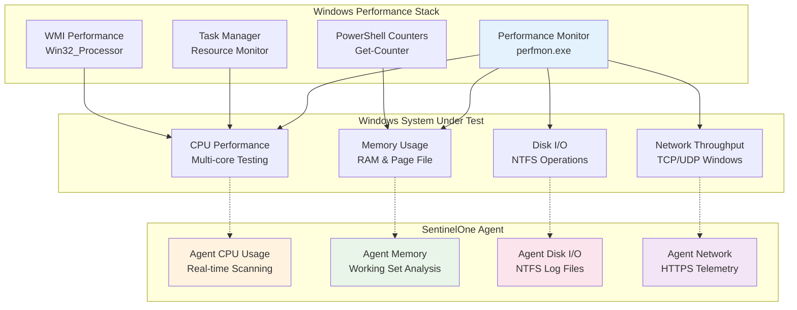

# Windows Performance Testing Scenarios

## Overview
Pengujian komprehensif dampak performa SentinelOne EDR terhadap sistem Windows Server dalam berbagai skenario beban kerja.

---

## 🎯 Performance Testing Architecture



---

## 📊 E1: CPU Performance Testing

### E1.1: Baseline CPU Performance Measurement

```powershell
# Windows CPU Performance Baseline Test
Write-Host "=== Windows CPU Performance Baseline Test ===" -ForegroundColor Green

# System information
Write-Host "System Information:" -ForegroundColor Yellow
Get-ComputerInfo | Select-Object WindowsProductName, WindowsVersion, TotalPhysicalMemory
Get-WmiObject -Class Win32_Processor | Select-Object Name, NumberOfCores, NumberOfLogicalProcessors

# Install tools if needed (using Chocolatey)
function Install-Tools {
    if (-not (Get-Command sysbench -ErrorAction SilentlyContinue)) {
        Write-Host "Installing sysbench via Chocolatey..." -ForegroundColor Yellow
        if (-not (Get-Command choco -ErrorAction SilentlyContinue)) {
            Write-Host "Please install Chocolatey first: https://chocolatey.org/install"
            return
        }
        choco install sysbench -y
    }
}

Install-Tools

# CPU benchmark without SentinelOne (if not installed)
Write-Host "=== CPU Benchmark Results ===" -ForegroundColor Yellow
$cores = (Get-WmiObject -Class Win32_Processor).NumberOfLogicalProcessors
sysbench cpu --cpu-max-prime=20000 --threads=$cores run

# PowerShell CPU stress test
Write-Host "=== PowerShell CPU Stress Test (60 seconds) ===" -ForegroundColor Yellow
$jobs = @()
for ($i = 1; $i -le $cores; $i++) {
    $jobs += Start-Job -ScriptBlock {
        $start = Get-Date
        while ((Get-Date) -lt $start.AddSeconds(60)) {
            $result = 0
            for ($j = 1; $j -le 1000; $j++) {
                $result += $j * $j
            }
        }
    }
}

# Monitor CPU during stress test
$start = Get-Date
while ((Get-Date) -lt $start.AddSeconds(65)) {
    $cpu = Get-Counter "\Processor(_Total)\% Processor Time" -SampleInterval 1 -MaxSamples 1
    Write-Host "CPU Usage: $([math]::Round(100 - $cpu.CounterSamples[0].CookedValue, 2))%"
    Start-Sleep 5
}

# Cleanup jobs
$jobs | Remove-Job -Force
```

### E1.2: CPU Performance with SentinelOne Agent

```powershell
# Windows CPU Performance with SentinelOne Agent
Write-Host "=== CPU Performance with SentinelOne Agent ===" -ForegroundColor Green

# Check SentinelOne agent status
Write-Host "SentinelOne Agent Status:" -ForegroundColor Yellow
& "C:\Program Files\SentinelOne\Sentinel Agent\SentinelCtl.exe" status

# Monitor SentinelOne CPU usage during stress test
$monitoringJob = Start-Job -ScriptBlock {
    while ($true) {
        $sentinelProcesses = Get-Process | Where-Object {$_.ProcessName -like "*Sentinel*"}
        $totalCpu = ($sentinelProcesses | Measure-Object CPU -Sum).Sum
        $timestamp = Get-Date -Format "yyyy-MM-dd HH:mm:ss"
        Write-Output "$timestamp - SentinelOne Total CPU: $totalCpu seconds"
        Start-Sleep 5
    }
}

# Run CPU benchmark with agent active
Write-Host "=== CPU Benchmark with SentinelOne Active ===" -ForegroundColor Yellow
$cores = (Get-WmiObject -Class Win32_Processor).NumberOfLogicalProcessors
sysbench cpu --cpu-max-prime=20000 --threads=$cores run

# Stop monitoring
$monitoringJob | Stop-Job
$monitoringJob | Receive-Job
$monitoringJob | Remove-Job

# Compare results
Write-Host "=== Performance Impact Analysis ===" -ForegroundColor Yellow
Write-Host "Compare CPU benchmark results between baseline and with-agent tests"
```

### E1.3: Real-time CPU Impact During File Operations

```powershell
# Real-time CPU monitoring during file operations
Write-Host "=== CPU Impact During File Operations ===" -ForegroundColor Green

# Function to create large files for scanning
function Create-TestFiles {
    Write-Host "Creating test files for real-time scanning..." -ForegroundColor Yellow
    New-Item -Path "C:\temp\performance_test" -ItemType Directory -Force
    
    # Create various file types
    $randomBytes = New-Object byte[] (100MB)
    (New-Object System.Random).NextBytes($randomBytes)
    [System.IO.File]::WriteAllBytes("C:\temp\performance_test\binary_file.bin", $randomBytes)
    
    # Create zero-filled file
    fsutil file createnew "C:\temp\performance_test\zero_file.dat" 104857600  # 100MB
    
    # Create text files
    for ($i = 1; $i -le 50; $i++) {
        Get-EventLog -LogName System -Newest 1000 | Out-File "C:\temp\performance_test\text_file_$i.txt"
    }
    
    # Create executable files
    Copy-Item -Path "C:\Windows\System32\calc.exe" -Destination "C:\temp\performance_test\test_executable.exe"
}

# Start CPU monitoring
$cpuCounter = "\Processor(_Total)\% Processor Time"
$monitoringJob = Start-Job -ScriptBlock {
    param($counter)
    for ($i = 1; $i -le 60; $i++) {
        $cpu = Get-Counter $counter -SampleInterval 1 -MaxSamples 1
        $usage = [math]::Round(100 - $cpu.CounterSamples[0].CookedValue, 2)
        $timestamp = Get-Date -Format "HH:mm:ss"
        Write-Output "$timestamp - System CPU: $usage%"
    }
} -ArgumentList $cpuCounter

# Create files (will trigger real-time scanning)
Create-TestFiles

# Wait for monitoring to complete
$monitoringJob | Wait-Job
$results = $monitoringJob | Receive-Job
$monitoringJob | Remove-Job

# Display results
Write-Host "CPU usage during file operations:" -ForegroundColor Yellow
$results

# Cleanup
Remove-Item -Path "C:\temp\performance_test" -Recurse -Force -ErrorAction SilentlyContinue
```

---

## 🧠 E2: Memory Performance Testing

### E2.1: Memory Footprint Analysis

```powershell
# Windows Memory footprint analysis
Write-Host "=== Memory Footprint Analysis ===" -ForegroundColor Green

# System memory information
Write-Host "System Memory Information:" -ForegroundColor Yellow
$memory = Get-WmiObject -Class Win32_ComputerSystem
$memoryGB = [math]::Round($memory.TotalPhysicalMemory / 1GB, 2)
Write-Host "Total Physical Memory: $memoryGB GB"

Get-Counter "\Memory\Available MBytes", "\Memory\Committed Bytes" | 
    Select-Object -ExpandProperty CounterSamples | 
    Format-Table Path, @{Name="Value"; Expression={[math]::Round($_.CookedValue/1MB, 2)}}

# SentinelOne agent memory usage
Write-Host "=== SentinelOne Agent Memory Usage ===" -ForegroundColor Yellow
$sentinelProcesses = Get-Process | Where-Object {$_.ProcessName -like "*Sentinel*"}
$sentinelProcesses | Select-Object ProcessName, 
    @{Name="WorkingSet(MB)"; Expression={[math]::Round($_.WorkingSet/1MB, 2)}}, 
    @{Name="VirtualMemory(MB)"; Expression={[math]::Round($_.VirtualMemorySize/1MB, 2)}}, 
    @{Name="PrivateMemory(MB)"; Expression={[math]::Round($_.PrivateMemorySize/1MB, 2)}} | 
    Format-Table

# Total SentinelOne memory usage
$totalWorkingSet = ($sentinelProcesses | Measure-Object WorkingSet -Sum).Sum / 1MB
$totalVirtual = ($sentinelProcesses | Measure-Object VirtualMemorySize -Sum).Sum / 1MB
Write-Host "Total SentinelOne Working Set: $([math]::Round($totalWorkingSet, 2)) MB"
Write-Host "Total SentinelOne Virtual Memory: $([math]::Round($totalVirtual, 2)) MB"

# Memory usage monitoring over time (5 minutes)
Write-Host "=== Memory Usage Monitoring (5 minutes) ===" -ForegroundColor Yellow
for ($i = 1; $i -le 60; $i++) {
    $timestamp = Get-Date -Format "HH:mm:ss"
    $processes = Get-Process | Where-Object {$_.ProcessName -like "*Sentinel*"}
    $currentWS = ($processes | Measure-Object WorkingSet -Sum).Sum / 1MB
    $systemAvail = (Get-Counter "\Memory\Available MBytes").CounterSamples[0].CookedValue
    
    Write-Host "$timestamp - SentinelOne Memory: $([math]::Round($currentWS, 2)) MB, System Available: $([math]::Round($systemAvail, 2)) MB"
    Start-Sleep 5
}
```

### E2.2: Memory Stress Testing with Agent

```powershell
# Memory stress testing with SentinelOne agent
Write-Host "=== Memory Stress Testing ===" -ForegroundColor Green

# Baseline memory usage
Write-Host "Baseline memory usage:" -ForegroundColor Yellow
Get-Counter "\Memory\Available MBytes", "\Memory\% Committed Bytes In Use" | 
    Select-Object -ExpandProperty CounterSamples | 
    Format-Table Path, CookedValue

# Memory stress test function
function Start-MemoryStressTest {
    param(
        [string]$TestName,
        [int]$DurationSeconds,
        [int]$MemoryMB
    )
    
    Write-Host "=== $TestName ===" -ForegroundColor Yellow
    
    # Start memory monitoring
    $monitorJob = Start-Job -ScriptBlock {
        param($duration)
        for ($i = 1; $i -le $duration; $i++) {
            $mem = Get-Counter "\Memory\Available MBytes", "\Memory\% Committed Bytes In Use"
            $available = $mem.CounterSamples[0].CookedValue
            $committed = $mem.CounterSamples[1].CookedValue
            $timestamp = Get-Date -Format "HH:mm:ss"
            Write-Output "$timestamp - Available: $([math]::Round($available, 0)) MB, Committed: $([math]::Round($committed, 2))%"
            Start-Sleep 1
        }
    } -ArgumentList $DurationSeconds
    
    # Memory stress test
    Write-Host "Allocating $MemoryMB MB of memory..."
    $memoryArrays = @()
    $chunkSize = 10MB
    $chunks = [math]::Floor($MemoryMB * 1MB / $chunkSize)
    
    for ($i = 1; $i -le $chunks; $i++) {
        $memoryArrays += New-Object byte[] $chunkSize
        if ($i % 10 -eq 0) {
            Write-Progress -Activity "Allocating Memory" -Status "$i/$chunks chunks allocated" -PercentComplete (($i / $chunks) * 100)
        }
        Start-Sleep -Milliseconds 100
    }
    
    Write-Host "Memory allocated, holding for $DurationSeconds seconds..."
    Start-Sleep $DurationSeconds
    
    # Release memory
    $memoryArrays.Clear()
    [System.GC]::Collect()
    [System.GC]::WaitForPendingFinalizers()
    [System.GC]::Collect()
    
    # Stop monitoring and get results
    $monitorJob | Wait-Job
    $results = $monitorJob | Receive-Job
    $monitorJob | Remove-Job
    
    Write-Host "Memory test results for $TestName:"
    $results | Select-Object -Last 10
    
    # Check SentinelOne agent stability
    Write-Host "SentinelOne agent status after $TestName:" -ForegroundColor Yellow
    $agentStatus = & "C:\Program Files\SentinelOne\Sentinel Agent\SentinelCtl.exe" status
    if ($agentStatus -match "running") {
        Write-Host "✅ Agent remained stable during memory stress" -ForegroundColor Green
    } else {
        Write-Host "⚠️  Agent status needs verification" -ForegroundColor Yellow
    }
}

# Run different memory stress scenarios
Start-MemoryStressTest -TestName "Moderate Load" -DurationSeconds 60 -MemoryMB 512
Start-Sleep 10
Start-MemoryStressTest -TestName "Heavy Load" -DurationSeconds 120 -MemoryMB 1024

Write-Host "=== Memory Impact Summary ===" -ForegroundColor Yellow
Write-Host "Check if SentinelOne agent maintained stability during memory pressure"
```

---

## 💾 E3: Disk I/O Performance Testing

### E3.1: Disk I/O Baseline and Impact

```powershell
# Windows Disk I/O performance testing
Write-Host "=== Disk I/O Performance Testing ===" -ForegroundColor Green

# System disk information
Write-Host "Disk Information:" -ForegroundColor Yellow
Get-WmiObject -Class Win32_LogicalDisk | Where-Object {$_.DriveType -eq 3} | 
    Select-Object DeviceID, 
    @{Name="Size(GB)"; Expression={[math]::Round($_.Size/1GB, 2)}}, 
    @{Name="FreeSpace(GB)"; Expression={[math]::Round($_.FreeSpace/1GB, 2)}}, 
    @{Name="FileSystem"; Expression={$_.FileSystem}} | 
    Format-Table

# Function to run disk I/O tests
function Start-DiskIOTest {
    param(
        [string]$TestName,
        [string]$TestType,
        [int]$FileSizeMB = 1000,
        [int]$DurationSeconds = 60
    )
    
    Write-Host "=== $TestName ===" -ForegroundColor Yellow
    
    # Start I/O monitoring
    $ioCounters = @(
        "\LogicalDisk(C:)\Disk Reads/sec",
        "\LogicalDisk(C:)\Disk Writes/sec", 
        "\LogicalDisk(C:)\Disk Read Bytes/sec",
        "\LogicalDisk(C:)\Disk Write Bytes/sec"
    )
    
    $monitorJob = Start-Job -ScriptBlock {
        param($counters, $duration)
        for ($i = 1; $i -le $duration; $i++) {
            $stats = Get-Counter $counters -SampleInterval 1 -MaxSamples 1
            $timestamp = Get-Date -Format "HH:mm:ss"
            $reads = [math]::Round($stats.CounterSamples[0].CookedValue, 2)
            $writes = [math]::Round($stats.CounterSamples[1].CookedValue, 2)
            $readBytes = [math]::Round($stats.CounterSamples[2].CookedValue / 1MB, 2)
            $writeBytes = [math]::Round($stats.CounterSamples[3].CookedValue / 1MB, 2)
            Write-Output "$timestamp - Reads: $reads/sec, Writes: $writes/sec, Read: $readBytes MB/s, Write: $writeBytes MB/s"
        }
    } -ArgumentList $ioCounters, $DurationSeconds
    
    # Monitor SentinelOne I/O impact
    $sentinelMonitorJob = Start-Job -ScriptBlock {
        param($duration)
        for ($i = 1; $i -le $duration; $i++) {
            $sentinelProcesses = Get-Process | Where-Object {$_.ProcessName -like "*Sentinel*"}
            $totalReadOps = ($sentinelProcesses | Measure-Object ReadOperationCount -Sum).Sum
            $totalWriteOps = ($sentinelProcesses | Measure-Object WriteOperationCount -Sum).Sum
            $timestamp = Get-Date -Format "HH:mm:ss"
            Write-Output "$timestamp - SentinelOne IO - Reads: $totalReadOps, Writes: $totalWriteOps"
            Start-Sleep 1
        }
    } -ArgumentList $DurationSeconds
    
    # Run I/O test based on type
    $testFile = "C:\temp\iotest_$TestType.dat"
    New-Item -Path "C:\temp" -ItemType Directory -Force -ErrorAction SilentlyContinue
    
    switch ($TestType) {
        "SequentialWrite" {
            Write-Host "Running sequential write test..."
            $data = New-Object byte[] (1MB)
            $stream = [System.IO.File]::Create($testFile)
            for ($i = 1; $i -le $FileSizeMB; $i++) {
                $stream.Write($data, 0, $data.Length)
                if ($i % 100 -eq 0) {
                    Write-Progress -Activity "Sequential Write" -Status "$i/$FileSizeMB MB written" -PercentComplete (($i / $FileSizeMB) * 100)
                }
            }
            $stream.Close()
        }
        "SequentialRead" {
            Write-Host "Running sequential read test..."
            if (Test-Path $testFile) {
                $buffer = New-Object byte[] (1MB)
                $stream = [System.IO.File]::OpenRead($testFile)
                $totalRead = 0
                while ($totalRead -lt $stream.Length) {
                    $bytesRead = $stream.Read($buffer, 0, $buffer.Length)
                    $totalRead += $bytesRead
                    if ($totalRead % (100MB) -eq 0) {
                        Write-Progress -Activity "Sequential Read" -Status "$([math]::Round($totalRead/1MB, 0)) MB read" -PercentComplete (($totalRead / $stream.Length) * 100)
                    }
                }
                $stream.Close()
            }
        }
        "RandomIO" {
            Write-Host "Running random I/O test..."
            # Create file first
            fsutil file createnew $testFile ([long]$FileSizeMB * 1MB)
            
            # Random access
            $random = New-Object System.Random
            $buffer = New-Object byte[] (4KB)
            $stream = [System.IO.File]::Open($testFile, [System.IO.FileMode]::Open, [System.IO.FileAccess]::ReadWrite)
            
            for ($i = 1; $i -le 1000; $i++) {
                $position = $random.Next(0, [int]($stream.Length - $buffer.Length))
                $stream.Seek($position, [System.IO.SeekOrigin]::Begin) | Out-Null
                $stream.Write($buffer, 0, $buffer.Length)
                
                if ($i % 100 -eq 0) {
                    Write-Progress -Activity "Random I/O" -Status "$i/1000 operations" -PercentComplete (($i / 1000) * 100)
                }
            }
            $stream.Close()
        }
    }
    
    # Wait for monitoring to complete
    Start-Sleep 5
    $monitorJob | Stop-Job
    $sentinelMonitorJob | Stop-Job
    
    # Get results
    Write-Host "I/O statistics for $TestName:" -ForegroundColor Yellow
    $ioResults = $monitorJob | Receive-Job
    $ioResults | Select-Object -Last 10
    
    Write-Host "SentinelOne I/O impact during $TestName:" -ForegroundColor Yellow
    $sentinelResults = $sentinelMonitorJob | Receive-Job
    $sentinelResults | Select-Object -Last 10
    
    # Cleanup
    $monitorJob | Remove-Job
    $sentinelMonitorJob | Remove-Job
    Remove-Item $testFile -ErrorAction SilentlyContinue
}

# Run various I/O tests
Start-DiskIOTest -TestName "Sequential Write" -TestType "SequentialWrite" -FileSizeMB 500
Start-Sleep 10
Start-DiskIOTest -TestName "Sequential Read" -TestType "SequentialRead" -FileSizeMB 500
Start-Sleep 10
Start-DiskIOTest -TestName "Random I/O" -TestType "RandomIO" -FileSizeMB 100
```

---

## 📊 Performance Impact Summary

### Expected Performance Targets

| Metric | Target Impact | Acceptable Range |
|--------|---------------|------------------|
| CPU Usage | < 5% average | < 10% peak |
| Memory Usage | < 300MB RSS | < 500MB RSS |
| Disk I/O Overhead | < 15% | < 25% |
| Network Bandwidth | < 1MB/s | < 2MB/s |

### Validation Checklist

#### CPU Performance
- [ ] **Baseline CPU**: Benchmark results recorded without agent
- [ ] **Agent CPU Impact**: CPU overhead < 5% during normal operations
- [ ] **Stress Test Stability**: Agent remains stable under CPU stress
- [ ] **Real-time Scanning**: File scanning CPU impact < 10%

#### Memory Performance
- [ ] **Memory Footprint**: Agent working set < 300MB
- [ ] **Memory Stability**: No memory leaks over 24 hours
- [ ] **Stress Test Resilience**: Agent survives memory pressure tests
- [ ] **Growth Rate**: Memory growth < 1MB/hour

#### Disk I/O Performance
- [ ] **I/O Overhead**: Disk I/O impact < 15%
- [ ] **Real-time Scanning**: File scanning I/O overhead acceptable
- [ ] **Batch Operations**: Large file operations don't overwhelm system
- [ ] **Log Management**: Agent logs don't consume excessive disk space

---

## Windows-Specific Performance Considerations

### Event Log Impact
```powershell
# Monitor Windows Event Log performance
Write-Host "=== Event Log Performance Monitoring ===" -ForegroundColor Green

# Check event log sizes
Get-WinEvent -ListLog * | Where-Object {$_.LogName -like "*SentinelOne*"} |
    Select-Object LogName, RecordCount, FileSize, IsEnabled |
    Format-Table

# Monitor event log write performance
$eventCounters = @(
    "\Windows Event Log(*)\Events/sec"
)

for ($i = 1; $i -le 60; $i++) {
    $events = Get-Counter $eventCounters -ErrorAction SilentlyContinue
    if ($events) {
        $timestamp = Get-Date -Format "HH:mm:ss"
        $eventsPerSec = ($events.CounterSamples | Measure-Object CookedValue -Sum).Sum
        Write-Host "$timestamp - Total Events/sec: $([math]::Round($eventsPerSec, 2))"
    }
    Start-Sleep 5
}
```

### Registry Performance Impact
```powershell
# Monitor registry performance
Write-Host "=== Registry Performance Monitoring ===" -ForegroundColor Green

$registryCounters = @(
    "\Registry\Registry Writes/sec",
    "\Registry\Registry Reads/sec"
)

for ($i = 1; $i -le 60; $i++) {
    $registry = Get-Counter $registryCounters -ErrorAction SilentlyContinue
    if ($registry) {
        $timestamp = Get-Date -Format "HH:mm:ss"
        $writes = $registry.CounterSamples[0].CookedValue
        $reads = $registry.CounterSamples[1].CookedValue
        Write-Host "$timestamp - Registry Writes/sec: $([math]::Round($writes, 2)), Reads/sec: $([math]::Round($reads, 2))"
    }
    Start-Sleep 5
}
```

---

## Next Steps

Continue with:
- [Windows Offline Testing](windows-offline.md)
- [Windows Enterprise Testing](windows-enterprise.md)
- [Cross-Platform Performance Comparison](../cross-platform/cross-platform-testing.md)

---

*Last updated: {{ git_revision_date_localized }}*
